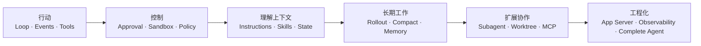

# Learn Codex: 从 Agent Loop 到工程化 Coding Agent

这是一套面向 Agent 初学进阶者的 Codex 风格 Coding Agent 教程。

它借鉴 `learn-claude-code` 的渐进式课程结构，但研究对象是开源的
[OpenAI Codex](https://github.com/openai/codex)。教程不会逐行翻译 Rust
源码，而是提炼 Codex 的关键设计，再使用以 Python 为主的可运行代码重新实现。

> 核心路线：先让 Agent 行动，再让行动可控、可恢复、可持久、可扩展，最终把所有机制放回一个完整运行时。

## 教程定位

- **比基础 Agent Loop 更进一步**：不仅讲工具调用，还讲事件流、线程、持久化、安全边界和协议。
- **比源码导读更容易进入**：先解释问题和设计，再指出真实 Codex 中的对应位置。
- **代码以 Python 为主**：只有当 Java 能更清楚地展示强类型协议或集成边界时才引入 Java。
- **每章只增加一个主要机制**：章节代码应当可以独立运行，并清楚展示相对上一章的变化。
- **不是官方文档**：课程基于公开源码与官方文档整理，教学实现会主动简化生产细节。

## 课程主线



课程规划为 24 章，完整路线见 [Plan.md](./Plan.md)。当前进度见
[Progress.md](./Progress.md)。

## 仓库结构

```text
.
├── AGENTS.md                 # 多会话协作规则、课程目标和完成标准
├── Plan.md                   # 课程路线与章节计划
├── Progress.md               # 当前进展、交接说明和下一步
├── docs/
│   ├── Decisions.md          # 持久化设计决策
│   └── SourceMap.md          # Codex 源码与章节映射
├── templates/chapter/        # 新章节模板
├── scripts/check_course.py   # 课程结构检查
├── tests/                    # 跨章节测试
└── s01_* ... s24_*           # 渐进式课程章节
```

`learn-claude-code/` 与 `references/codex/` 是本地研究参考，不会提交到本仓库。

## 写作状态

目前已完成 **M1 Runnable Core**，开始进入 **M2 Safe Runtime** 阶段。

- 已完成：[s01 Turn Loop](./s01_turn_loop/)
- 已完成：[s02 Streaming Items](./s02_streaming_items/)
- 已完成：[s03 Tool Registry](./s03_tool_registry/)
- 已完成：[s04 Shell Execution](./s04_shell_execution/)
- 已完成：[s05 File Tools & Apply Patch](./s05_file_tools_apply_patch/)
- 已完成：[s06 Approval Pipeline](./s06_approval_pipeline/)
- 已完成：[s07 Sandbox & Permissions](./s07_sandbox_permissions/)
- 已完成：[s08 Config & Trust](./s08_config_and_trust/)
- 下一章：`s09_hooks_and_policy`

每完成一章，都会单独提交并推送。
