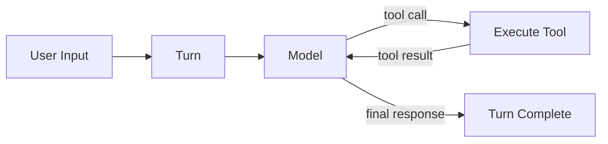

# s01: Turn Loop — 从一次回答到连续行动

```mermaid
flowchart LR
    U["User Input"] --> T["Turn"]
    T --> M["Model"]
    M -->|tool call| X["Execute Tool"]
    X -->|tool result| M
    M -->|final response| D["Turn Complete"]
```

> 状态：待编写。目标是实现最小事件化 Turn Loop，并建立 Thread、Turn、Item 的初步边界。

