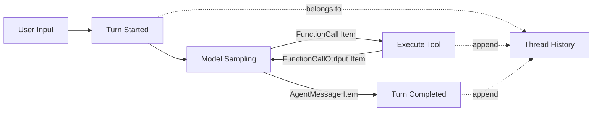

# s01: Turn Loop — 从一次回答到连续行动



> **本章一句话：** Agent 的最小核心不只是一个 `while True`，而是一个能够把模型输出、工具结果和生命周期事实持续追加到 Thread 中的 Turn Loop。

## 本章目标

学完本章，你应该能够：

- 解释 **Thread、Turn、Item** 三个概念分别解决什么问题。
- 写出一个模型调用、工具执行、结果回传组成的最小 Turn Loop。
- 理解为什么工具调用后需要再次请求模型，而不是由代码替模型决定下一步。
- 看懂真实 Codex `run_turn` 的主干，而不需要理解它周围所有 Rust 工程细节。

本章代码完全离线运行，不需要 API Key。我们使用一个确定性的 `ScriptedModel` 模拟模型，
这样可以先观察运行时结构。后续可以把它替换成真实模型客户端，而不改变 Turn Loop 的核心形状。

## 问题：`prompt -> answer` 不是 Agent

普通聊天程序通常只做一次调用：

```python
answer = model.generate(prompt)
print(answer)
```

这个程序能回答问题，但不能完成需要行动的任务。假设用户说：

> 统计这句话有多少个单词，然后告诉我结果。

模型可以提出工具调用：

```text
FunctionCall(name="count_words", arguments={"text": "..."})
```

但模型本身没有执行 Python 函数的能力。运行时必须：

1. 接收模型提出的 `FunctionCall`。
2. 执行对应工具。
3. 把执行结果包装成 `FunctionCallOutput`。
4. 将结果追加回上下文，再次调用模型。
5. 直到模型只返回最终 `AgentMessage`，本轮才结束。

这就是 Agent Loop 的核心。不过，为了向 Codex 的工程模型迈进一步，我们不只维护一个模糊的
`messages[]`，而是先明确三层边界。

## 心智模型：Thread、Turn、Item

### Thread：长期容器

**Thread** 是一段可以包含多次用户输入的会话。它拥有持续增长的历史：

```text
Thread
├── Turn 1: "统计这句话的单词数"
│   ├── UserMessage
│   ├── FunctionCall
│   ├── FunctionCallOutput
│   └── AgentMessage
└── Turn 2: "再统计另一句话"
    ├── UserMessage
    └── ...
```

Thread 解决的是：

> 下一轮从哪里继续？

### Turn：一次用户任务的运行生命周期

**Turn** 从一次新的用户输入开始，到 Agent 完成这一轮所有行动后结束。

一个 Turn 内部可能调用模型多次：

```text
一次 Turn
  ├── 第一次 sampling：模型要求调用工具
  ├── 执行工具并追加结果
  └── 第二次 sampling：模型给出最终回答
```

所以：

```text
Turn != 一次模型 API 请求
```

Turn 解决的是：

> 这一次用户任务什么时候真正完成？

### Item：历史中的结构化事实

**Item** 是追加到 Thread 历史中的一个结构化事实。本章只保留四种：

| Item | 含义 |
|---|---|
| `UserMessage` | 用户本轮提交的输入 |
| `FunctionCall` | 模型提出的工具调用 |
| `FunctionCallOutput` | 运行时执行工具后的结果 |
| `AgentMessage` | 模型给用户的回答 |

Item 解决的是：

> 历史里发生的到底是什么，而不只是“这里有一段字符串”。

明确 Item 类型后，后续才能可靠地做流式 UI、持久化、恢复、审批、压缩和测试。

## 最小实现

本章代码在 [code.py](./code.py)，没有第三方依赖。运行：

```bash
python3.11 s01_turn_loop/code.py "Codex turns model requests into agent actions"
```

输出类似：

```text
turn/started
item/completed: UserMessage
item/completed: FunctionCall
tool> count_words({"text": "Codex turns model requests into agent actions"})
item/completed: FunctionCallOutput
item/completed: AgentMessage
turn/completed

assistant> The text contains 7 words.
```

注意：这是**一次 Turn、两次模型 sampling、一次工具执行**。

### 四种 Item

代码使用 `dataclass` 表达结构化 Item：

```python
@dataclass(frozen=True)
class FunctionCall:
    id: str
    call_id: str
    name: str
    arguments: dict[str, Any]


@dataclass(frozen=True)
class FunctionCallOutput:
    id: str
    call_id: str
    output: str
```

`call_id` 把一次工具请求与它的结果配对：

```text
FunctionCall(call_id="call_3")
        ↕
FunctionCallOutput(call_id="call_3")
```

这条关系非常重要。后续做上下文压缩时，如果保留结果却删除对应调用，历史就会变得不合法。

### 一个故意简单的模型接口

Turn Loop 不应该依赖某一家模型 SDK，所以本章只要求模型实现：

```python
class Model(Protocol):
    def sample(self, history: Sequence[Item]) -> list[Item]:
        ...
```

教学用 `ScriptedModel` 的行为是：

1. 看到 `UserMessage` 时，返回 `FunctionCall(count_words)`。
2. 看到 `FunctionCallOutput` 时，返回最终 `AgentMessage`。

它不聪明，但完整走过了 Agent 的行动闭环。替换为真实模型时，只需要让真实客户端把响应转换成
相同的 Item，Turn Loop 不需要知道供应商细节。

### Turn Loop

本章最重要的代码是：

```python
while True:
    sampled_items = model.sample(thread.history)

    needs_follow_up = False
    for item in sampled_items:
        thread.append(item)

        if isinstance(item, FunctionCall):
            output = execute_tool(item)
            thread.append(output)
            needs_follow_up = True

    if not needs_follow_up:
        return turn_result
```

这个循环只负责四件事：

1. 请求模型。
2. 记录模型输出。
3. 执行模型要求的工具并记录结果。
4. 判断模型是否还需要看到工具结果。

它不负责替模型规划，也不使用大量 `if-else` 决定任务步骤。**模型选择行动，运行时执行并记录行动。**

## 工作原理

下面是一次完整运行的数据变化：

### 第一步：Turn 开始

```text
history = [
  UserMessage("Codex turns model requests into agent actions")
]
```

运行时发出粗粒度生命周期事件：

```text
turn/started
item/completed(UserMessage)
```

### 第二步：第一次 sampling

模型读取 Thread 历史并返回：

```text
FunctionCall(
  call_id="call_3",
  name="count_words",
  arguments={"text": "..."}
)
```

运行时将调用追加到历史，然后执行工具：

```text
history = [
  UserMessage(...),
  FunctionCall(...),
  FunctionCallOutput(call_id="call_3", output="7")
]
```

因为出现了 `FunctionCall`，这一 Turn 还没有结束。代码再次 sampling。

### 第三步：第二次 sampling

模型现在能看到工具结果，于是返回：

```text
AgentMessage("The text contains 7 words.")
```

这次没有新的函数调用，运行时发出 `turn/completed`，并返回最终结果。

### 为什么不是看到 `AgentMessage` 就立刻结束？

一次模型响应可以包含多个 Item。理论上它可能同时包含说明文字和工具调用。如果响应中仍有工具调用，
运行时就应该执行工具并继续，而不是看到一段文字便提前结束。

所以本章使用的完成条件是：

```text
本次 sampling 没有产生需要执行的 FunctionCall
```

真实 Codex 的判断更复杂，还会考虑待处理输入、Stop hooks、上下文压缩等机制；但“工具调用会要求
后续 sampling”是稳定的主干。

## 粗粒度事件：先让运行时可观察

本章在 Thread 历史之外，还发出三个事件：

| Event | 用途 |
|---|---|
| `turn/started` | 通知客户端本轮开始 |
| `item/completed` | 通知客户端一个结构化 Item 已完成 |
| `turn/completed` | 通知客户端本轮已经结束 |

为什么历史和事件都需要？

- **历史**回答：“模型下一次应该看到什么？”
- **事件**回答：“外部客户端刚刚观察到什么？”

本章事件仍然很粗糙：没有 `item/started`，也没有文本 delta。第二章会在不改变 Turn Loop 主干的前提下，
把它扩展成真正的流式事件系统。

## 与 `learn-claude-code` 起点的差异

`learn-claude-code` 的起点用 `messages[] + stop_reason` 非常直接地揭示了 Agent Loop。
本教程假设你已经理解那一层，因此第一章向前多走一步：

| 基础 Agent Loop | 本章 |
|---|---|
| 一组 `messages[]` | 有类型的 Item 历史 |
| 一次循环直到停止 | 明确的 Turn 生命周期 |
| 打印工具调用 | 发出粗粒度运行时 Event |
| 会话边界隐含在变量中 | Thread 显式拥有历史 |

代价是代码稍多；收益是后续章节可以自然加入流式 UI、恢复、压缩和 App Server，而不用推翻起点。

## 与真实 Codex 的对应关系

以下对应关系基于本项目记录的公开 Codex 源码快照。它们是概念映射，不代表教学代码与生产实现一一对应。

### `run_turn`：同一个核心循环

公开源码中的 `codex-rs/core/src/session/turn.rs` 对 `run_turn` 的注释直接描述了主干：

- 模型返回函数调用时，执行调用，并在下一次 sampling 把输出发回模型。
- 模型只返回 assistant message 时，记录消息并认为 Turn 完成。

真实 `run_turn` 周围还处理 hooks、pending input、skills、plugins、自动压缩、重试和遥测。本章暂时把这些
全部拿掉，只留下最容易理解的骨架。

### `RegularTask`：Turn 有明确开始和结束

`codex-rs/core/src/tasks/regular.rs` 在运行普通 Turn 前发出 `TurnStarted`。
任务生命周期结束时，`codex-rs/core/src/tasks/mod.rs` 发出 `TurnComplete`。

这说明 Turn 不只是模型请求，而是客户端可以观察和管理的运行生命周期。

### `CodexThread`：Thread 是双向消息通道

`codex-rs/core/src/codex_thread.rs` 将 `CodexThread` 描述为组成 Thread 的双向消息流通道。
真实 Thread 还持有配置快照、rollout 路径、运行状态等内容；本章只保留历史和 `run_turn()`。

### `ResponseItem` 与 `TurnItem`

真实 Codex 至少存在两种相邻但不同的 Item 视角：

- `ResponseItem`：模型请求与响应使用的较底层 Item。
- `TurnItem`：提供给客户端的、更适合展示的 Turn 级 Item。

本章故意把两者压缩成一个简单 `Item` 联合类型。第二章再讨论模型事件如何映射成客户端事件。

## 教学简化与生产边界

本章不是可直接用于生产的 Coding Agent。它主动省略了：

- **真实模型连接**：`ScriptedModel` 只是确定性的测试替身。
- **工具注册和参数验证**：目前只有一个硬编码工具，s03 再建立 registry。
- **Shell 与文件工具**：分别留到 s04 和 s05。
- **审批和沙箱**：工具执行尚无安全边界，s06-s07 处理。
- **流式响应**：本章只发完成事件，s02 处理增量流。
- **错误恢复和取消**：模型或工具异常会直接抛出，s18 再系统处理。
- **持久化与恢复**：Thread 只存在内存中，s15 引入 rollout。
- **并行工具调用**：本章按顺序执行。
- **无限循环防护**：只用简单 `max_sampling_rounds` 上限。

最重要的安全提醒：

> 不要把本章的 `execute_tool()` 换成不受限制的 shell，然后称它为安全 Agent。

## 试一试

### 运行示例

```bash
python3.11 s01_turn_loop/code.py "Agent runtimes record actions as structured items"
```

观察：

1. 一个 Turn 中出现了几次 `item/completed`？
2. `FunctionCall` 和 `FunctionCallOutput` 是否拥有相同的 `call_id`？
3. 最终 `AgentMessage` 是否也被追加进 Thread 历史？

### 运行测试

```bash
python3.11 -m unittest s01_turn_loop/test_code.py -v
```

测试覆盖：

- 工具调用后确实发生第二次 sampling。
- `call_id` 请求与结果正确配对。
- 两个 Turn 共享同一个 Thread 历史。
- 不需要工具时，一个 sampling 就能完成 Turn。

### 思考实验

尝试修改 `ScriptedModel`，让它连续调用两次工具。不要改 Turn Loop。

如果你需要修改 Turn Loop 才能支持第二次工具调用，说明“模型输出 Item”与“运行时执行 Item”的边界
还没有分干净。

## 小结

本章建立了整套教程后续都会依赖的最小骨架：

```text
Thread 保存历史
Turn 管理一次用户任务
Item 表达结构化事实
FunctionCallOutput 让模型看到行动结果
Event 让外部客户端观察生命周期
```

核心循环仍然很小。接下来真正复杂的不是“让模型再调用一次”，而是如何让 UI、日志、持久化和其他客户端
实时理解 Agent 正在做什么。

下一章：**s02 Streaming Items — 用事件流观察 Agent。**

