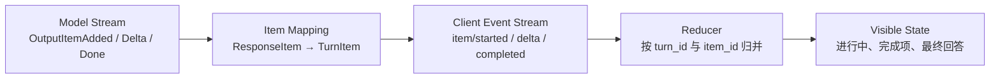

# s02: Streaming Items — 用事件流观察 Agent



> **本章一句话：** 流式 Agent 不只是提前打印几个字符，而是把运行中的事实变成带身份、
> 生命周期和归属关系的事件，再由客户端 reducer 重建当前状态。

## 本章要解决的问题

s01 已经能完成一次包含工具调用的 Turn，但客户端只能等到 Item 完成后才知道发生了什么：

```text
item/completed: FunctionCall
item/completed: AgentMessage
turn/completed
```

这对短回答勉强够用，对 Coding Agent 却不够。一次 shell 命令可能运行几十秒，一次文件修改可能等待
审批，多个 Turn 还可能并发产生事件。客户端需要持续回答：

- 当前 Turn 是否仍在运行？
- 哪个 Item 刚开始，哪个已经完成？
- 这段文本 delta 属于哪个 assistant message？
- 多个 Turn 的事件交错到达时，应该更新哪块界面？
- 临时流式文本与最终完成 Item 不一致时，以谁为准？

因此我们要从“运行时打印日志”升级为：

```text
结构化事件流 + reducer = 可恢复、可测试的客户端状态
```

本章仍然使用离线 `ScriptedStreamingModel`，工具也仍然硬编码。唯一重点是把 s01 的粗粒度事件扩展为
完整的 Item 生命周期。

## 心智模型：一次运行，两种 Item 视角

真实 Codex 中存在相邻但不同的两种 Item 视角：

```text
模型侧 ResponseItem
    │  parse / filter / adapt
    ▼
客户端侧 TurnItem
```

### `ResponseItem`：模型流说“生成了什么”

模型协议关心模型输出，例如 assistant message、function call 和 reasoning。它可以逐步产生：

```text
OutputItemAdded
OutputTextDelta
OutputItemDone
ResponseCompleted
```

这些事件描述的是一次模型 sampling 的输出过程。

### `TurnItem`：运行时说“客户端应该看到什么”

客户端不应该被迫理解所有模型内部细节。运行时会把选中的模型输出映射为更稳定、展示友好的
`TurnItem`。真实 Codex 的 `event_mapping.rs` 会过滤 system message 和部分上下文内容，并转换
assistant message、reasoning、web search 等可见 Item。

所以：

```text
ResponseItem != TurnItem
```

映射层是一条重要边界。它允许模型协议变化，也允许运行时隐藏不适合直接展示的内部上下文。

### `Event`：状态发生了什么变化

本章客户端消费五类事件：

| Event | 含义 |
|---|---|
| `turn/started` | 一个 Turn 开始运行 |
| `item/started` | 一个客户端可见 Item 进入进行中状态 |
| `item/agentMessage/delta` | 某个 assistant message 增加一段临时文本 |
| `item/completed` | 一个 Item 已形成最终结构化结果 |
| `turn/completed` | 整个 Turn 已完成 |

事件不是随手打印的字符串。它们必须携带稳定关联键：

```text
turn_id：事件属于哪个 Turn
item_id：delta 属于哪个 Item
call_id：工具结果对应哪个工具调用
```

## 最小教学实现

代码位于 [code.py](./code.py)，只依赖 Python 3.11+ 标准库：

```bash
python3.11 s02_streaming_items/code.py "Codex streams structured events to clients"
```

输出类似：

```text
turn/started
item/started UserMessage
item/completed UserMessage
item/started FunctionCall
item/completed FunctionCall
item/started FunctionCallOutput
item/completed FunctionCallOutput
item/started AgentMessage
The text contains 7 words.
item/completed AgentMessage

turn status: completed
assistant: The text contains 7 words.
```

这次最终文本在 `AgentMessage` 完成前已经逐段可见，但 reducer 仍然等待完成事件来确认最终 Item。

### 第一步：模型产生原始流事件

教学模型不再一次返回完整 Item 列表，而是实现：

```python
class StreamingModel(Protocol):
    def stream(self, history: Sequence[TurnItem]) -> Iterator[ModelEvent]:
        ...
```

assistant message 的一次 sampling 类似：

```python
yield OutputItemAdded(ResponseMessage(id=message_id, role="assistant", text=""))
yield OutputTextDelta(item_id=message_id, delta="The text ")
yield OutputTextDelta(item_id=message_id, delta="contains 7 ")
yield OutputTextDelta(item_id=message_id, delta="words.")
yield OutputItemDone(ResponseMessage(id=message_id, role="assistant", text=final_text))
yield ResponseCompleted()
```

`OutputItemDone` 和 `ResponseCompleted` 不是一回事：

- `OutputItemDone`：某一个模型输出 Item 完成。
- `ResponseCompleted`：这一次模型 sampling 的流结束。

一个 response 可以包含多个 Item，所以不能把两者混为一个停止信号。

### 第二步：映射为客户端 Item

`to_client_item` 是本章最小映射层：

```python
def to_client_item(item: ResponseItem) -> TurnItem | None:
    if isinstance(item, ResponseMessage):
        if item.role == "assistant":
            return AgentMessage(id=item.id, text=item.text)
        return None
    return FunctionCall(...)
```

返回 `None` 是有意义的：并非模型产生的每项内容都应该进入客户端事件流。

真实 Codex 的映射更丰富，也包含兼容与过滤逻辑。本章只保留足以解释边界的最小版本。

这里有一个必须明确的教学简化：本章 `to_client_item` 也把 `ResponseFunctionCall` 转成了教学
`FunctionCall`。真实 Codex 的 `event_mapping.rs::parse_turn_item` 并不直接负责普通 FunctionCall
的工具生命周期；工具调用还会经过 router、handler 和对应工具 Item 的处理路径。本章暂时合并这些
边界，是为了延续 s01 的最小工具闭环，s03 才会拆出 Tool Registry 与 Router。

### 第三步：运行时发出 Item 生命周期事件

当模型流报告 Item 新增时，运行时映射并发出 started：

```python
if isinstance(model_event, OutputItemAdded):
    item = to_client_item(model_event.item)
    if item is not None:
        active_items[item.id] = item
        emit(Event(method="item/started", turn_id=turn_id, item=item))
```

当同一个 Item 完成时，运行时使用相同 ID 发出 completed：

```text
item/started  AgentMessage(id="item_7", text="")
delta         item_id="item_7", "The text "
delta         item_id="item_7", "contains 7 words."
item/completed AgentMessage(id="item_7", text="The text contains 7 words.")
```

稳定 ID 让客户端知道这四条事件描述的是同一个对象，而不是四条无关日志。

## Reducer：从过去的事件计算现在

事件流只描述“发生了什么”，客户端还需要知道“现在是什么状态”。Reducer 负责把事件依次投影为
`TurnView`：

```python
@dataclass
class TurnView:
    status: str = "not_started"
    in_progress: dict[str, TurnItem] = field(default_factory=dict)
    completed: list[TurnItem] = field(default_factory=list)
    text_buffers: dict[str, str] = field(default_factory=dict)
    final_response: str | None = None
```

它遵循四条规则：

1. `turn/started` 将 Turn 标为 `in_progress`。
2. `item/started` 按 Item ID 加入 `in_progress`。
3. 文本 delta 按 `item_id` 追加到临时 buffer。
4. `item/completed` 移除进行中 Item，并记录最终完成 Item。

### 为什么 delta 不是最终事实？

delta 适合低延迟展示，却可能因解析、过滤、断流或后续规范化而不完整。完成 Item 才是运行时最终
交付给客户端的结构化对象。

本章 reducer 因此使用：

```python
turn.text_buffers[item.id] = item.text
```

在 `item/completed` 到达时，用最终 Item 文本覆盖临时 buffer。可以把两者理解为：

```text
delta           = live projection，追求及时
completed item  = authoritative result，追求确定
```

### 为什么 reducer 按 `turn_id` 分区？

真实客户端可能同时观察多个 Turn。事件到达顺序可能是：

```text
turn_1 delta "one-a"
turn_2 delta "two-a"
turn_1 delta "one-b"
turn_2 delta "two-b"
```

本章 `EventReducer.turns` 使用 `turn_id -> TurnView` 路由，因此交错不会混合文本。Codex Python SDK
的消息路由测试也专门验证了这种按 Turn 分发的行为。

本章对“未知 Item 的 delta”选择立即报错：

```python
if item_id not in turn.in_progress:
    raise ValueError(...)
```

这是一种适合教学和协议测试的严格策略。真实客户端可能为了处理注册前到达的事件而暂存它们，这类
并发与恢复问题会在后续章节再讨论。

## 相对 s01 的变化

Turn Loop 的骨架没有被推翻，变化集中在模型与客户端边界：

| s01 | s02 |
|---|---|
| 模型一次返回完成 Item 列表 | 模型产生 Added、Delta、Done、Completed 流 |
| 模型 Item 与客户端 Item 合并 | 显式映射 `ResponseItem -> TurnItem` |
| 主要只有 `item/completed` | Item 具有 started、delta、completed 生命周期 |
| Event 只用于观察 | reducer 用 Event 计算客户端状态 |
| 默认只考虑当前 Turn | 按 `turn_id` 路由交错事件 |

工具调用后继续 sampling 的逻辑仍与 s01 相同。流式机制增强的是可观察性，不负责替代 Agent Loop。

## 与真实 Codex 的对应关系

以下对应关系基于本章 [SOURCE_NOTES.md](./SOURCE_NOTES.md) 记录的公开源码快照：

| 教学实现 | 真实 Codex 入口 | 对应关系 |
|---|---|---|
| `ResponseItem` | `codex-rs/protocol/src/models.rs` | 模型侧结构化输出 |
| `TurnItem` | `codex-rs/protocol/src/items.rs` | 面向客户端的 Item 视图 |
| `to_client_item` | `codex-rs/core/src/event_mapping.rs` 与工具处理路径 | 选择、过滤并转换 Item 的合并教学版 |
| `OutputItemAdded/Done/Delta` 处理 | `codex-rs/core/src/session/turn.rs` | 消费模型流并产生运行时行为 |
| `item/started`、`item/completed`、delta | `codex-rs/protocol/src/protocol.rs` | 带 Turn 与 Item 标识的协议事件 |
| `EventReducer.turns` | Python SDK `_message_router.py` | 按 Turn 路由通知的简化教学版 |

真实 Codex 的 `TurnItem` 包含 AgentMessage、Reasoning、WebSearch、FileChange、MCP Tool Call、
ContextCompaction 等更多类型。它的事件处理还涉及 plan mode、流式文本解析、工具参数 delta、
审批、遥测和取消。本章不尝试复制这些实现，只提取稳定心智模型。

## 教学简化与生产边界

本章主动省略：

- SSE、WebSocket、JSON-RPC 和异步 channel，只用同步 Python generator。
- 背压、断线重连、重放、取消、超时和重复事件处理。
- delta 的复杂解析、引用处理和 plan mode 过滤。
- 完整的 `TurnItem` 类型集合与状态转换。
- App Server 的外部协议转换。
- 工具 registry、schema 验证、审批和 sandbox。

尤其不要从本章推导：

> 每一种真实 Codex Item 都严格经历完全相同的 started → delta → completed 序列。

不同 Item 有不同生命周期。可靠的客户端应该根据协议定义和具体 Item 类型处理，而不是假设所有
事件都长得一样。

## 可运行实验

### 实验一：观察完整事件流

```bash
python3.11 s02_streaming_items/code.py "events need identity and lifecycle"
```

观察：

- 一次 Turn 仍然进行两次 sampling。
- FunctionCall 没有文本 delta，但有 started/completed。
- AgentMessage 在 completed 前逐段显示。
- reducer 最终没有遗留 `in_progress` Item。

### 实验二：运行协议行为测试

```bash
python3.11 -m unittest discover -s s02_streaming_items -p 'test_*.py' -v
```

测试覆盖：

- delta 可以构成实时文本，但完成 Item 最终具有权威性。
- started 与 completed 通过相同 Item ID 关联。
- 两个 Turn 的交错事件被正确路由。
- 未知 Item 或非 Agent Item 的文本 delta 被拒绝。
- 完整 Turn 最终还原为有序完成 Item 和最终回答。

### 实验三：制造协议错误

在测试或 Python REPL 中直接发送：

```python
reducer.apply(
    Event(
        method="item/agentMessage/delta",
        turn_id="turn_1",
        item_id="missing",
        delta="orphan",
    )
)
```

它会抛出错误。这个实验说明结构化事件的价值不只是方便 UI：协议关系可以被自动验证，而普通日志
字符串很难做到这一点。

## 小结与下一章

本章把 Agent 的输出从“完成后打印”升级为可关联、可归并、可测试的事件流：

```text
模型流 → Item 映射 → 客户端事件 → reducer → 当前状态
```

最重要的三个结论：

1. 模型侧 Item 与客户端侧 Item 是不同视角，需要明确映射边界。
2. delta 用于及时展示，完成 Item 用于确认最终结构化事实。
3. `turn_id`、`item_id` 和 `call_id` 让并发事件与生命周期关系可以被可靠还原。

s03 将保留这套事件系统，把目前硬编码的 `count_words` 工具升级为可发现、可验证、可路由的
Tool Registry。
