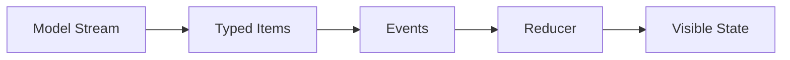

# s02: Streaming Items — 用事件流观察 Agent

```mermaid
flowchart LR
    M["Model Stream"] --> I["Typed Items"]
    I --> E["Events"]
    E --> R["Reducer"]
    R --> S["Visible State"]
```

> 状态：待编写。目标是把 Agent 输出建模为 Item 与 Event，而不是只等待最终字符串。

