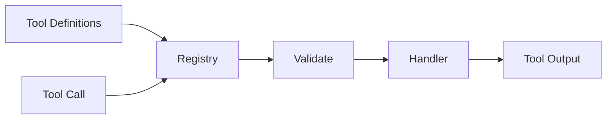

# s03: Tool Registry — 让工具可发现、可验证、可路由

```mermaid
flowchart LR
    D["Tool Definitions"] --> R["Registry"]
    C["Tool Call"] --> R
    R --> V["Validate"] --> H["Handler"] --> O["Tool Output"]
```

> 状态：待编写。目标是建立 registry、router 和 handler 生命周期。

