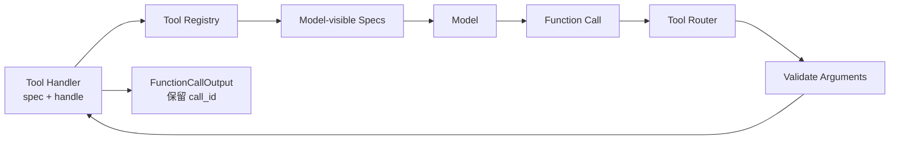

# s03: Tool Registry — 让工具可发现、可验证、可路由



> **本章一句话：** 工具不是 Turn Loop 里的 `if name == ...`，而是一组同时具备模型可见契约与
> 可执行行为、能够被统一发现和路由的运行时能力。

## 本章要解决的问题

s02 已经可以观察 FunctionCall 的完整事件生命周期，但执行工具仍依赖一个硬编码函数：

```python
if call.name != "count_words":
    result = "Error: unknown tool"
else:
    result = ...
```

当工具只有一个时，这段代码看起来足够直接。工具增多后，它会迅速产生四类问题：

- 模型如何知道当前有哪些工具、每个工具需要什么参数？
- 一个工具名如何稳定找到对应实现？
- 缺少参数、类型错误和多余参数应该在哪里被发现？
- 新增工具时，是否必须继续修改 Turn Loop？

真正的问题不是“如何再写一个函数”，而是如何建立稳定的工具边界：

```text
工具契约 ToolSpec + 可执行 Handler + Registry + Router
```

本章保留 s02 的模型流、Item、Event 和 Reducer，只替换硬编码工具执行路径。

## 心智模型：工具有两个面

一个可被 Agent 使用的工具至少有两个不同的面：

```text
给模型看的 ToolSpec
    name + description + parameters

给运行时用的 Handler
    handle(validated_arguments) -> output
```

### ToolSpec：帮助模型提出合法调用

`ToolSpec` 描述工具叫什么、解决什么问题、接受哪些参数。教学版中的 `count_words`：

```python
ToolSpec(
    name="count_words",
    description="Count whitespace-separated words in text.",
    properties={"text": str},
    required=("text",),
)
```

模型在 sampling 前接收当前可见工具的 specs，因此可以选择工具并构造 FunctionCall。

但 spec 只是契约，不是执行代码。把 spec 发给模型也不意味着模型一定严格遵守它。

### Handler：执行已经路由到自己的调用

Handler 把 spec 与行为放在一起：

```python
class CountWordsHandler:
    spec = ToolSpec(...)

    def handle(self, arguments):
        return str(len(str(arguments["text"]).split()))
```

这种组织方式让新增工具成为注册一个新 Handler，而不是修改 Turn Loop 的条件分支。

### Registry：按名字保存可执行能力

Registry 建立：

```text
tool name -> handler
```

它负责拒绝重复名字、列出 specs，并在 dispatch 前完成教学版参数验证。

### Router：连接模型调用与 Registry

Router 位于模型输出和 Registry 之间：

```text
FunctionCall(name, call_id, arguments)
    -> lookup
    -> validate
    -> handler
    -> ToolResult
```

未知工具或非法参数不会让整个 Turn 崩溃。Router 把错误转成失败的 `ToolResult`，Thread 再生成保留
原始 `call_id` 的 `FunctionCallOutput` 返回模型。模型因此有机会修正调用或解释失败。

## 最小教学实现

代码位于 [code.py](./code.py)，只依赖 Python 3.11+ 标准库：

```bash
python3.11 s03_tool_registry/code.py "tools need discoverable contracts"
```

输出开头会先展示模型可见工具：

```text
model-visible tools: count_words, repeat_text
turn/started
item/started UserMessage
...
```

完整 Turn 仍然进行两次 sampling：

1. 第一次 sampling 接收工具 specs，产生 `count_words` FunctionCall。
2. Router 查找工具、验证参数并调用 Handler。
3. Thread 记录 FunctionCallOutput，并再次 sampling。
4. 模型根据工具结果产生最终 AgentMessage。

## 工作原理

### 第一步：注册 Handler

`default_router` 负责组合当前教学运行时的工具：

```python
def default_router() -> ToolRouter:
    return ToolRouter(ToolRegistry([CountWordsHandler(), RepeatTextHandler()]))
```

Registry 不需要知道 Handler 的具体类，只依赖统一的 `spec` 与 `handle` 契约。

重复工具名会立即失败：

```python
if name in self._handlers:
    raise ToolError(f"tool {name!r} is already registered")
```

没有这条规则，同名工具的实际执行者会依赖注册顺序，调用行为将变得难以审计。

### 第二步：把 specs 暴露给模型

Thread 在每次 sampling 时传入 Router 当前的模型可见 specs：

```python
self.model.stream(tuple(self.history), self.router.model_visible_specs())
```

这一步把“运行时拥有某个 Python 函数”升级为“模型知道当前可以调用什么”。

真实系统中的可见集合可能随 Turn 配置、模型能力、模式或动态工具变化。本章所有已注册工具默认都
直接可见，暂不实现延迟发现和隐藏工具。

### 第三步：Router 路由 FunctionCall

Thread 不再调用 `execute_tool`，而是把结构化 FunctionCall 交给 Router：

```python
result = self.router.dispatch(item)
```

Router 使用工具名查找 Handler。教学版只使用普通字符串工具名；真实 Codex 的 `ToolName` 会保留
namespace，避免不同来源的同名工具被错误匹配。

### 第四步：执行前验证参数

模型生成的调用属于不可信输入。即使模型看过 schema，运行时也必须再次检查。

教学版验证器覆盖一个刻意受限的 schema 子集：

- 必需参数必须存在。
- 参数值必须满足声明的 Python 类型。
- 默认拒绝未声明的额外参数。

只有验证通过后，Handler 才会执行。测试使用 RecordingHandler 验证非法参数不会触发副作用。

这里必须区分教学设计与真实 Codex：真实 Codex 的 ToolSpec 使用 JSON Schema 风格结构向模型描述
参数，而具体 Handler 常通过 `serde_json` 反序列化为强类型参数并返回可供模型理解的解析错误。
不能把本章的集中 Python 验证器描述成真实 Codex 的统一验证实现。

### 第五步：把错误也变成工具结果

Router 捕获可恢复的 `ToolError`：

```python
except ToolError as error:
    return ToolResult(output=f"Error: {error}", success=False)
```

Thread 随后生成 FunctionCallOutput，并保留调用的 `call_id`。这条关联让模型知道错误属于哪次调用。

未知工具、参数错误和 Handler 内部致命故障在生产系统中可能具有不同错误等级。本章只实现最小的
“返回模型继续处理”路径。

## 相对 s02 的变化

| s02 | s03 |
|---|---|
| `execute_tool` 硬编码 `count_words` | Handler 可独立注册 |
| 模型不知道工具定义 | 每次 sampling 接收模型可见 specs |
| 参数通过 `.get()` 宽松读取 | 执行前验证必需项、类型和额外参数 |
| Turn Loop 负责识别工具名 | Router 负责路由，Registry 负责查找 |
| 未知工具直接拼接错误字符串 | Router 产生带成功状态的 ToolResult |

s02 的 Event、Reducer、Item 生命周期和工具调用后继续 sampling 的主干保持不变。新增工具机制没有
推翻 Agent Loop，只把其中一条硬编码分支提炼为可扩展边界。

## 与真实 Codex 的对应关系

以下对应关系基于本章 [SOURCE_NOTES.md](./SOURCE_NOTES.md) 记录的公开源码快照：

| 教学实现 | 真实 Codex 入口 | 对应关系 |
|---|---|---|
| `ToolSpec` | `codex-rs/tools/src/tool_spec.rs` | 模型可见的工具定义 |
| Handler 的 `spec + handle` | `codex-rs/tools/src/tool_executor.rs` | 将定义、暴露方式与执行行为绑定 |
| `ToolRegistry` | `codex-rs/core/src/tools/registry.rs` | 按 ToolName 保存 runtime 并 dispatch |
| `ToolRouter` | `codex-rs/core/src/tools/router.rs` | 从 ResponseItem 构造 ToolCall 并路由 |
| `default_router` | `codex-rs/core/src/tools/spec_plan.rs` | 根据 Turn 上下文组合 specs 与 registry |
| sampling 时传入 specs | `codex-rs/core/src/session/turn.rs::build_prompt` | 把模型可见 specs 放入 Prompt |
| Handler 参数解析 | `core/src/tools/handlers/mod.rs` 与各 Handler | 将函数参数反序列化并返回解析错误 |

真实 Codex 还区分 `Direct`、`Deferred`、`DirectModelOnly` 和 `Hidden` 工具暴露方式。`spec_plan`
可以让 runtime 保持注册但不出现在初始模型可见列表中，也可以组合 MCP、动态工具、扩展工具和托管
工具。Router 还保留 namespace，处理 FunctionCall、CustomToolCall 和客户端执行的 ToolSearchCall。

工具执行之后还会进入 hooks、lifecycle、遥测、并行调用、取消、审批与沙箱等机制。本章只讲发现、
验证与路由；审批和沙箱将在 s06、s07 展开。

## 教学简化与生产边界

本章主动省略：

- 完整 JSON Schema，只支持必需字段、额外字段和少量 Python 类型检查。
- namespace、自由格式工具、Tool Search、MCP 和动态工具。
- Direct、Deferred、DirectModelOnly、Hidden 等暴露策略。
- 异步 Handler、并行工具调用、取消、超时与流式参数 diff。
- hooks、遥测、工具生命周期 contributor 和输出类型体系。
- approval、sandbox、policy 与失败后的权限升级重试。
- Handler 的业务约束验证，例如数值范围、路径规则和跨字段关系。

本章使用 Registry 集中验证参数，是为了让边界一眼可见。真实系统仍需由每个 Handler 验证其专属
语义，且“schema 已发送给模型”永远不能替代运行时验证。

## 可运行实验

### 实验一：观察工具发现与完整 Turn

```bash
python3.11 s03_tool_registry/code.py "registry routes tools by stable names"
```

观察模型可见工具列表、FunctionCall/FunctionCallOutput 生命周期，以及第二次 sampling 的最终回答。

### 实验二：运行行为测试

```bash
python3.11 -m unittest discover -s s03_tool_registry -p 'test_*.py' -v
```

测试覆盖：

- Registry 暴露两个 specs，并把调用路由给正确 Handler。
- 重复工具名被拒绝。
- 缺少参数、错误类型和额外参数在 Handler 执行前被拒绝。
- Python 中容易混淆的 `bool` 与 `int` 仍按声明类型严格区分。
- 未知工具变成可返回模型的失败结果。
- 完整 Turn 能发现并执行注册工具，同时保留 s02 的事件行为。

### 实验三：直接观察非法调用

```python
router = default_router()
result = router.dispatch(
    FunctionCall(
        id="item_1",
        call_id="call_1",
        name="count_words",
        arguments={"text": 42},
    )
)
print(result)
```

结果是失败的 `ToolResult`，而不是执行 Handler。这个实验说明 ToolSpec 既用于帮助模型，也用于提醒
运行时在能力边界处进行验证。

## 小结与下一章

本章把硬编码工具分支升级为一条明确的运行时路径：

```text
Handler 注册 → specs 暴露 → 模型调用 → Router → 验证 → Handler → FunctionCallOutput
```

最重要的三个结论：

1. ToolSpec 描述能力，Handler 执行能力，两者相关但不能混为一谈。
2. Registry 与 Router 让新增工具不再要求修改 Turn Loop。
3. 模型调用是不可信输入，schema 提示不能替代运行时验证。

s04 将沿用这套工具运行时，加入第一个真正具有长任务状态的工具：Shell Execution。届时需要处理
持续输出、进程会话、截断、轮询与退出状态。
