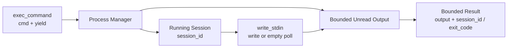

# s04: Shell Execution — 命令不是一次函数调用



> **本章一句话：** Shell 命令可能比一次工具调用活得更久，因此运行时必须把进程身份、增量输出、
> 输入交互和最终退出状态分开管理。

## 本章要解决的问题

s03 已经把工具升级为可发现、可验证、可路由的 Handler，但所有 Handler 都符合一个简单假设：

```text
调用函数 → 立刻得到完整字符串 → 工具结束
```

Shell 命令经常打破这个假设：

- 测试、构建和服务器可能运行数秒、数分钟，甚至持续运行。
- 命令可能先输出一部分内容，之后才完成。
- 交互式进程需要继续接收 stdin。
- 输出可能无限增长，不能全部塞进内存或模型上下文。
- “本次没有新输出”不代表进程已经结束。

如果 `exec_command` 一直阻塞到进程结束，Agent 无法继续观察或控制长任务；如果它提前返回但不保存
进程身份，之后又找不到原进程。

因此 shell 工具的核心返回值不是字符串，而是一段状态快照：

```text
recent output + optional session_id + optional exit_code
```

## 心智模型：调用结束不等于进程结束

一次 `exec_command` 工具调用只负责：

1. 启动进程。
2. 在有限的 yield 窗口内收集输出。
3. 检查进程是否结束。
4. 返回当前状态。

如果进程仍在运行：

```text
session_id = 1000
exit_code  = None
```

如果进程已经结束：

```text
session_id = None
exit_code  = 0
```

这两个字段表达不同事实：

- `session_id`：之后还能否继续轮询或写入这个进程。
- `exit_code`：进程是否已经结束，以及结束结果是什么。

不能用“输出是否为空”推断进程状态。一个安静的服务器可能仍在正常运行；一个已经退出的命令也可能
没有输出。

## 两个工具，一份进程状态

本章在 s03 Registry 中注册两个共享同一个 `ProcessManager` 的 Handler：

```text
exec_command -> 创建 session 或直接返回退出状态
write_stdin  -> 写入已有 session，或使用空字符串轮询
```

`write_stdin(chars="")` 不向进程写任何内容，只等待并收集近期输出。非空 `chars` 则先写 stdin，
随后等待进程产生输出或退出。

共享 ProcessManager 很重要。如果两个 Handler 各自拥有独立 session 表，`write_stdin` 将无法找到
由 `exec_command` 创建的进程。

## 最小教学实现

代码位于 [code.py](./code.py)，只依赖 Python 3.11+ 标准库：

```bash
python3.11 s04_shell_execution/code.py
```

教学模型会执行一条固定命令：

```sh
printf 'started\n'; sleep 0.05; printf 'finished\n'
```

完整 Turn 进行三次 sampling：

1. 模型调用 `exec_command`。
2. 进程在短 yield 窗口后仍运行，返回 `session_id`；模型调用空 `write_stdin` 轮询。
3. 轮询获得最终输出与 `exit_code=0`；模型生成最终回答。

输出中的工具生命周期类似：

```text
item/completed FunctionCall       # exec_command
item/completed FunctionCallOutput # session_id 存在
item/completed FunctionCall       # write_stdin 空轮询
item/completed FunctionCallOutput # exit_code 存在
item/completed AgentMessage
```

## 工作原理

### 第一步：启动真实子进程

`ProcessManager.exec_command` 使用 `subprocess.Popen` 启动命令，并把 stdout 与 stderr 合并：

```python
process = subprocess.Popen(
    cmd,
    shell=True,
    stdin=subprocess.PIPE,
    stdout=subprocess.PIPE,
    stderr=subprocess.STDOUT,
)
```

后台 reader thread 持续读取输出。工具调用线程只等待自己的 yield 窗口，因此不会被长命令永久占用。

这里使用 `shell=True` 是为了让教学代码短小并能直接运行 shell 片段，不是安全建议。本章尚未加入
approval、sandbox、命令策略和可信项目边界，不能把这个 Handler 直接当作生产执行器。

### 第二步：保存活进程

ProcessManager 为每个进程分配稳定 session ID：

```text
1000 -> ManagedProcess
1001 -> ManagedProcess
```

ManagedProcess 保存：

- `Popen` 进程句柄
- 有界的未读输出 buffer
- 输出 reader 是否结束
- 保护 buffer 的锁

初次 yield 后，如果进程还活着，结果保留 `session_id`。如果进程已经退出，Manager 立即删除 session，
关闭父进程持有的 stdin/stdout 句柄，并返回 `exit_code`。

### 第三步：轮询与写入使用同一路径

`write_stdin` 先按 session ID 查找进程：

```python
managed = self._sessions.get(session_id)
```

查找失败会返回可供模型理解的工具错误。找到后：

- `chars=""`：只等待并读取近期输出。
- `chars!="..."`：先写入 stdin，再等待近期输出。

每次响应都会 drain 当前未读输出。下一次轮询只看到之后新增的输出，而不是重复返回完整历史。

### 第四步：同时限制后台输出和模型输出

“有界输出”至少包含两层限制：

```text
进程未读输出 buffer：保护运行时内存
单次工具响应 budget：保护模型上下文
```

本章 `HeadTailBuffer` 保留稳定前缀与最新后缀，中间内容超出预算时丢弃：

```text
01234
... 10 chars omitted ...
FGHIJ
```

只截断返回模型的字符串是不够的。如果后台 reader 仍把所有输出放进无限队列，长时间不轮询的进程
仍会耗尽内存。本章测试因此分别验证未读 session 输出和单次响应都受限。

输出被截断时，`ExecResult` 仍单独保留：

- `original_chars`
- `omitted_chars`
- `session_id`
- `exit_code`

状态元数据不依赖输出文本，因此不会被截断掉。

### 第五步：退出后清除 session

轮询发现进程退出后：

```python
self._sessions.pop(session_id, None)
self._close_process_handles(managed)
```

之后再次使用同一 session ID 会得到 unknown-session 错误。这避免已经完成的进程永久滞留在运行时，
也防止调用者误以为它仍可交互。

测试还使用 `-W error::ResourceWarning` 运行，确保完成路径关闭父进程持有的文件句柄。

## 相对 s03 的变化

| s03 | s04 |
|---|---|
| Handler 调用期间完成全部工作 | 工具调用结束后进程可能继续运行 |
| ToolResult 主要是普通字符串 | Shell 结果包含 output、session_id、exit_code |
| Handler 自己完成调用 | 两个 Handler 共享 ProcessManager |
| 没有长期工具状态 | session 表保存活进程 |
| 输出规模很小 | 未读输出与单次响应都必须有界 |
| 一次工具调用后模型回答 | 模型可多次轮询同一进程 |

s03 的 ToolSpec、Registry、Router、参数验证，以及 s02 的 Item/Event/Reducer 仍然保留。Shell
Execution 是注册在已有工具运行时上的第一个有状态工具家族。

## 与真实 Codex 的对应关系

以下对应关系基于本章 [SOURCE_NOTES.md](./SOURCE_NOTES.md) 记录的公开源码快照：

| 教学实现 | 真实 Codex 入口 | 对应关系 |
|---|---|---|
| `ProcessManager` | `core/src/unified_exec/process_manager.rs` | 创建、保存、轮询和清理进程 |
| `ManagedProcess` | `core/src/unified_exec/process.rs` | 封装进程句柄、输出和退出状态 |
| `HeadTailBuffer` | `core/src/unified_exec/head_tail_buffer.rs` | 对保留输出设置上限并保留首尾 |
| `ExecCommandHandler` | `tools/handlers/unified_exec/exec_command.rs` | 解析调用并启动 unified exec |
| `WriteStdinHandler` | `tools/handlers/unified_exec/write_stdin.rs` | 写 stdin 或空轮询已有 session |
| `ExecResult` | `tools/context.rs::ExecCommandToolOutput` | 组合输出、process/session ID 与 exit code |
| 后台 reader | `unified_exec/process.rs` 与 `async_watcher.rs` | 持续读取并发出输出/结束状态 |

真实 Codex 的 `exec_command` spec 明确描述“返回 output 或 session ID”；`write_stdin` 的空输入用于
轮询。`ExecCommandToolOutput` 同时携带 raw output、process ID、exit code、wall time、chunk ID 和
原始 token 数，并在面向模型时按策略截断输出。

真实 ProcessManager 会根据 yield deadline 收集输出，进程仍存活时将其放入 store；轮询观察到退出后
移除它。相关集成测试验证：

- 活进程返回 process/session ID 且没有 exit code。
- `write_stdin` 复用原 process ID。
- 退出后省略 process ID、返回 exit code 并清除 session。
- 长进程可以在 Turn 完成后继续运行。
- 模型请求的输出预算仍会受运行时策略上限约束。

## 教学简化与生产边界

本章主动省略：

- approval、sandbox、exec policy、权限升级与网络策略。
- PTY、终端尺寸、控制字符、信号和平台差异。
- cwd、环境变量策略、login shell、远程 environment 与 exec-server。
- 真正的 shell output delta 事件；教学客户端只看到每次工具调用完成后的输出。
- 独立 stdout/stderr、UTF-8 边界处理、chunk ID 与 wall time。
- 进程数量上限、LRU 清理、取消、超时和 Turn/Thread 关闭时的终止策略。
- 跨 Turn 保留 session；教学 ProcessManager 只活在当前 Python 进程中。
- 完整 transcript 与事件重放。

真实 Codex 还通过 `ToolOrchestrator` 把 unified exec 接入 approval 与 sandbox。本章只研究进程状态与
输出边界，不提前混入 s06、s07 的安全机制。

## 可运行实验

### 实验一：观察长命令变成 session

```bash
python3.11 s04_shell_execution/code.py
```

观察：

- 模型可见工具为 `exec_command` 与 `write_stdin`。
- 第一次工具结果包含 session ID。
- 第二次调用使用空字符串轮询。
- 最终结果包含 exit code，不再包含 session ID。

### 实验二：运行行为测试

```bash
python3.11 -W error::ResourceWarning -m unittest discover -s s04_shell_execution -p 'test_*.py' -v
```

测试覆盖：

- Head-tail 截断保留首尾，零预算丢弃全部内容。
- 短命令直接返回 exit code，不创建可继续使用的 session。
- 长命令返回 session，轮询后返回退出状态并清除 session。
- `write_stdin` 可以继续一个等待输入的进程。
- session 未读输出和单次工具响应都受预算限制。
- 非法预算与未知 session 被拒绝。
- 完整 Turn 依次执行 `exec_command`、`write_stdin` 和最终回答。
- 完成路径不泄漏父进程文件句柄。

### 实验三：直接与进程交互

```python
manager = ProcessManager()
started = manager.exec_command(
    "read line; printf 'got:%s\\n' \"$line\"",
    yield_time_ms=5,
    max_output_chars=100,
)
finished = manager.write_stdin(
    started.session_id,
    "hello\n",
    yield_time_ms=200,
    max_output_chars=100,
)
print(finished)
```

这个实验说明 session ID 不是日志装饰，而是后续工具调用重新定位同一进程的能力句柄。

## 小结与下一章

本章把 shell 从“一次函数调用”升级为可持续观察的进程状态机：

```text
start → yield → running session → poll/write → exited → cleanup
```

最重要的三个结论：

1. 工具调用完成与底层进程完成是两件事。
2. `session_id` 表示仍可交互，`exit_code` 表示已经结束，输出文本不能替代状态字段。
3. 有界输出必须同时保护运行时内存和模型上下文。

s05 将继续沿用 Tool Registry，但转向文件修改：为什么结构化 read/edit/apply-patch 比把所有修改都
塞进任意 shell 字符串更可验证、更容易审阅。
