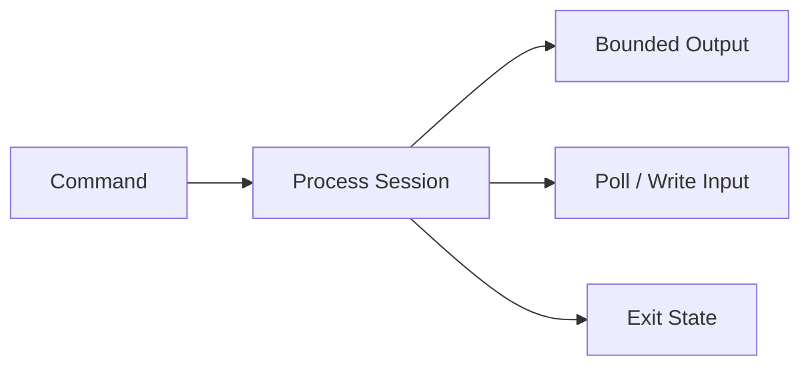

# s04: Shell Execution — 命令不是一次函数调用

```mermaid
flowchart LR
    C["Command"] --> P["Process Session"]
    P --> B["Bounded Output"]
    P --> W["Poll / Write Input"]
    P --> X["Exit State"]
```

> 状态：待编写。目标是处理长命令、持续输出、轮询与退出状态。

