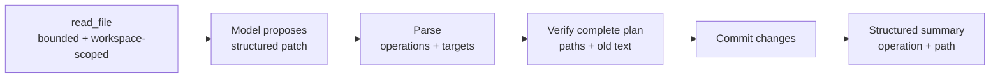

# s05: File Tools & Apply Patch — 让修改可表达、可检查



> **本章一句话：** 文件修改不只是“执行一串能改文件的字符”，而应先表达目标变化、验证旧状态，
> 再提交并返回可审计结果。

## 本章要解决的问题

s04 已经能执行任意 shell 命令。于是模型当然可以这样修改文件：

```sh
sed -i 's/old/new/' config.txt
printf 'content' > new.txt
rm obsolete.txt
```

这些命令可以工作，但运行时在执行前很难直接回答：

- 哪些文件会被修改？
- 修改类型是新增、更新还是删除？
- 模型期待替换的旧文本是否真的存在？
- 同一段旧文本出现多次时，应替换哪一处？
- 路径是否仍在允许的工作区内？
- 工具结果如何稳定地告诉客户端“实际改了什么”？

Shell 字符串描述的是“怎样运行”；结构化补丁描述的是“希望文件从什么状态变成什么状态”。
后者为验证、审批、沙箱、事件、diff 展示和测试提供了更清晰的边界。

## 心智模型：补丁是一份拟议变更

本章把文件修改分成四个阶段：

```text
parse → resolve targets → verify old state → commit
```

一个 update 不是“无条件写入新文件”，而是：

```text
在 greeting.txt 中，找到唯一的 "hello\n"
并把它替换为 "hello, structured patch\n"
```

如果旧文本不存在，说明模型看到的文件状态已经过时；如果出现两次，说明补丁定位有歧义。两种情况都应
拒绝，而不是猜测。

本章还把文件读取建模为独立工具：

```text
read_file(path) → {path, content, chars}
```

于是 Agent 的工作流成为：

```text
先读当前状态 → 提议补丁 → 运行时验证 → 提交变化 → 模型解释结果
```

## 为什么不只提供 write_file

`write_file(path, content)` 对创建生成文件很方便，但它缺少一个重要事实：模型认为旧文件是什么样。

对已有文件直接整文件覆盖，会掩盖并发修改或过时上下文。结构化 update 同时携带：

- 目标路径
- 期望存在的旧文本
- 要写入的新文本

这让运行时能够检测冲突。换句话说，补丁既是修改指令，也是一个轻量 precondition。

本章没有把 `write_file` 和 `edit_file` 注册成独立工具。新增、更新和删除统一由 `apply_patch`
表达；`read_file` 负责获取当前状态。

## 最小教学实现

代码位于 [code.py](./code.py)，只依赖 Python 3.11+ 标准库：

```bash
python3.11 s05_file_tools_apply_patch/code.py
```

离线脚本会创建临时工作区和 `greeting.txt`，然后完成三次 sampling：

1. 模型调用 `read_file("greeting.txt")`。
2. 模型提交一个同时更新 `greeting.txt`、新增 `notes.txt` 的补丁。
3. 模型根据结构化变更摘要生成最终回答。

补丁格式是一个刻意缩小的 Codex `apply_patch` 子集：

```text
*** Begin Patch
*** Update File: greeting.txt
@@
-hello
+hello, structured patch
*** Add File: notes.txt
+created by apply_patch
*** End Patch
```

教学版支持：

- `*** Add File: path`
- `*** Update File: path`
- `*** Delete File: path`
- update 中的 `-`、`+` 和空格上下文行

## 工作原理

### 第一步：所有路径先经过 Workspace

`Workspace` 保存一个明确的根目录。任何读取或修改都先解析为真实路径，并确认仍位于根目录内：

```python
resolved = (self.root / path).resolve()
if not resolved.is_relative_to(self.root):
    raise ToolError(...)
```

教学版拒绝绝对路径和 `../` 工作区逃逸。这个边界让文件工具的作用域比任意 shell 命令更容易理解。

它仍不是生产沙箱：路径检查无法替代操作系统级权限限制，也没有解决校验与写入之间的竞态。真正的
approval 与 sandbox 将在 s06、s07 引入。

### 第二步：读取结果是结构化且有界的

`read_file` 返回 JSON：

```json
{"chars": 6, "content": "hello\n", "path": "greeting.txt"}
```

调用方必须给文件读取设置上限。教学版在文件超过 `max_chars` 时直接拒绝，而不是静默截断，因为生成
补丁时缺失中间内容可能导致错误上下文。

真实产品还需要处理二进制文件、编码、分页、按行范围读取和大文件搜索。本章只处理 UTF-8 文本。

### 第三步：先把补丁解析成计划

`parse_patch` 不直接触碰文件系统。它先把 freeform 文本转换为：

```text
PatchPlan[
  PatchChange(operation="update", path="greeting.txt", old_text=..., new_text=...),
  PatchChange(operation="add", path="notes.txt", new_text=...)
]
```

解析阶段验证补丁边界、hunk header、行前缀和必要内容。这样，语法错误不会在文件写到一半时才被发现。

### 第四步：验证完整计划

`Workspace._verify` 检查每项拟议变化：

- 所有路径都在工作区内。
- 同一个目标不会在一个补丁中出现两次。
- add 目标尚不存在。
- update/delete 目标是普通文件。
- update 的旧文本恰好出现一次。

验证阶段只构造待写入的新内容，不修改文件。只有所有变化都通过后，`apply_patch` 才进入提交循环。

这个教学选择便于建立“验证优先”的心智模型，但它不是数据库事务：实际写文件时仍可能发生磁盘故障，
导致部分提交。生产系统需要更强的文件系统策略、失败追踪或恢复机制。

### 第五步：返回结构化变更摘要

成功后，工具不只返回 `"done"`，而是：

```json
{
  "changes": [
    {"operation": "update", "path": "greeting.txt"},
    {"operation": "add", "path": "notes.txt"}
  ]
}
```

运行时、客户端和模型因此不必重新解析 shell stdout 来判断修改范围。后续章节可以把这些目标路径接入
审批、沙箱、事件流和 turn diff。

## 相对 s04 的变化

| s04 | s05 |
|---|---|
| Shell 字符串描述执行过程 | Patch 描述拟议文件变化 |
| 运行时主要管理进程状态 | 运行时主要管理路径与文件前置状态 |
| output/session_id/exit_code | read result / structured change summary |
| 命令可修改任意可访问路径 | 教学文件工具只解析工作区内路径 |
| 很难在执行前知道修改目标 | parse 后即可列出目标与操作类型 |
| 命令失败依赖退出码与日志 | 验证错误直接指出路径或上下文问题 |

s03 的 Registry/Router 与 s02 的 Item/Event 仍然保留。`read_file` 和 `apply_patch` 都是注册工具，
补丁成功或失败仍通过普通 ToolResult 回到模型。

## 与真实 Codex 的对应关系

以下对应关系基于本章 [SOURCE_NOTES.md](./SOURCE_NOTES.md) 记录的公开源码快照：

| 教学实现 | 真实 Codex 入口 | 对应关系 |
|---|---|---|
| `parse_patch` | `codex-rs/apply-patch/src/parser.rs` | 把 freeform 补丁解析为 add/delete/update hunks |
| `PatchPlan` | `ApplyPatchAction` | 表达解析、验证后的拟议文件变化 |
| old-text 验证 | `verify_apply_patch_args`、`unified_diff_from_chunks` | 执行前读取目标并确认 update 可计算 |
| `Workspace.apply_patch` | `codex-rs/apply-patch/src/lib.rs::apply_patch` | 执行 hunks 并形成受影响路径摘要 |
| `ApplyPatchHandler` | `core/src/tools/handlers/apply_patch.rs` | 接收 freeform 输入、验证并交给运行时 |
| 结构化变化摘要 | `FileChange`、`AppliedPatchDelta`、patch events | 向审批、事件和失败追踪暴露变化 |

真实 Codex 将 `apply_patch` 暴露为带 Lark grammar 的 **freeform tool**，明确要求补丁正文不要包在 JSON
中。教学 Registry 当前只支持函数参数，因此用 `{"patch": "..."}` 承载正文；这是协议层简化，不是
真实 Codex 的模型调用格式。

真实处理路径先 parse，再通过 `verify_apply_patch_args` 读取 delete/update 目标、计算 update
后的内容并构造 `ApplyPatchAction`。Handler 随后解析目标路径与所需权限，通过安全评估和
`ToolOrchestrator` 进入 approval、sandbox 与实际文件系统。

真实 Codex 还会识别 shell/unified-exec 中符合严格形态的 `apply_patch` 调用，并在普通命令开始前
拦截它。相关集成测试确认：被拦截的调用产生 patch 事件，而不是 exec-command begin/end 事件。

### 一个必须明确的差异：部分成功

真实 `apply-patch` 测试明确覆盖了这种情况：

```text
第一个 add 成功 → 后续 update 失败 → 已新增文件仍然存在
```

`AppliedPatchDelta` 会追踪失败前已经提交的变化。也就是说，真实实现不是“全部成功或全部回滚”的数据库
事务。

教学版为了突出验证阶段，会在任何写入前验证完整计划，因此可提前发现的缺失文件或上下文错误不会造成
部分修改。正文不把这一教学选择描述为真实 Codex 行为。

## 教学简化与生产边界

本章主动省略：

- approval、sandbox、permission profile、trusted project 与外部路径授权。
- 真实 Codex 的 freeform custom-tool payload 和 Lark grammar 约束。
- move/rename、`*** End of File`、change-context header、多 update chunk。
- 真实实现的宽松空白匹配、Unicode 标点归一化和 heredoc 兼容。
- remote environment 与抽象 `ExecutorFileSystem`。
- symlink 策略、竞态防护、文件锁、权限位、换行风格和编码保留。
- 二进制文件、大文件分页、按行读取和搜索工具。
- patch argument streaming 与 `PatchApplyUpdated` 进度事件。
- `AppliedPatchDelta` 对部分成功、覆盖内容和 exactness 的追踪。
- hooks、turn diff tracker、失败恢复与撤销。

教学 `read_file` 是为完整展示“读—验证—改”闭环而加入的课程工具。当前研究快照中的核心内建
`apply_patch` 是明确的独立工具，而文件读取也可能通过 shell 或外部 MCP 工具完成；不要把本章
`read_file` 的具体接口当作真实 Codex 核心协议。

## 可运行实验

### 实验一：观察完整文件修改 Turn

```bash
python3.11 s05_file_tools_apply_patch/code.py
```

观察：

- 模型先看到并调用 `read_file`。
- 第二次 sampling 提交结构化补丁。
- 工具结果列出 update 和 add 的路径。
- 最终回答来自第三次 sampling。

### 实验二：运行行为测试

```bash
python3.11 -m unittest discover -s s05_file_tools_apply_patch -p 'test_*.py' -v
```

测试覆盖：

- 解析 add、update、delete 和拒绝非法补丁。
- 有界结构化读取。
- 拒绝绝对路径与工作区逃逸。
- 一次提交多个已验证变化。
- 缺失、歧义上下文和重复目标被拒绝。
- 完整计划验证失败时，不提交此前可执行的变化。
- 完整 Turn 依次执行读取、补丁和最终回答。

### 实验三：观察冲突检测

把文件内容改为：

```text
same
same
```

再提交把 `same` 替换为 `changed` 的 update。教学版会报告旧文本出现两次，而不是擅自选择第一处。
这说明结构化补丁的价值不只是语法漂亮，而是能够表达并检查修改前提。

## 小结与下一章

阶段一从最小 Turn Loop 走到了一个可运行的 Agent 核心：

```text
Turn Loop → Item/Event → Tool Registry → Shell Sessions → Structured File Changes
```

本章最重要的三个结论：

1. 文件修改应尽量表达目标变化，而不只是执行任意字符串。
2. update 中的旧文本是可验证的前置条件，可以暴露过时或歧义上下文。
3. 路径、拟议变化和实际提交结果都应成为运行时可观察的数据。

s06 将进入安全运行时：即使修改已经结构化、目标已经明确，运行时仍需要判断什么时候必须停下来请求
用户批准。
