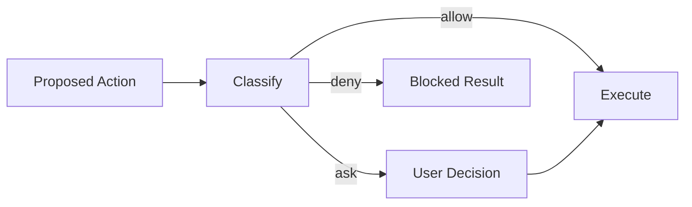

# s06: Approval Pipeline — 在行动前暂停

```mermaid
flowchart LR
    A["Proposed Action"] --> C["Classify"]
    C -->|allow| E["Execute"]
    C -->|ask| U["User Decision"]
    C -->|deny| B["Blocked Result"]
    U --> E
```

> 状态：待编写。目标是区分自动允许、请求确认和明确拒绝。

