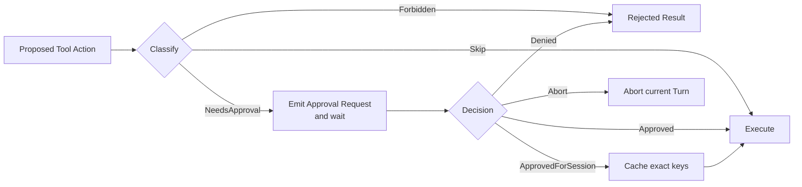

# s06: Approval Pipeline — 在行动前暂停



> **本章一句话：** Approval 不是执行后的通知，而是在副作用发生前暂停运行中的工具调用，并用明确
> 决策决定执行、拒绝或中止。

## 本章要解决的问题

s05 已经把文件变化表达成可解析、可验证的补丁。运行时现在能在写入前知道：

- 要调用哪个工具。
- 要修改哪些路径。
- 拟议变化是什么。
- 旧文件状态是否满足补丁前提。

但“知道要做什么”不等于“可以直接做”。某些行动需要用户确认：

```text
读取工作区文件              → 通常自动执行
修改文件                    → 可能需要确认
策略明确禁止的行动          → 不应打扰用户，直接拒绝
```

如果 Handler 自己随手弹出确认框，审批逻辑会散落在每个工具中；如果先执行再询问，审批已经失去意义。
成熟运行时需要一个位于“拟议行动”和“实际执行”之间的统一编排层。

## 心智模型：审批是一段等待中的工具调用

本章把工具调用分成两个阶段：

```text
propose action → approval gate → execute action
```

审批门首先把行动分类为三种要求：

| 要求 | 含义 |
|---|---|
| `Skip` | 当前行动无需询问，可以执行 |
| `NeedsApproval` | 发出结构化请求，等待决策 |
| `Forbidden` | 策略不允许执行，也不应该询问 |

`NeedsApproval` 不是把工具调用结束掉。运行时保存待决请求，发出 approval event，然后等待对应
approval ID 的决策。批准后，原工具调用从暂停处继续执行。

这解释了为什么审批请求必须携带稳定 ID：客户端的回答要回到正确的运行中调用，而不是启动一条新的、
脱离原上下文的命令。

## 四种教学决策

教学版实现四个核心 `ReviewDecision`：

| 决策 | 行为 |
|---|---|
| `Approved` | 只批准本次行动，然后执行 |
| `ApprovedForSession` | 批准本次行动，并缓存精确 action keys |
| `Denied` | 不执行工具，把失败结果返回模型；Turn 可以继续 |
| `Abort` | 不执行工具，并中止当前 Turn |

`Denied` 与 `Abort` 不能合并：

- Denied 表示“这条路不行，你可以尝试别的方法”。
- Abort 表示“停止当前工作，等用户下一条命令”。

## 最小教学实现

代码位于 [code.py](./code.py)，只依赖 Python 3.11+ 标准库：

```bash
python3.11 s06_approval_pipeline/code.py
```

本章沿用 s05 的 `read_file` 与 `apply_patch`：

- `read_file` 分类为 `Skip`，直接执行。
- `apply_patch` 分类为 `NeedsApproval`，先生成包含目标路径的请求。

离线示例中的审批者返回 `ApprovedForSession`。事件顺序类似：

```text
item/completed FunctionCall       # apply_patch 已被模型提出
approval/requested                # 文件尚未修改
approval/resolved                 # ApprovedForSession
item/completed FunctionCallOutput # 补丁此时才执行完成
```

## 工作原理

### 第一步：Handler 描述审批要求

每个教学 Handler 除了 `spec` 和 `handle`，还实现：

```python
approval_requirement(arguments)
approval_request(call_id, arguments)
```

`approval_requirement` 只分类。只有 `NeedsApproval` 才需要构造请求。

`ApplyPatchHandler.approval_request` 会先通过 `preview_patch` 解析并验证 patch，再形成结构化请求：

```text
approval_id = call_id
tool_name   = apply_patch
summary     = Modify files: greeting.txt, notes.txt
keys        = apply_patch:greeting.txt, apply_patch:notes.txt
```

此时还没有调用 `Workspace.apply_patch`，因此文件没有发生变化。验证失败的拟议行动也不会制造一个
无法执行的审批提示；真正执行时仍会再次验证，以检测等待审批期间发生的状态变化。

### 第二步：Orchestrator 位于分类与执行之间

`ApprovalOrchestrator.run` 的核心顺序是：

```python
requirement = handler.approval_requirement(arguments)

if requirement is SKIP:
    return handler.handle(arguments)
if requirement is FORBIDDEN:
    raise ToolError(...)

request = handler.approval_request(call_id, arguments)
decision = decider(request)
```

只有允许类决策会到达 `handler.handle`。测试会在决策函数内部检查 `executions == 0`，证明审批发生在
实际执行之前。

### 第三步：请求与决策都是事件

审批期间，Orchestrator 发出：

```text
approval/requested
approval/resolved
```

`EventReducer` 将待决请求保存到 `TurnView.pending_approvals`。决策到达后，请求从 pending map 删除，
并追加到 `approval_decisions`。

这让客户端能够稳定渲染“正在等待哪个行动的审批”，也能检查 Turn 是否留下未解决请求。

教学版 `decider(request)` 是同步回调，因此 Python 示例不会真的跨进程等待。真实 Codex 使用异步
channel：请求事件发给客户端，运行中的任务等待响应，响应再按 approval ID 唤醒正确请求。

### 第四步：session approval 缓存精确能力

`ApprovedForSession` 不应等同于“之后所有工具都批准”。本章 `ApprovalStore` 缓存请求的精确 keys：

```text
apply_patch:greeting.txt
apply_patch:notes.txt
```

之后的请求只有在所有 keys 都已批准时才能跳过提示：

```text
请求 {greeting.txt}              → 命中
请求 {greeting.txt, notes.txt}   → 命中
请求 {greeting.txt, secret.txt}  → 不命中，重新询问
```

这比缓存工具名 `apply_patch` 更窄，避免一次批准无意间扩展为整个工具的无限权限。

### 第五步：拒绝和中止走不同路径

当决策为 `Denied`，Orchestrator 返回普通 `ToolError`。Router 将其转换为失败 ToolResult，模型可以
看到 `"rejected by user"`，然后解释失败或选择替代方案。

当决策为 `Abort`，Orchestrator 抛出 `ApprovalAborted`。Thread 捕获后发出 `turn/aborted`，不再请求
模型继续，也不会执行工具。

## 相对 s05 的变化

| s05 | s06 |
|---|---|
| 验证成功后直接执行工具 | 验证与执行之间增加 approval gate |
| Handler 只描述参数和执行 | Handler 还描述审批要求与请求 |
| Router 直接调用 Handler | Router 通过 ApprovalOrchestrator |
| 只有工具与 Turn 事件 | 新增 requested/resolved approval events |
| 错误主要来自参数或文件状态 | 新增策略禁止、用户拒绝与用户中止 |
| 没有跨调用许可记忆 | 精确 action keys 可获 session approval |

s05 的结构化 patch 很适合审批，因为请求可以展示具体目标路径。任意 shell 字符串也能审批，但运行时
需要先解析和规范化命令，才能构造有意义的 action key 与摘要。

## 与真实 Codex 的对应关系

以下对应关系基于本章 [SOURCE_NOTES.md](./SOURCE_NOTES.md) 记录的公开源码快照：

| 教学实现 | 真实 Codex 入口 | 对应关系 |
|---|---|---|
| `ApprovalRequirement` | `ExecApprovalRequirement` | 区分 Skip、NeedsApproval、Forbidden |
| `ApprovalOrchestrator` | `core/src/tools/orchestrator.rs` | 在工具尝试前统一处理审批 |
| `ApprovalRequest` | `ExecApprovalRequestEvent`、`ApplyPatchApprovalRequestEvent` | 向客户端暴露待决行动 |
| `ReviewDecision` | `protocol.rs::ReviewDecision` | 表达批准、session 批准、拒绝、中止等结果 |
| `ApprovalStore` | `tools/sandboxing.rs::ApprovalStore`、`with_cached_approval` | 缓存精确 session approval keys |
| `pending_approvals` | `core/src/state/turn.rs::TurnState` | 保存 approval ID 到等待响应 channel 的映射 |

真实 `ToolOrchestrator` 明确将自己描述为 approvals、sandbox selection 和 retry semantics 的中心。其
执行顺序先处理 approval requirement，再选择 sandbox 并运行第一次尝试。s06 只重建第一部分；sandbox
选择与失败后升级留到 s07。

真实 Codex 的审批请求不是一个通用文本框：

- exec 请求包含 command、cwd、reason、解析后的命令和可选策略修改。
- apply-patch 请求包含 call ID、changes、reason 和可选 grant root。
- Guardian 自动审查请求还能表达 shell、unified exec、execve、patch、network、MCP 和权限请求。

真实 `TurnState` 保存 `pending_approvals`。`request_command_approval` 先注册 oneshot sender，再发出
`ExecApprovalRequest`，随后等待响应；`notify_approval` 按 ID 移除待决请求并传回决策。如果等待通道
被清除，命令审批按 `Abort` 处理，避免中断后的 Turn 意外继续执行。

### 真实决策比教学版更丰富

真实 `ReviewDecision` 还包括：

- `ApprovedExecpolicyAmendment`：批准并持久化拟议命令策略规则。
- `NetworkPolicyAmendment`：批准或拒绝并持久化网络策略。
- `TimedOut`：自动审批审查超时。

审批请求还可以携带 `available_decisions`，客户端应只展示当前请求允许的选项。教学版保留固定的四种
决策，是为了先建立核心状态机。

### Approval 不等于 Sandbox

真实 Orchestrator 在 approval 之后才选择 sandbox。批准表达的是“用户同意尝试这个行动”；实际能否
访问文件、网络或系统资源，仍由 sandbox 和 permission profile 决定。

反过来，策略也可能直接返回 `Forbidden`，此时运行时不会请求用户批准。用户确认不是绕过所有安全规则
的万能开关。

## 教学简化与生产边界

本章主动省略：

- sandbox 选择、权限 profile、第一次失败后的升级与重试。
- Guardian 自动审查、超时与审查生命周期事件。
- approval policy 的完整组合，如 `Never`、`OnRequest`、`OnFailure`、`UnlessTrusted` 和 granular。
- permission request hooks；真实 Orchestrator 可让 hook 的 allow/deny 优先于用户或 Guardian 路径。
- execpolicy 与 network policy amendment 的持久化。
- command 规范化、子命令审批、network approval、MCP approval 和 remote environment。
- 真正的异步等待、跨进程客户端、并行待决请求和取消竞态。
- 请求开始时间、reason 的完整来源、available decisions 动态计算和审计 telemetry。
- session approval 的持久化与生命周期管理。

教学版用同步回调模拟等待，但严格保持“request event → decision → execution”的顺序。它不声称真实
Codex 使用 Python 回调或本章的数据结构。

## 可运行实验

### 实验一：观察审批发生在文件修改之前

```bash
python3.11 s06_approval_pipeline/code.py
```

观察：

- `read_file` 没有产生审批事件。
- `apply_patch` 完成模型 Item 后产生 `approval/requested`。
- 审批摘要列出将修改的文件。
- `approval/resolved` 后才出现工具输出。

### 实验二：运行行为测试

```bash
python3.11 -m unittest discover -s s06_approval_pipeline -p 'test_*.py' -v
```

测试覆盖：

- Skip 自动执行且不询问。
- NeedsApproval 在执行前请求决策。
- Denied 不执行工具，但 Turn 可以继续。
- Abort 不执行工具，并中止当前 Turn。
- Forbidden 不执行也不询问。
- ApprovedForSession 只缓存精确 keys。
- read_file 自动执行，patch 请求展示目标且批准前不修改文件。
- 无效 patch 在请求审批前失败。
- 完整 Turn 的审批事件、批准执行和中止路径。

### 实验三：比较 Denied 与 Abort

把示例 decider 分别改为：

```python
ReviewDecision.DENIED
ReviewDecision.ABORT
```

Denied 路径会完成 Turn，并让模型说明行动未执行；Abort 路径会发出 `turn/aborted`，没有最终模型回答。

## 小结与下一章

本章把工具运行从：

```text
validate → execute
```

升级为：

```text
validate → classify → request/wait → decide → execute/reject/abort
```

最重要的三个结论：

1. Approval 必须位于副作用之前，并保留原工具调用的身份。
2. `Denied` 允许 Agent 继续寻找替代方案，`Abort` 则停止当前 Turn。
3. session approval 应缓存精确能力，而不是笼统放行整个工具。

s07 将继续处理一个容易混淆的问题：用户批准了行动之后，为什么运行时仍需要真正的 sandbox 与权限
边界。
