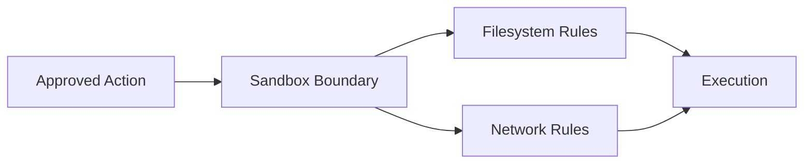

# s07: Sandbox & Permissions — 审批不等于权限

```mermaid
flowchart LR
    A["Approved Action"] --> S["Sandbox Boundary"]
    S --> F["Filesystem Rules"]
    S --> N["Network Rules"]
    F --> E["Execution"]
    N --> E
```

> 状态：待编写。目标是解释用户同意与操作系统实际限制之间的区别。

