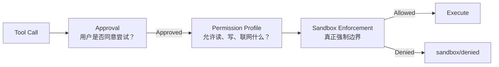

# s07: Sandbox & Permissions — 审批不等于权限



s06 已经能在副作用发生前暂停，等待用户批准。但“用户点击允许”只回答了一个问题：

> 我是否同意 Agent 尝试执行这个行动？

它没有回答：

> 这个进程实际上能访问哪些文件、网络和系统资源？

如果把 Approval 当成万能权限开关，Agent 一旦得到一次确认，就可能越过项目边界、读取敏感文件或
修改本不该写入的目录。本章在审批之后加入真正的运行时权限检查，建立 Approval、Permission
Profile 与 Sandbox 三层心智模型。

## 本章要解决的问题

考虑一个运行在 read-only 环境中的 Agent：

1. 模型提出修改 `greeting.txt`。
2. 用户批准这个 patch。
3. 运行时尝试写文件。

正确结果不是“批准后一定成功”，而是 sandbox 拒绝写入：

```text
approval/resolved → sandbox/denied → failed ToolResult
```

用户同意表达意图；sandbox 表达运行时事实。

## 心智模型：三种不同的边界

### Approval：是否同意尝试

Approval 是一次决策流程。它可以暂停执行、展示行动摘要，并产生 Approved、Denied 或 Abort 等
结果。

它适合回答：

- 是否允许执行这个命令？
- 是否允许修改这些文件？
- 是否对同类行动在本 session 中不再询问？

Approval 本身不是文件系统隔离机制。

### Permission Profile：这次运行拥有什么能力

Permission Profile 是声明式权限集合。本章教学版包含：

```python
@dataclass(frozen=True)
class PermissionProfile:
    name: str
    file_system: tuple[FileSystemRule, ...]
    network_enabled: bool = False
```

内置三个教学 profile：

| Profile | 文件系统 | 网络 |
|---|---|---|
| `read-only` | workspace 可读、不可写 | 禁止 |
| `workspace-write` | workspace 可写，保护 `.git` 与 `.codex` | 禁止 |
| `danger-full-access` | 教学 workspace 可写 | 允许 |

注意，教学版的 `danger-full-access` 仍受 `Workspace.resolve()` 的路径边界约束。它不是对整台机器
开放权限，只用于对比规则。

### Sandbox：真正执行权限检查

Sandbox 接收 Permission Profile，并在副作用发生前强制检查：

```python
workspace.sandbox.check_read(path)
workspace.sandbox.check_write(path)
workspace.sandbox.check_network(url)
```

本章教学版是进程内 sandbox model。它能可靠约束这些受控 Python 工具，但不能包含任意 shell
子进程。生产系统需要操作系统级 sandbox 才能形成真正的安全边界。

## 最小教学实现

### 路径规则

每条文件系统规则绑定一个绝对路径与访问模式：

```python
class AccessMode(str, Enum):
    DENY = "deny"
    READ = "read"
    WRITE = "write"


@dataclass(frozen=True)
class FileSystemRule:
    path: Path
    access: AccessMode
```

教学版采用两个解析原则：

1. 更具体的路径优先。
2. 同等具体度下，`DENY > WRITE > READ`。

因此 workspace 根可以整体可写，同时 `.git` 保持不可访问：

```python
PermissionProfile(
    name="workspace-write",
    file_system=(
        FileSystemRule(root, AccessMode.WRITE),
        FileSystemRule(root / ".git", AccessMode.DENY),
        FileSystemRule(root / ".codex", AccessMode.DENY),
    ),
)
```

### 默认拒绝

当路径没有匹配任何规则时，sandbox 返回 Deny，而不是猜测用户也许愿意放行：

```python
def _access_for(self, path: Path) -> AccessMode:
    matches = [...]
    if not matches:
        return AccessMode.DENY
```

默认拒绝（default deny）让遗漏规则变成失败，而不是意外授权。

### 审批预览与实际执行分离

`apply_patch` 在请求审批前仍然要验证 patch 是否有效、目标是否合法。预览保留读取既有目标所需的
权限检查，但不应假装 patch 已经拥有写权限：

```python
def preview_patch(self, patch: str) -> PatchPlan:
    plan = parse_patch(patch)
    self._verify(plan, enforce_write_permissions=False)
    return plan
```

获批后，执行阶段重新验证并强制检查写权限：

```python
def apply_patch(self, patch: str) -> PatchResult:
    plan = parse_patch(patch)
    staged = self._verify(plan, enforce_write_permissions=True)
    ...
```

这保留了两个不同事实：

- Approval Request 展示的是拟议行动。
- Sandbox 检查的是行动实际执行时的权限。

### Sandbox denial 是结构化运行时结果

教学版用 `SandboxDenial` 记录被拒绝的操作、目标、profile 和原因：

```python
@dataclass(frozen=True)
class SandboxDenial:
    operation: str
    target: str
    profile: str
    reason: str
```

`ApprovalOrchestrator` 在获批后执行工具。如果 sandbox 拒绝，它发出 `sandbox/denied`，再把失败
返回给模型：

```text
approval/requested
approval/resolved
sandbox/denied
FunctionCallOutput(Error: ...)
AgentMessage
```

模型可以据此解释失败或寻找不需要该权限的替代方案。

## 工作原理

完整 patch 路径如下：

```text
FunctionCall
  → ToolRegistry 参数验证
  → preview_patch 结构验证
  → approval/requested
  → Approved
  → WorkspaceSandbox.check_write
  → execute 或 sandbox/denied
  → ToolResult
```

read-only profile 下，即使用户批准，`check_write()` 得到的有效权限仍是 Read：

```text
effective access is read
```

文件保持不变，Turn 收到失败 ToolResult 后仍可正常完成。

网络权限使用独立开关。workspace-write 并不自动意味着可以联网：

```python
restricted = WorkspaceSandbox(PermissionProfile.workspace_write(root))
restricted.check_network("https://example.test")  # SandboxDenied
```

这避免把“能修改项目文件”错误扩展为“能访问任意外部服务”。

## 相对上一章的变化

s06 的执行路径是：

```text
validate → classify → approve → execute
```

s07 升级为：

```text
validate → classify → approve → enforce permissions → execute/deny
```

新增机制：

- `PermissionProfile`：声明文件系统和网络能力。
- `FileSystemRule` 与 `AccessMode`：表达路径级 Read、Write、Deny。
- `WorkspaceSandbox`：在工具执行边界强制检查。
- `SandboxDenied` 与 `sandbox/denied`：把运行时拒绝暴露给客户端。
- protected metadata 规则：workspace 可写时仍保护 `.git` 和 `.codex`。
- 模拟 `network_probe`：展示网络权限与文件权限独立。

保留机制：

- 审批请求仍发生在副作用之前。
- `ApprovedForSession` 仍只缓存精确 action keys。
- Denied、Abort 与 Forbidden 的语义不变。
- patch 仍先完整验证再提交，失败时不产生部分写入。

## 与真实 Codex 的对应关系

### PermissionProfile 是规范化运行权限

当前研究快照中，`codex-rs/protocol/src/models.rs` 的 `PermissionProfile` 明确区分：

- `Managed`：Codex 负责构造 sandbox。
- `Disabled`：不应用外层 sandbox。
- `External`：文件系统隔离由外部调用方负责。

真实 profile 同样把文件系统与网络权限分开。`read_only()` 默认文件系统只读且网络受限；
`workspace_write()` 增加 workspace 写权限但网络仍受限；`Disabled` 对应无外层 sandbox。

教学版借用了“规范化 profile → 运行时规则”的心智模型，但没有复刻真实类型。

### Orchestrator 先审批，再选择 Sandbox

`codex-rs/core/src/tools/orchestrator.rs` 把核心顺序写得很清楚：

```text
approval → select sandbox → attempt → optional escalated retry
```

真实 Codex 会根据文件系统策略、网络策略、工具偏好和平台能力选择初次 sandbox。首次尝试因
sandbox denial 失败后，某些审批策略允许再次请求无 sandbox 或扩展权限执行。

因此真实行为比“永远获批后仍留在原 sandbox”更细致。本章只实现第一轮权限强制，不实现升级重试。

### 权限规则由平台后端强制

当前快照中的主要后端包括：

- macOS：Seatbelt，通过固定 `/usr/bin/sandbox-exec` 和生成的 policy 执行。
- Linux：默认使用 bubblewrap；受限文件系统从只读根开始，再叠加 writable roots 与 carve-outs。
- Windows：根据 resolved permissions 选择 restricted-token 能力与可写根。

这正是教学版与生产实现的关键差异：生产 sandbox 的目标是约束工具内部启动的进程，而不只是让工具
函数主动调用 `check_write()`。

### Approval 不能静默抹掉 Deny

真实 Codex 支持特定条件下批准无 sandbox 执行，但源码对 denied-read 有额外保护：

- 如果无 sandbox 执行会丢失 denied-read 规则，则不能直接绕过 sandbox。
- additional permissions 合并时仍保留基础 deny entries。
- 集成测试确认父级命令获批后，命令仍无法读取被拒绝的 secret。

这说明“用户批准”与“删除所有安全限制”不是同义词。

### Workspace Write 也有内部保护边界

真实协议与平台实现会保护 `.git`、`.agents`、`.codex` 等 workspace metadata。可写根内部仍可
存在更具体的只读或拒绝路径。

教学版只保护 `.git` 和 `.codex`，用于展示“更具体规则覆盖宽泛授权”。

## 教学简化与生产边界

本章主动省略：

- 真正的 Seatbelt、bubblewrap、Landlock、restricted token、ACL 与 namespace 隔离。
- 任意 shell 子进程的强制约束；教学 sandbox 只覆盖主动接入检查的工具。
- `Managed`、`Disabled`、`External` enforcement 类型。
- special paths、glob deny、TMPDIR、多 workspace roots 与用户配置解析。
- managed network proxy、域名策略、DNS、socket 和网络审批。
- per-command additional permissions 与权限交集。
- sandbox denial 后的升级审批、重试与 telemetry。
- 各平台对 symlink、hard link、不存在路径和 deny-read 的不同实现细节。

教学版的 `danger-full-access` 也只在教学 workspace 内放宽规则，不代表真实整机权限。

## 可运行实验

### 实验一：观察获批后仍被拒绝

```bash
/Users/air/.local/bin/python3.11 s07_sandbox_permissions/code.py
```

示例使用 read-only profile。输出中会依次出现：

```text
approval/requested
approval/resolved
sandbox/denied
```

最终 `greeting.txt` 仍为 `hello`。

### 实验二：运行行为测试

```bash
/Users/air/.local/bin/python3.11 -m unittest discover \
  -s s07_sandbox_permissions -p 'test_*.py' -v
```

测试覆盖：

- read-only 允许读取但拒绝写入。
- 文件系统规则拒绝相对路径并规范化绝对路径。
- workspace-write 可以修改普通文件。
- 更具体的 `.git` deny 规则覆盖 workspace 写权限。
- 未匹配路径默认拒绝。
- 网络权限与文件权限独立。
- sandbox denial 产生结构化事件。
- 审批预览不能读取 deny 目标，也不会弹出审批请求。
- patch 获批后仍可被 read-only sandbox 拒绝。
- sandbox 拒绝后文件不变，Turn 可以继续完成。
- s06 的审批、拒绝、中止与 session cache 行为仍然成立。

### 实验三：比较两个 Profile

在测试或 REPL 中分别构造：

```python
Workspace(root, PermissionProfile.read_only(root))
Workspace(root, PermissionProfile.workspace_write(root))
```

对同一个已批准 patch：

- read-only 返回 `sandbox/denied`。
- workspace-write 提交修改。

这说明最终能力来自 active permission profile，而不是批准按钮本身。

## 小结与下一章

本章最重要的三个结论：

1. Approval 表达用户同意，Permission Profile 声明能力，Sandbox 强制边界。
2. 获批行动仍可能被 sandbox 拒绝；拒绝应成为结构化、可观察的运行时结果。
3. 宽泛授权内部仍需要更具体的 deny 或只读规则，网络权限也不应从文件权限隐式推导。

s08 将继续处理这些权限从哪里来：用户配置、项目配置、默认值与可信项目状态如何分层合并，并形成
最终生效的运行配置。
