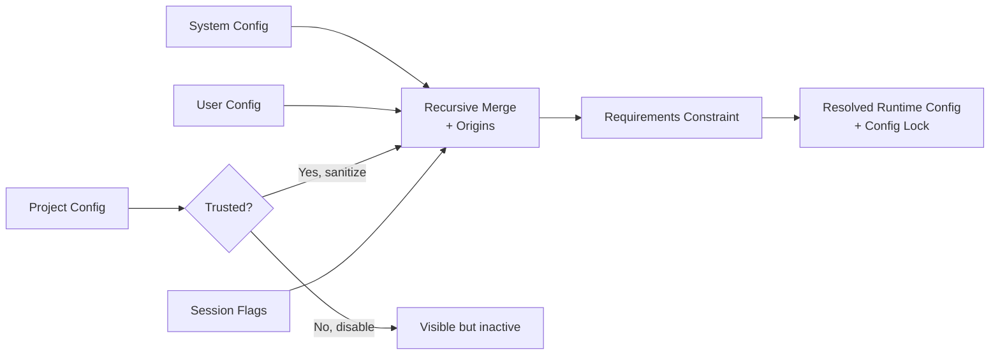

# s08: Config & Trust — 配置有层级，项目有边界



s07 建立了运行时边界，但它仍直接接收一个已经构造好的 `PermissionProfile`。真实 Coding Agent
不能把权限、模型、功能开关和审批策略全部硬编码在代码里，它需要从多个来源加载配置：

- 系统或企业默认值。
- 用户个人配置。
- 仓库中的项目配置。
- 当前 session 的临时覆盖。

问题在于，这些来源不具有相同的可信度和权力。项目配置来自正在处理的仓库内容，不能仅因为它离
当前目录更近，就允许它重定向凭据或关闭所有安全边界。

本章实现一个最小配置运行时，把“配置覆盖”“项目可信状态”“管理员约束”和“最终运行配置”分开。

## 本章要解决的问题

假设配置层提出了这些值：

```text
system:  model = gpt-default
user:    default_permissions = :workspace
project: default_permissions = :danger-full-access
project: model_provider = project-controlled-provider
session: model = gpt-session
```

直接按“后面的值覆盖前面的值”合并，会产生两个危险结果：

1. 仓库可以把模型请求重定向到它控制的 provider。
2. 仓库可以让 Agent 获得 full access。

正确的解析过程需要回答四个问题：

1. 普通配置层的优先级是什么？
2. 项目配置是否有资格参与合并？
3. 即使项目可信，哪些键仍不能由项目控制？
4. 合并后的选择是否满足管理员 requirements？

## 心智模型：输入、资格、约束、结果

配置解析不是一次字典覆盖，而是一条流水线：

```text
load layers
  → gate project layers by trust
  → sanitize project-local high-risk keys
  → recursively merge enabled layers
  → record per-field origins
  → apply requirements
  → compile resolved runtime config
  → snapshot config lock
```

这条流水线中有四种不同概念。

### Config Layer：谁提出了值

每个普通配置层保存来源、值和可选禁用原因：

```python
@dataclass(frozen=True)
class ConfigLayer:
    name: str
    source: ConfigSource
    values: Mapping[str, Any]
    disabled_reason: str | None = None
```

教学版按低优先级到高优先级保存：

```text
system → user → project → session
```

后面的启用层覆盖前面的层。

### Trust：项目层是否有资格生效

Trust 不是“这个仓库永远安全”的证明，而是用户是否允许项目级配置参与当前配置解析。

教学版区分：

```python
class TrustLevel(str, Enum):
    UNKNOWN = "unknown"
    TRUSTED = "trusted"
    UNTRUSTED = "untrusted"
```

未知或显式 untrusted 项目层不会消失。它们仍保留在 stack 中，并带有
`disabled_reason`，方便客户端解释“发现了项目配置，但没有应用”。

### Requirements：最终值允许是什么

Requirements 不是普通的高优先级 overlay。它不只是提出另一个值，而是限制哪些候选值可以进入
运行时：

```python
@dataclass(frozen=True)
class ConfigRequirements:
    allowed_permission_profiles: tuple[str, ...]
    default_permission_profile: str
```

如果普通配置最终选择 `:danger-full-access`，但 requirements 只允许 `:read-only` 和
`:workspace`，解析器会使用 requirements 指定的安全默认值，并产生 warning。

### Resolved Runtime Config：实际运行什么

最终结果同时保存：

- 合并后的配置值。
- 每个字段的来源。
- 实际生效的 permission profile id。
- 已编译的 `PermissionProfile`。
- 实际审批策略。
- warning。
- resolved config lock。

运行时应消费 resolved config，而不是在不同模块中反复猜测原始配置是什么意思。

## 最小教学实现

### 递归合并，而不是浅层覆盖

假设 system 层配置：

```python
{"features": {"shell": False, "memory": True}}
```

user 层只覆盖：

```python
{"features": {"shell": True}}
```

递归合并结果应保留 `memory`：

```python
{"features": {"shell": True, "memory": True}}
```

教学实现：

```python
def _merge_config(base: dict[str, Any], overlay: Mapping[str, Any]) -> None:
    for key, value in overlay.items():
        if isinstance(value, Mapping) and isinstance(base.get(key), dict):
            _merge_config(base[key], value)
        else:
            base[key] = copy.deepcopy(value)
```

当任一侧不再是 table 时，overlay 整体替换旧值。这与真实 Codex 的 TOML merge 核心规则一致。

### 字段来源与优先级同样重要

只知道最终 `model = "gpt-session"` 不够。调试配置问题时还需要知道它来自哪里：

```python
origins["model"] == "session"
origins["features.shell"] == "user"
origins["features.memory"] == "system"
```

来源信息让客户端可以解释：

> 为什么我的用户配置没有生效？

如果某个 scalar 覆盖了旧 table，旧 table 的子字段来源也会被清除，避免展示已经失效的来源。

### Disabled Layer 可见但不生效

项目未知或不可信时，教学版把项目层改写为：

```python
ConfigLayer(
    name="project",
    source=ConfigSource.PROJECT,
    values={},
    disabled_reason="project is untrusted",
)
```

它仍存在于 `stack.layers`，但 `effective_config()` 和 `origins()` 会跳过它。

这样同时满足：

- 安全：不执行仓库提供的配置。
- 可解释：UI 可以告诉用户为什么项目配置没有生效。

### Trusted 也不是无限授权

可信项目层仍经过 denylist 清理：

```python
PROJECT_LOCAL_CONFIG_DENYLIST = {
    "model_provider",
    "notify",
    "openai_base_url",
    "profile",
    "profiles",
}
```

例如项目可以设置本章教学版允许的 `approval_policy`，但不能把请求重定向到
`project-controlled-provider`。

被移除的键会产生 warning，而不是静默消失。

### Requirements 在 Merge 之后执行

普通配置先得出 requested profile：

```python
requested = effective["default_permissions"]
```

之后 requirements 再判断它是否允许：

```python
if requested not in requirements.allowed_permission_profiles:
    active = requirements.default_permission_profile
```

这刻意区别于“管理员配置层覆盖用户配置”：

- Config layer 说明某个来源提出了什么。
- Requirements 说明最终候选是否被允许。

### Trust 与 Permission 不是同一个开关

当前教学版沿用本章研究快照中的一个重要行为：

- trusted 项目默认选择 `:workspace`。
- 显式 untrusted 项目也默认选择 `:workspace`，但 approval policy 为 `unless-trusted`。
- trust unknown 时默认选择 `:read-only`。

这看起来有些反直觉，但能帮助建立正确边界：

> Trust 决定项目配置能否生效，也参与默认策略选择；它不等同于一个简单的 sandbox 开关。

requirements 仍可把这些默认值进一步限制为更保守的 profile。

### Config Lock 检测解析结果漂移

教学版在 resolved config 上创建内存快照：

```python
lock = ConfigLock(copy.deepcopy(resolved_values))
```

之后可验证候选配置是否仍与原运行配置一致：

```python
resolved.lock.verify(candidate)
```

如果 model、权限或其他 resolved 值发生变化，验证失败。它展示的是“锁定实际运行结果”的概念，
而不是锁定某个原始配置文件。

## 工作原理

本章示例的解析路径如下：

```text
system model=gpt-default
  → user default_permissions=:workspace
  → trusted project requests :danger-full-access
  → project model_provider is removed by denylist
  → session model=gpt-session
  → recursive merge
  → requirements reject :danger-full-access
  → fallback :read-only
  → build s07 WorkspaceSandbox
```

因此最终可以同时观察到：

```text
active permission profile: :read-only
model origin: session
config warning: project layer ignored model_provider
config warning: :danger-full-access disallowed by requirements
```

模型随后提出 patch，用户批准，但 s07 sandbox 根据 resolved read-only profile 拒绝写入。

配置解析和权限执行由此连成一条完整链路：

```text
config inputs → resolved profile → sandbox enforcement
```

## 相对上一章的变化

s07 直接构造运行权限：

```python
Workspace(root, PermissionProfile.read_only(root))
```

s08 改为先解析配置：

```python
config = ConfigLayerStack(...).resolve(root)
Workspace(root, config.permission_profile)
```

新增机制：

- `ConfigSource` 与 `ConfigLayer`：表示普通配置来源。
- `ConfigLayerStack`：验证优先级、递归合并和记录 origins。
- `TrustLevel`：控制项目层是否参与合并。
- project-local denylist：可信项目也不能控制高风险键。
- `ConfigRequirements`：约束最终 permission profile。
- `ResolvedRuntimeConfig`：集中保存实际运行配置。
- `ConfigLock`：检测 resolved config 漂移。

继承机制：

- s07 的 `PermissionProfile` 与 `WorkspaceSandbox`。
- Approval、Tool Registry、Event Stream 与结构化 patch。
- 获批后仍由最终 resolved sandbox 权限决定能否执行。

## 与真实 Codex 的对应关系

### ConfigLayerStack 保留层、结果和来源

真实 `codex-rs/config/src/state.rs` 的 `ConfigLayerStack` 同样：

- 按低优先级到高优先级保存 layers。
- 只合并 enabled layers。
- 保留 disabled layers 供 UI 使用。
- 提供 effective config 与 per-key origins。
- 把 requirements 与普通配置层分开保存。

真实层列表比教学版丰富，包括 enterprise managed、用户 profile、多个 project 层、session flags
以及兼容期 managed config。

### Project Config 由 Trust Gate 控制

真实 loader 会从 project root 到 cwd 查找 `.codex/config.toml`。越接近 cwd 的项目层优先级越高。

如果项目未知或不可信：

- project layer 会带 `disabled_reason`。
- 不参与 effective config。
- 即使项目配置 TOML 无效，也不会像 trusted 项目那样中止加载。

这不是简单地“找不到配置”，而是“找到了，但没有资格应用”。

### Trusted Project 仍有 Denylist

`codex-rs/config/src/loader/mod.rs` 明确说明：项目本地配置来自仓库内容，因此不应该决定凭据发送位置
或本地通知命令。

当前源码会清理 provider、base URL、notify、profile/profiles、otel 等顶层键。教学版只保留其中
一小部分代表性键。

### Requirements 不是最高优先级 Config

真实 Codex 单独加载并组合 requirements。它们可以限制：

- permission profiles。
- approval policies。
- sandbox modes。
- features。
- web search、MCP、hooks、rules 和其他受管理能力。

`Constrained<T>` 允许运行时探测和设置候选值，但违反 requirements 的修改会被拒绝或规范化。

教学版只实现 permission profile allowlist 与 fallback。

### Trust 不等于 Read-Only

当前快照中的默认推导显示：

- 显式 trusted 或 untrusted 项目都可默认使用 workspace profile。
- untrusted 项目默认使用更严格的 `UnlessTrusted` approval policy。
- unknown 项目更保守。

因此正文不把“untrusted”简化为“必然 read-only”。真实权限结果还受到平台能力、显式配置和
requirements 影响。

### Config Lock 锁定 Resolved 行为

真实 config lock 会从 effective layer stack 开始，再写入 session 构造、默认值、feature
materialization 等阶段得到的 resolved 值。

Replay validation 会检查 lock version、Codex version 和 resolved config 差异。教学版只实现内存
等值比较，但保留“比较实际运行结果，而不只是原始输入”的核心心智模型。

## 教学简化与生产边界

本章主动省略：

- TOML 文件读取、严格 schema 校验、key aliases 和相对路径解析。
- enterprise cloud、MDM、system requirements 与 legacy managed config 的完整层级。
- 用户 profile 文件和旧 profile table。
- project root marker、git root、worktree、canonical path 与多层 `.codex` 自动发现。
- 真实 project trust map 的持久化和编辑。
- 完整 project-local denylist。
- named permission profiles、extends、profile compilation 与 workspace roots。
- approval、feature、MCP、hook、rule 和网络 requirements。
- `Constrained<T>` 的运行时 mutation API。
- config layer version、optimistic concurrency 和完整 diagnostics。
- config lock TOML 导出、Codex version 检查与 replay。

教学版继续使用 s07 的进程内 sandbox，不声称配置解析本身能够提供操作系统隔离。

## 可运行实验

### 实验一：观察配置解析如何影响 Sandbox

```bash
/Users/air/.local/bin/python3.11 s08_config_and_trust/code.py
```

重点观察：

- session 层成为 `model` 的来源。
- trusted project 的 `model_provider` 仍被忽略。
- project 请求的 full access 被 requirements 回退为 read-only。
- patch 获批后仍被 resolved read-only sandbox 拒绝。

### 实验二：运行行为测试

```bash
/Users/air/.local/bin/python3.11 -m unittest discover \
  -s s08_config_and_trust -p 'test_*.py' -v
```

测试覆盖：

- 层必须按低到高优先级排列。
- stack 保存输入层快照，不受调用方后续修改影响。
- table 递归合并，scalar 整体替换 table。
- 字段 origins 随最终值更新。
- unknown 与 untrusted project layers 可见但不生效。
- trusted project 仍不能设置 denylisted keys。
- requirements 保留允许的 profile，并回退被禁止的 profile。
- trust、默认 permission profile 与 approval policy 的独立关系。
- config lock 检测 resolved config 漂移。
- resolved permission profile 驱动 s07 sandbox。
- s01-s07 继承的审批、事件与工具行为仍然成立。

### 实验三：切换 Trust

把相同项目层分别传入：

```python
TrustLevel.UNKNOWN
TrustLevel.UNTRUSTED
TrustLevel.TRUSTED
```

观察：

- unknown 与 untrusted 项目层带 `disabled_reason`，不进入 effective config。
- trusted 项目层应用允许的键，但高风险 denylist 键仍被清理。
- untrusted 与 unknown 的默认运行策略并不完全相同。

## 小结与下一章

本章最重要的四个结论：

1. 配置层说明“谁提出了值”，Trust 决定“项目层是否有资格生效”。
2. Trusted 不代表项目可以控制所有配置，高风险键仍需要来源边界。
3. Requirements 不是普通覆盖层，而是约束最终候选值的独立机制。
4. 运行时应消费 resolved config，并能解释字段来源、回退原因与配置漂移。

s09 将在这套安全运行时上加入 Hooks 与 Policy：如何在工具生命周期中扩展行为，同时避免把扩展逻辑
散落进主循环。
