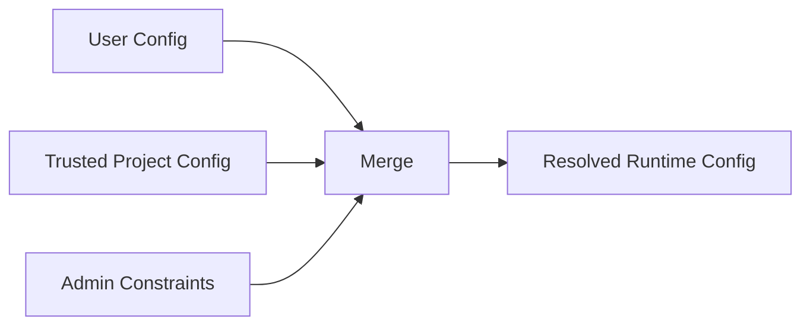

# s08: Config & Trust — 配置有层级，项目有边界

```mermaid
flowchart LR
    U["User Config"] --> M["Merge"]
    P["Trusted Project Config"] --> M
    A["Admin Constraints"] --> M
    M --> R["Resolved Runtime Config"]
```

> 状态：待编写。目标是实现配置分层、优先级与可信项目判断。

