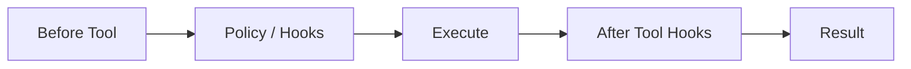

# s09: Hooks & Policy — 围绕生命周期扩展

```mermaid
flowchart LR
    B["Before Tool"] --> P["Policy / Hooks"]
    P --> E["Execute"]
    E --> A["After Tool Hooks"]
    A --> R["Result"]
```

> 状态：待编写。目标是在不改写主循环的情况下加入审计、策略和扩展点。

