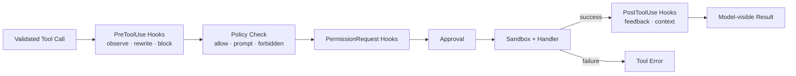

# s09: Hooks & Policy — 围绕生命周期扩展



s08 已经能从配置解析出权限并驱动安全运行时，但扩展逻辑仍然容易散落到 Tool Router、
Approval Orchestrator 和每个 Handler 里。

例如团队可能希望：

- 在每次工具调用前写审计记录。
- 把旧命令重写为团队认可的新命令。
- 在审批出现前由 managed policy 自动允许或拒绝。
- 在工具成功后补充反馈。
- 用规则统一判断哪些 shell 命令可直接运行、必须询问或永远禁止。

如果把这些判断逐个写进主循环，Agent 很快会变成无法理解的条件分支集合。本章加入
**Hooks** 与 **Exec Policy**，让扩展点和策略判断都拥有明确边界。

## 本章要解决的问题

考虑一条模型提出的命令：

```text
git status
```

运行时可能依次遇到这些决定：

1. PreToolUse hook 是否要审计、阻断或重写输入？
2. Exec Policy 对最终命令的判断是 allow、prompt 还是 forbidden？
3. 如果需要审批，PermissionRequest hook 是否直接给出 allow / deny？
4. 如果仍无决定，用户是否批准？
5. Sandbox 是否允许实际执行？
6. 成功后 PostToolUse hook 是否需要提供反馈？

这些步骤都能影响结果，但职责不同。把它们压成一个 `is_allowed()` 会失去解释能力，也容易让
一个扩展点意外绕过安全边界。

## 心智模型：扩展与裁决分开

本章使用两条相邻但独立的机制。

### Hooks：在稳定生命周期点扩展

Hook 回答的是：

> “当运行时走到这个生命周期点时，还需要执行哪些额外逻辑？”

教学版实现三个工具事件：

```text
PreToolUse       工具执行前：观察、重写或阻断
PermissionRequest 审批出现时：allow、deny 或不做决定
PostToolUse      成功输出后：审计或替换模型可见反馈
```

Hook 不应偷偷成为无限权限入口。即使 PermissionRequest hook 返回 allow，后续 sandbox 仍会执行。

### Exec Policy：把命令分类为决策

Policy 回答的是：

> “根据当前规则，这条命令需要什么处理？”

教学版保留真实 Codex 的三个核心决策：

```python
class PolicyDecision(str, Enum):
    ALLOW = "allow"
    PROMPT = "prompt"
    FORBIDDEN = "forbidden"
```

它们映射到已有审批管线：

```text
allow      → Skip
prompt     → NeedsApproval
forbidden  → Forbidden
```

Policy 不执行命令、不代表用户同意，也不替代 sandbox。

## 最小教学实现

### Hook Registration

每个 hook 声明名称、事件、callback 和可选工具匹配条件：

```python
@dataclass(frozen=True)
class HookRegistration:
    name: str
    event_name: HookEventName
    callback: HookCallback
    tool_name: str | None = None
```

`tool_name=None` 表示匹配所有工具；教学版不实现正则表达式和兼容 alias。

Hook callback 接收稳定上下文：

```python
@dataclass(frozen=True)
class HookContext:
    event_name: HookEventName
    turn_id: str
    call_id: str
    tool_name: str
    arguments: Mapping[str, JsonType]
    output: str | None = None
```

它不直接拿到 Router、Handler 或任意内部对象，这能减少扩展对运行时实现细节的耦合。

### PreToolUse：先扩展，再重新验证

Pre hook 可以返回新的参数：

```python
HookResult(updated_arguments={"command": ["echo", "reviewed"]})
```

Router 的顺序是：

```text
registry resolve + initial validation
  → pre hooks
  → validate rewritten arguments again
  → policy / approval / sandbox / handler
```

重新验证非常重要。Hook 是扩展代码，不应因为它在内部运行，就能把非法输入送进 Handler。

如果 hook 返回：

```python
HookResult(block_reason="command violates local policy")
```

调用会在审批和 Handler 执行前结束，并把模型可见错误返回给下一轮 sampling。

### PermissionRequest：只接管审批问题

PermissionRequest hook 只在动作已经被分类为 `NeedsApproval` 时运行：

```text
permission hook allow → 执行后续 sandbox + handler
permission hook deny  → 拒绝，不展示用户审批
no decision           → 回退到正常用户审批
```

多个决策采取保守规则：

```text
任意 deny > allow > no decision
```

这里的 allow 只回答“是否批准这次意图”，并不回答“实际权限是否允许”。

### PostToolUse：只处理成功结果

教学版只在 Handler 成功返回后运行 PostToolUse：

```python
HookResult(feedback="checked by post hook")
```

如果存在 feedback，它替换模型可见结果。失败工具调用不会触发 PostToolUse，因为没有成功结果可供
扩展。

### Hook 事件与 Fail-Open

每个教学 hook 发出：

```text
hook/started
hook/completed
```

完成状态可以是 `completed`、`blocked` 或 `failed`。教学版 callback 抛出异常时记录失败，但默认
继续工具调用：

```text
hook failure → visible failed event → operation continues
```

这是教学选择，不是所有 hook 类型的通用生产承诺。明确的 block / deny 仍然会停止动作。

### Prefix Rules 与最严格决策

教学 policy 使用 token prefix：

```python
ExecPolicy(
    [
        PrefixRule(("git",), PolicyDecision.PROMPT),
        PrefixRule(("git", "push"), PolicyDecision.FORBIDDEN),
        PrefixRule(("git", "status"), PolicyDecision.ALLOW),
    ]
)
```

`git push origin main` 同时命中 `git` 与 `git push`，最终必须取更严格的 `forbidden`：

```text
forbidden > prompt > allow
```

没有规则匹配时，教学版使用显式 fallback。示例默认使用 `prompt`，避免把未知命令静默当成安全。

## 工作原理

第九章的 Tool Router 形成以下顺序：

```text
FunctionCall
  → Registry.resolve()
  → HookEngine.run_pre_tool_use()
  → validate rewritten input
  → Handler.approval_requirement()
      → SimulatedExecHandler asks ExecPolicy
  → PermissionRequest hooks when approval is needed
  → user approval when hooks do not decide
  → Sandbox / Handler
  → HookEngine.run_post_tool_use() on success
  → ToolResult
```

这个顺序带来几个关键保证：

- Pre hook 阻断时，用户不会看到无意义审批。
- Pre hook 重写的最终命令会重新进入 policy，而不是沿用旧命令的决定。
- Forbidden policy 不会被送给用户询问“是否仍要执行”。
- Permission hook allow 不会关闭 sandbox。
- Post hook 不会把失败工具伪装成成功结果。

## 相对上一章的变化

s08 的工具路径是：

```text
resolve config → validate → approval → sandbox → handler
```

s09 变为：

```text
resolve config
  → validate
  → pre hooks
  → policy
  → permission hooks / approval
  → sandbox
  → handler
  → post hooks
```

新增机制：

- `HookEventName`、`HookContext`、`HookResult` 与 `HookRegistration`。
- `HookEngine` 及结构化 hook lifecycle events。
- `PolicyDecision`、`PrefixRule`、`PolicyEvaluation` 与 `ExecPolicy`。
- 离线 `SimulatedExecHandler`，展示 policy 如何产生审批需求。

继承机制：

- s08 的 config、trust、requirements 与 resolved runtime config。
- s07 的 permission profile 与 sandbox。
- s06 的 approval request、session cache 与决策状态。
- s01-s05 的 Thread、Event、Registry、Router 与文件工具。

## 与真实 Codex 的对应关系

### Hooks Engine 有稳定输入与事件状态

真实 `codex-rs/hooks/` 会发现配置或 plugin 提供的 handlers，并按事件与 matcher 选择。

运行前可以 preview 匹配 handlers，使客户端显示 pending hook；完成后会记录状态、耗时、来源与输出
entries。教学版只保留 started/completed 和简化状态。

### PreToolUse 位于 Handler 前

真实 `core/src/tools/registry.rs` 在确认工具和 payload 后先通知 lifecycle start，再运行
PreToolUse。Hook 可以 block 或返回 updated input，具体 Handler 负责把更新后的稳定 hook input
重新构造成真实 invocation。

教学版同样在 handler 前运行并重新验证输入，但直接使用 Python mapping。

### PermissionRequest 位于审批路径

真实 `core/src/tools/orchestrator.rs` 在需要审批时先运行 PermissionRequest hooks。明确 allow 或 deny
会优先于 Guardian / 用户 UI；无决定时继续正常审批。

这不会跳过后续 sandbox selection。教学版保留同样边界。

### PostToolUse 只接收稳定成功结果

真实 registry 只在工具成功且 Handler 提供 `post_tool_use_payload` 时运行 PostToolUse。传给 hook 的
tool name、input 和 response 已由 Handler 适配为稳定契约，避免暴露内部结构。

真实运行时还能把 feedback 包装为新的模型可见输出，同时保留原始结果用于日志。教学版直接替换
字符串。

### Exec Policy 与 Hooks 不是同一机制

真实 `codex-execpolicy` 使用 prefix rules 判断命令，支持 allow、prompt 与 forbidden。一个命令或
多个命令段命中多条规则时，取最严格决策。

`core/src/exec_policy.rs` 再把 evaluation 编译为 `ExecApprovalRequirement`，并结合 approval policy、
permission profile、sandbox request 与 fallback heuristics。

教学版只实现 prefix rule 到 approval requirement 的核心路径。

### Allow 不等于无 Sandbox

真实 Core 只有在所有解析命令段都被显式 allow rule 覆盖等条件下，才可能让首轮执行绕过 sandbox。
因此正文不把 policy allow 写成“获得全部权限”。

## 教学简化与生产边界

本章主动省略：

- 外部 command hooks、JSON stdin/stdout schema、timeout 与并发执行。
- 真实 PreToolUse handlers 基于同一输入并发运行、按完成顺序选择 rewrite；教学版串行链式重写。
- 真实 PermissionRequest 执行匹配 handlers 后折叠决定；教学版遇到首个 deny 即短路。
- regex matcher、matcher aliases、plugin hooks、managed hooks 和 trust hash。
- SessionStart、Stop、compact、subagent 等非工具 hook。
- additional context 注入、output spill 和完整 hook output entries。
- extension lifecycle contributor API。
- Starlark `.rules` parser、规则目录加载与 rules diagnostics。
- shell 字符串、复合命令、heredoc、PowerShell 和 host executable 解析。
- network rules、requirements exec policy 与 policy amendment。
- 真实子进程执行和操作系统 sandbox。

教学版 `SimulatedExecHandler` 永远不启动命令。真实命令 policy 必须与可靠解析、审批和 OS sandbox
共同工作。

## 可运行实验

### 实验一：观察 Hook、Policy 与审批边界

```bash
/Users/air/.local/bin/python3.11 s09_hooks_and_policy/code.py
```

重点观察：

- `git status` 先被 PreToolUse hook 重写成 `echo`。
- 重写后的 `echo` 由 policy 直接 allow，不产生用户审批。
- 成功结果被 PostToolUse feedback 替换。
- `rm` 被 policy 直接 forbidden。
- 后续 patch 仍需审批，并继续受到 read-only sandbox 拒绝。

### 实验二：运行行为测试

```bash
/Users/air/.local/bin/python3.11 -m unittest discover \
  -s s09_hooks_and_policy -p 'test_*.py' -v
```

测试覆盖：

- 多条 prefix rule 取最严格决策。
- 未匹配命令使用显式 fallback。
- policy decision 映射为 Skip、NeedsApproval 与 Forbidden。
- Pre hook 在 policy 前重写，或在审批前阻断。
- Pre hook 重写后的参数会再次验证。
- Permission hook allow / deny / no-decision。
- 任意 permission deny 胜出。
- Post hook 只在成功后运行并可替换模型可见输出。
- hook failure 可见且教学版 fail-open。
- s01-s08 的配置、sandbox、审批、事件和工具行为仍然成立。

## 小结与下一章

本章最重要的四个结论：

1. Hooks 是稳定生命周期上的扩展点，不应散落在主循环和每个 Handler 中。
2. Exec Policy 负责分类命令，Approval 负责确认意图，Sandbox 负责强制权限。
3. Pre、PermissionRequest 与 Post hooks 位于不同阶段，不能互相替代。
4. 可扩展运行时必须让 hook 状态、policy 决策和最终执行结果都可解释。

s09 完成了 **M2 Safe Runtime**。s10 将进入 **M3 Context Architecture**，首先解释仓库级
`AGENTS.md` 指令如何按目录层级发现、组合并进入模型上下文。
