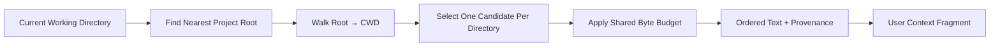

# s10: AGENTS.md — 让仓库自己解释规则



前九章构造了一个有工具、安全边界和扩展点的 Agent Runtime，但模型仍只看到用户当前提出的任务。
它不知道这个仓库怎样测试、哪些目录使用不同风格，也不知道提交说明必须包含什么。

把这些知识硬编码进 Agent 会让运行时与每个仓库耦合。更好的做法是让仓库通过 `AGENTS.md`
提供项目级指令（project instructions），并由运行时根据当前工作目录加载真正相关的部分。

本章实现一个最小层级加载器，回答四个问题：

1. 从哪里开始寻找项目指令？
2. 当前目录应该加载哪些文件？
3. 多份指令如何排序、限制大小并保留来源？
4. 最终怎样成为模型可见上下文，而不是偷偷修改运行权限？

## 本章要解决的问题

假设仓库结构如下：

```text
repo/
├── .git/
├── AGENTS.md
└── packages/
    └── api/
        ├── AGENTS.override.md
        └── handler.py
```

当 Agent 在 `repo/packages/api` 工作时，它需要同时看到：

- 根目录 `AGENTS.md` 中适用于整个仓库的规则。
- `packages/api/AGENTS.override.md` 中更接近当前目录的规则。

但它不应继续越过 `repo`，读取父目录中无关项目的文档；也不能无限读取大型文件，把上下文窗口全部
占满。

还有一个容易混淆的边界：

> `AGENTS.md` 是模型应该遵循的上下文指令，不是操作系统权限或配置层。

它能告诉 Agent “运行测试”，但不能直接授予网络、文件写入或无审批执行能力。

## 心智模型：发现、选择、加载、渲染

完整流程可以拆成四个阶段：

```text
find project root
  → enumerate directories root to cwd
  → choose one candidate file per directory
  → read under a shared byte budget
  → preserve ordered entries and sources
  → render a model-visible user context fragment
```

### Project Root：限定搜索上界

教学版默认向上寻找最近的 `.git`：

```python
AgentsMdLoader(project_root_markers=(".git",))
```

如果找到 marker，就从该目录加载到 cwd；如果没有找到，只检查 cwd。

这与“从文件系统根一路向下找”不同。项目根是当前加载任务的上边界。

显式空 marker 列表表示禁用父级遍历：

```python
AgentsMdLoader(project_root_markers=())
```

此时同样只检查 cwd。

### Candidate Priority：每层只选择一份文档

每个目录中的候选优先级是：

```text
AGENTS.override.md
AGENTS.md
configured fallback filenames
```

例如同一目录同时存在：

```text
AGENTS.override.md
AGENTS.md
WORKFLOW.md
```

只选择 `AGENTS.override.md`。这里的 override 是候选文件覆盖，不是把同目录所有文档拼起来。

### Hierarchy：从根到叶保持顺序

加载顺序为：

```text
repo/AGENTS.md
repo/packages/AGENTS.md
repo/packages/api/AGENTS.override.md
```

根级规则先进入上下文，较深目录规则随后进入。当前 Codex 的层级提示明确告诉模型：当文件作用域
覆盖当前任务且规则冲突时，更深层 `AGENTS.md` 优先；system、developer 和用户直接提示仍高于
`AGENTS.md`。

教学加载器不解析规则，也不执行结构化覆盖。它保留层级顺序，把解释和遵循规则的任务交给模型。

### Byte Budget：项目文档共享有限预算

教学版默认预算与当前 Codex 快照一致，为 32 KiB：

```python
AgentsMdLoader(max_bytes=32 * 1024)
```

预算在一个项目环境的所有文档之间共享。根目录先消耗预算，因此后面的深层文档可能被截断：

```text
budget = 7 bytes
root AGENTS.md = "root"    → consumes 4
nested AGENTS.md = "abcdef" → only "abc" remains
```

空白文档不会成为有效条目，也不会消耗预算。`max_bytes=0` 会关闭项目文档加载，但不会删除调用方
单独提供的用户级指令。

## 最小教学实现

### 有来源的 Instruction Entry

加载结果不能只是一段字符串。每一段都需要保留真实来源：

```python
@dataclass(frozen=True)
class InstructionEntry:
    contents: str
    source_path: Path
```

来源用于：

- 向用户解释某条规则从哪里来。
- 调试不符合预期的项目行为。
- 支持未来的刷新、审计和多环境标记。

### 发现搜索目录

教学版先寻找最近 marker，再生成从根到 cwd 的目录序列：

```python
def _search_dirs(self, cwd: Path) -> tuple[Path, ...]:
    if not self.project_root_markers:
        return (cwd,)

    project_root = None
    for ancestor in (cwd, *cwd.parents):
        if any((ancestor / marker).exists()
               for marker in self.project_root_markers):
            project_root = ancestor
            break

    if project_root is None:
        return (cwd,)
```

“最近”很重要。如果嵌套仓库自身有 `.git`，加载器不会继续读取外层仓库的项目指令。

### 每目录选择首个普通文件

```python
for directory in search_dirs:
    for filename in self.candidate_filenames():
        candidate = directory / filename
        if candidate.is_file():
            found.append(candidate)
            break
```

`is_file()` 让目录形式的 `AGENTS.md` 不会阻断后续候选。教学版允许指向普通文件的 symlink。

### 按字节截断，而不是按字符猜测

预算单位是 bytes：

```python
data = path.read_bytes()
if len(data) > remaining:
    data = data[:remaining]
text = data.decode("utf-8", errors="replace")
```

如果截断落在多字节 UTF-8 字符中，教学版会用 replacement character 保留可解码结果；只有原文件
本身包含无效 UTF-8 时才产生对应损坏 warning。它不会因为一个损坏文档而静默丢掉所有其他项目
指令。

### 区分用户级与项目级指令

调用方还可以提供独立的 user instructions：

```python
loaded = loader.load(
    cwd,
    user_instructions="Keep explanations concise.",
    user_source=user_agents_path,
)
```

项目文档首次出现时，二者之间加入明确边界：

```text
Keep explanations concise.

--- project-doc ---

Use structured patches.
```

这不是权限优先级计算器，而是给模型和客户端的来源提示。

### 渲染为用户上下文片段

教学版最终渲染：

```text
# AGENTS.md instructions for /repo/packages/api

<INSTRUCTIONS>
...
</INSTRUCTIONS>
```

这里刻意使用 user context，而不是 system prompt。真实 Codex 当前同样把加载后的 `AGENTS.md`
渲染为 contextual user fragment，并在 TurnContext 中保存。

## 工作原理

`AgentsMdLoader.load()` 的完整路径是：

```text
cwd
  → _search_dirs()
  → candidate_filenames()
  → discover()
  → read bytes root to cwd
  → truncate against remaining budget
  → decode with warnings
  → skip whitespace entries
  → LoadedProjectInstructions
  → text() / sources() / render()
```

加载结果同时回答三个不同问题：

```text
text()    模型看到什么？
sources() 内容来自哪里？
render()  怎样作为上下文片段注入？
```

把三者分开，能避免“最终字符串正确，但无法解释其来源”的问题。

## 相对上一章的变化

s09 完成了安全运行时：

```text
tool call → hooks → policy → approval → sandbox → result
```

s10 开始构造模型真正看到的项目世界：

```text
filesystem + cwd + config knobs
  → scoped project instructions
  → model-visible context fragment
```

新增机制：

- `InstructionEntry`：保存文本与来源路径。
- `LoadedProjectInstructions`：保存 cwd、用户指令、项目条目、warnings 和渲染逻辑。
- `AgentsMdLoader`：实现根发现、候选优先级、层级遍历与累计预算。

本章没有改变 s01-s09 的工具执行路径。`AGENTS.md` 影响模型决策，但不绕过 Policy、Approval 或
Sandbox。

## 与真实 Codex 的对应关系

### 根发现不越界

真实 `codex-rs/core/src/agents_md.rs` 从 cwd 向上查找配置的 `project_root_markers`，默认使用
`.git`。找到后只搜索项目根到 cwd；未找到或 markers 为空时只看 cwd。

当前实现还会忽略 project config layers 对 `project_root_markers` 的覆盖，避免仓库内容改写自身
发现边界。教学版不从 config stack 读取 markers，因此没有这条额外处理。

### 同目录候选有严格优先级

真实候选顺序同样是：

```text
AGENTS.override.md → AGENTS.md → configured fallbacks
```

它只选择每个目录中的首个普通文件。目录、FIFO 等特殊文件不会成为项目文档。

### 字节预算按环境独立

真实 `project_doc_max_bytes` 默认是 32 KiB。一个环境内根到 cwd 的项目文档共享预算。

真实 Codex 还支持多个绑定环境，每个环境独立获得一份预算，并按 environment id 与 cwd 标记最终
文本。当前源码明确留下了未来增加跨环境 aggregate cap 的 TODO；教学版只实现单环境。

### LoadedAgentsMd 保留 Provenance

真实 `LoadedAgentsMd` 分开保存：

- Host 提供的 user instructions。
- 有序项目与内部 instruction entries。
- 每个项目 entry 的 source path、environment id 与 cwd。

它能生成模型可见文本、列出 sources，并按单环境或多环境布局渲染。

### AGENTS.md 是 User Context

Session 初始化时加载项目指令，TurnContext 再调用 `LoadedAgentsMd::render()`，生成
`# AGENTS.md instructions...<INSTRUCTIONS>` 用户上下文片段。

因此本章不把 AGENTS.md 描述为 system role，也不把它与配置、Skills 或权限 profile 混合。

### Child Guidance 是独立内部提示

当前 `child_agents_md` feature 开启时，真实 Codex 会追加一段内部层级说明，解释目录作用域、
深层规则优先，以及直接 prompt 指令高于 AGENTS.md。

教学版在正文解释该规则，但不自动追加内部提示。

## 教学简化与生产边界

本章主动省略：

- 多环境绑定、environment labels 与跨环境加载。
- `ExecutorFileSystem`、远程文件系统、`PathUri` 和异步 I/O。
- 从 ConfigLayerStack 解析 markers、fallbacks 与预算。
- Project layer 不得覆盖 root markers 的真实保护逻辑。
- 完整 provenance 类型与 internal instruction entries。
- `child_agents_md` feature guidance 注入。
- 文件发现和读取之间的完整竞态与 I/O 错误策略。
- 动态刷新、文件监听和 mid-session 重新加载。
- 将 rendered fragment 真正接入模型请求。

教学版只加载当前 cwd 对应的项目层级。它不尝试为一次跨多个子目录的修改分别重算每个目标文件的
作用域；真实层级说明要求 Agent 在修改文件时遵守覆盖该文件的所有 `AGENTS.md`。

## 可运行实验

### 实验一：观察来源、层级与渲染

```bash
/Users/air/.local/bin/python3.11 s10_agents_md_instructions/code.py
```

演示会创建：

```text
repo/AGENTS.md
repo/packages/api/AGENTS.override.md
```

重点观察：

- Sources 按 user、根级项目、深层项目顺序输出。
- 同层 override 文件成为选中的深层文档。
- User instructions 与 project docs 之间出现边界标记。
- 最终内容被包装为模型可见用户上下文。
- 后续工具运行仍经过 hooks、policy、approval 与 sandbox。

### 实验二：运行行为测试

```bash
/Users/air/.local/bin/python3.11 -m unittest discover \
  -s s10_agents_md_instructions -p 'test_*.py' -v
```

本章测试覆盖：

- 从项目根到 cwd 发现并排序文档。
- 最近根 marker 阻止越过嵌套仓库。
- 没有 marker 或 markers 为空时只检查 cwd。
- 每目录候选优先级、fallback 去重和普通文件判断。
- 累计字节预算截断后续文档。
- 空白文档不消耗预算。
- 无效 UTF-8 replacement 与 warning。
- 有效 UTF-8 被字节截断时 lossy 解码，但不误报原文件损坏。
- 零预算关闭项目 docs，但保留 user instructions。
- User/project 分隔、sources 和 render wrapper。
- s01-s09 继承行为继续成立。

## 小结与下一章

本章最重要的四个结论：

1. `AGENTS.md` 加载必须有明确项目根，不能无边界向父目录搜索。
2. 同一目录按候选优先级只选择一个文档，不是全部拼接。
3. 层级顺序、累计字节预算与 provenance 共同决定可解释的模型上下文。
4. 项目指令影响模型行为，但不替代配置、审批、策略或 sandbox。

s11 将把 `AGENTS.md` 与环境信息、权限说明、Skills 等内容统一建模为有界
**Context Fragments**，解释成熟 Agent 如何组装模型每轮真正看到的上下文。
