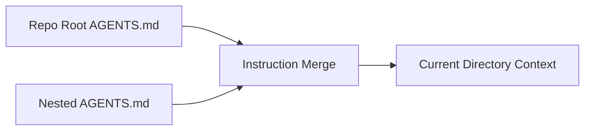

# s10: AGENTS.md — 让仓库自己解释规则

```mermaid
flowchart LR
    R["Repo Root AGENTS.md"] --> M["Instruction Merge"]
    N["Nested AGENTS.md"] --> M
    M --> C["Current Directory Context"]
```

> 状态：待编写。目标是加载具有目录作用域的仓库级指令。

