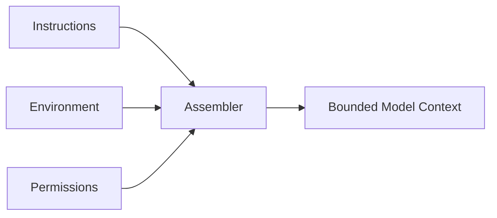

# s11: Context Fragments — 有界地构造模型世界

```mermaid
flowchart LR
    I["Instructions"] --> A["Assembler"]
    E["Environment"] --> A
    P["Permissions"] --> A
    A --> B["Bounded Model Context"]
```

> 状态：待编写。目标是用有界、可追踪的片段组装运行时上下文。

