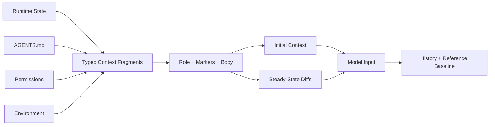

# s11: Context Fragments — 有界地构造模型世界



前一章解决了 `AGENTS.md` 从哪里来、如何按目录作用。现在问题变成：这些项目指令、权限说明、
环境信息、Skills、Apps、插件能力和动态提示，最终怎样进入模型？

最容易想到的做法是拼一个巨大字符串：

```text
system prompt + AGENTS.md + cwd + permissions + skills + user message
```

这在玩具 Agent 里能跑，但在长期会话里会很快失控：

- 不知道某段文本应该是 `developer` 还是 `user` role。
- 不知道某段文本是不是运行时注入的上下文，回滚时容易误删真实用户消息。
- 每一轮都重复注入完整上下文，浪费 token。
- 上下文变化后缺少基线，无法判断应该发完整上下文还是只发 diff。
- 权限说明、环境说明和项目说明混在一起，调试时很难解释“模型为什么看到了这个规则”。

本章用 **Context Fragment（上下文片段）** 建立一个更工程化的模型：每段上下文都知道自己的 role、
边界 marker 和正文 body；运行时再根据“首轮 / 后续 turn / baseline 是否存在”决定如何注入。

## 本章要解决的问题

成熟 Coding Agent 的模型输入不是只有用户消息。一次普通任务开始前，模型可能还需要看到：

- 当前工作目录、shell、日期、时区。
- 文件系统 workspace roots、权限 profile、网络限制。
- 审批策略和命令执行策略说明。
- `AGENTS.md` 项目指令。
- Skills、Apps、Plugins 或扩展贡献的能力说明。
- 模型切换、协作模式、token budget 等动态提示。

这些内容都不是同一种东西。`AGENTS.md` 更像用户上下文；权限和协作模式更像 developer 指令；
环境信息虽然是 user role 的 contextual message，但不应该在 UI 中当成用户真的输入过的话。

因此本章的核心问题是：

> 如何让模型看到必要上下文，同时让运行时仍能识别、更新、回滚和解释这些上下文？

## 心智模型：片段，而不是拼接

一个 Context Fragment 至少有三件事：

```text
role     → 发送给模型时属于 developer 还是 user
markers  → 用什么边界识别这段注入上下文
body     → 实际给模型看的内容
```

例如环境上下文：

```text
role = user
markers = <environment_context> ... </environment_context>
body =
  <cwd>/repo</cwd>
  <shell>zsh</shell>
  <current_date>2026-06-15</current_date>
```

权限说明则更适合 developer role：

```text
role = developer
markers = <permissions instructions> ... </permissions instructions>
body =
  permission_profile: read-only
  approval_policy: on-request
```

有了 marker，运行时可以在历史里识别“这是我注入的上下文”，而不是用户自然语言。这个识别能力会在
回滚、历史裁剪和 UI 展示时变得非常重要。

## 最小教学实现

### ContextFragment：统一渲染边界

教学版用一个简单基类表示片段：

```python
class ContextFragment:
    role: str
    start_marker: str
    end_marker: str

    def body(self) -> str:
        raise NotImplementedError

    def render(self) -> str:
        body = self.body()
        if not self.start_marker and not self.end_marker:
            return body
        return f"{self.start_marker}{body}{self.end_marker}"
```

这不是为了“XML 解析”，而是为了给模型输入和历史识别一个稳定边界。

### User Fragment：环境与项目指令

环境片段渲染为 user role：

```python
@dataclass(frozen=True)
class EnvironmentFragment(ContextFragment):
    cwd: Path | None
    shell: str | None
    current_date: str | None
    timezone: str | None
    workspace_roots: tuple[Path, ...]
    permission_profile_name: str | None
```

输出形状类似：

```text
<environment_context>
  <cwd>/repo</cwd>
  <shell>zsh</shell>
  <current_date>2026-06-15</current_date>
  <timezone>America/Los_Angeles</timezone>
  <filesystem>...</filesystem>
</environment_context>
```

`AGENTS.md` 仍使用 s10 的 `LoadedProjectInstructions.render()`：

```text
# AGENTS.md instructions for /repo

<INSTRUCTIONS>
...
</INSTRUCTIONS>
```

两者都会进入 contextual user message，但都不应被当成用户真的发出的任务。

### Developer Fragment：权限、模型切换与模式

教学版实现了几个 developer 侧片段：

```python
PermissionsFragment
ModelSwitchFragment
CollaborationFragment
TokenBudgetFragment
```

它们分别解释：

- 当前权限 profile、审批策略和命令策略。
- 模型切换后应该遵守的新模型说明。
- 当前协作模式的 developer instructions。
- 当前上下文窗口剩余预算。

其中 model switch diff 会排在 developer update 的最前面。原因很实际：如果模型已经变了，应该先
告诉它新的模型说明，再读其他差异上下文。

### ContextSnapshot：可比较的上下文基线

后续 turn 不应该盲目重复所有上下文。教学版把关键运行时状态压成一个 snapshot：

```python
@dataclass(frozen=True)
class ContextSnapshot:
    cwd: Path
    shell: str
    current_date: str | None
    timezone: str | None
    permission_profile: str
    approval_policy: str
    exec_policy_summary: str
    model: str
    model_instructions: str
```

它不是模型消息，而是运行时用来回答两个问题的基线：

```text
上一轮模型已经知道什么？
这一轮哪些上下文真的变了？
```

### ContextAssembler：首轮完整注入，后续只发 diff

首轮没有 baseline，所以发完整上下文：

```python
messages = assembler.build_initial(
    snapshot,
    developer_instructions="Use Python 3.11.",
    project_instructions=loaded_agents_md,
)
```

返回两类消息：

```text
developer message:
  permissions
  persistent developer instructions
  collaboration mode
  token budget

user message:
  AGENTS.md instructions
  environment context
```

后续 turn 有 baseline，只发变化：

```python
messages = assembler.build_updates(previous, current)
```

例如 cwd 和日期变化时，只发新的 environment diff；权限变化时发 developer permissions，同时
environment filesystem 摘要也可能变化。

### ContextHistory：保存 baseline 与清理回滚上下文

教学版 `ContextHistory` 做三件事：

1. 没有 `reference_snapshot` 时完整注入 initial context。
2. 有 baseline 时只注入 diffs。
3. 回滚最后一个用户 turn 时，删除紧贴该 turn 前面的 contextual update。

关键点是第三条。假设历史是：

```text
turn 1 user
turn 1 assistant
<permissions instructions>...</permissions instructions>
<environment_context>...</environment_context>
turn 2 user
turn 2 assistant
```

如果回滚 `turn 2`，那些只为 `turn 2` 注入的上下文 diff 也应该一起移除。否则下一轮模型会看到一段
已经不再对应当前历史状态的上下文。

还有一个更麻烦的情况：

```text
developer message:
  <permissions instructions>...</permissions instructions>
  persistent plugin instructions
```

这类 mixed developer bundle 同时包含“可回滚 contextual fragment”和“持久 developer 文本”。如果
回滚时裁掉它，运行时不能再确信 reference baseline 仍可由剩余历史重建，所以教学版会清空
`reference_snapshot`，要求下一轮完整重注入。

## 工作原理

教学版完整流程如下：

```text
ContextSnapshot + optional AGENTS.md
  → ContextAssembler.build_initial()
  → developer/user ModelMessage
  → history.reference_snapshot = snapshot

next ContextSnapshot
  → compare with reference_snapshot
  → build developer diffs and user diffs
  → append only changed context
  → advance reference_snapshot even when no diff is emitted
```

为什么“无 diff 也要更新 baseline”？

因为下一轮可能改变的是模型、权限、cwd 或时间。如果当前 turn 没有可见上下文变化，但它仍代表最新
运行时状态，baseline 必须前进。否则后续 diff 会拿旧状态比较，生成错误或重复的上下文。

## 相对上一章的变化

s10 只回答：

```text
当前 cwd 应该加载哪些 AGENTS.md？
```

s11 把问题扩大为：

```text
所有运行时上下文如何进入模型？
哪些进入 developer？
哪些进入 user？
哪些能被识别为注入上下文？
后续 turn 如何只发变化？
```

新增机制：

- `ContextFragment`：统一 role、markers、body 和 render。
- `EnvironmentFragment`、`PermissionsFragment`、`ModelSwitchFragment` 等代表性片段。
- `ContextSnapshot`：可比较的上下文基线。
- `ContextAssembler`：构造 initial context 与 steady-state diffs。
- `ContextHistory`：保存 reference baseline，并在 rollback 时清理 pre-turn context updates。

## 与真实 Codex 的对应关系

### Context Fragment Trait

真实 `codex-rs/context-fragments/src/fragment.rs` 中的 `ContextualUserFragment` 要求实现：

- `role()`
- `markers()`
- `body()`
- `type_markers()`

默认 `render()` 会把 marker 与 body 拼起来；默认 `matches_text()` 用 marker 判断文本是否属于该类
上下文片段。

教学版保留这个核心模型，但用 Python 基类替代 Rust trait 与 registration proxy。

### User Context Fragment 识别

真实 `contextual_user_message.rs` 注册了多类 user contextual fragments，包括：

- AGENTS.md instructions
- environment context
- additional context
- skill instructions
- user shell command
- turn aborted
- subagent notification
- internal model context
- legacy fragments

`event_mapping.rs` 遇到这些 user contextual messages 时不会把它们解析成普通 `UserMessageItem`。
这就是为什么 UI 和历史回滚能区分“用户说的话”和“运行时注入的上下文”。

教学版只实现 AGENTS.md、environment、skill marker、user shell marker 和 external user fragment
的识别示例。

### Environment Context

真实 `EnvironmentContext` 可以渲染：

- 单环境 cwd/shell。
- 多环境 `<environments>` 列表。
- current date 与 timezone。
- network allow/deny domains。
- filesystem workspace roots 与 permission profile。
- subagents。

真实 diff 比较时会忽略 shell；教学版同样让 shell-only change 不产生 environment update。

### Initial Context

真实 `Session::build_initial_context` 会收集 developer sections 和 contextual user sections。

developer sections 可包含 permissions、developer instructions、collaboration mode、realtime、
personality、apps、available skills、plugins、extension contributors、token budget 等。

contextual user sections 可包含扩展贡献的 contextual user fragments、AGENTS.md user instructions
和 environment context。

教学版只选取最能帮助理解的几类片段，避免把本章写成完整功能清单。

### Steady-State Diffs

真实 `context_manager::updates::build_settings_update_items` 在已有 reference context 时只生成变化项：

- developer 侧：model switch、permissions、collaboration mode、realtime、personality。
- user 侧：environment diff。

源码里明确把 model switch 放在 developer update sections 的第一位。教学版也保持这个顺序。

### Reference Context Item

真实 `TurnContext::to_turn_context_item` 会持久化 cwd、workspace roots、date/timezone、approval
policy、sandbox policy、permission profile、network、model、collaboration mode、realtime state
等字段。

`record_context_updates_and_set_reference_context_item` 在 baseline 缺失时完整重注入，否则发 diff；
无论是否发出可见 diff，都会持久化新的 `TurnContextItem` 并更新 reference baseline。

教学版用 `ContextSnapshot` 代替完整 `TurnContextItem`。

### Rollback 与混合 Developer Bundle

真实 `ContextManager::drop_last_n_user_turns` 会在回滚用户 turn 时，向前裁掉紧贴该 turn 的
contextual developer/user update。

如果裁掉的是 mixed initial-context developer bundle，真实实现会清空 `reference_context_item`，
因为剩余历史不再能证明旧 baseline 仍成立。教学版用 `reference_snapshot = None` 表达同一思想。

## 教学简化与生产边界

本章主动省略：

- 完整 `ResponseItem`、`ContentItem`、phase、图片和工具调用历史。
- 多环境选择、remote environment、subagent environment context。
- Apps、Plugins、Skills 的真实预算、排序和 side effects。
- Realtime、Personality、Guardian、InternalModelContext 与 legacy fragment。
- Rollout JSONL、resume、fork、compaction replacement history。
- 完整 token 估算与 output truncation。
- 配置开关矩阵，例如 `include_environment_context`、`include_permissions_instructions`。

教学版不是在复刻 Codex 的全部 prompt 构造器，而是在保留三个稳定心智模型：

1. 上下文片段有 role 和 marker。
2. 首轮完整注入，后续基于 baseline 发 diff。
3. 历史回滚必须理解哪些消息是运行时上下文。

## 可运行实验

### 实验一：观察 initial context 与 diff

```bash
/Users/air/.local/bin/python3.11 s11_context_fragments/code.py
```

重点观察输出中的两段：

```text
initial context messages:
- developer: 4 sections
- user: 2 sections

context update messages:
- developer: <permissions instructions>
- user: <environment_context>
```

这说明：

- 首轮把权限、developer instructions、协作模式、token budget 聚成 developer message。
- 首轮把 AGENTS.md 与 environment 聚成 user contextual message。
- 后续权限和 cwd/date/token 变化后，只注入变化的 developer/user 片段。
- 后续工具执行仍受 hooks、policy、approval 与 sandbox 约束。

### 实验二：运行行为测试

```bash
/Users/air/.local/bin/python3.11 -m unittest discover \
  -s s11_context_fragments -p 'test_*.py' -v
```

本章测试覆盖：

- Environment fragment 的结构化渲染与 user contextual marker 识别。
- Marker 匹配的大小写与边界行为。
- Initial context 按 developer/user role 分组。
- unchanged snapshot 不产生 diff。
- cwd/date 改变产生 environment diff。
- shell-only change 不产生 environment diff。
- model switch 排在 permissions、collaboration、token budget 前。
- 无 visible diff 仍推进 reference snapshot。
- baseline 缺失时完整重注入。
- contextual update 与普通用户消息的区分。
- rollback 删除 pre-turn context updates。
- mixed developer bundle 被回滚时清空 reference snapshot。
- external user fragment 的有界截断。
- s01-s10 继承行为继续成立。

## 小结与下一章

本章最重要的结论是：

1. 模型上下文不是一条字符串，而是一组有 role、有 marker、有生命周期的片段。
2. `AGENTS.md`、环境信息、权限说明和动态能力进入模型的 role 不相同。
3. reference baseline 让后续 turn 可以只注入变化，减少重复上下文。
4. 回滚和历史裁剪必须识别 contextual fragments，否则会留下过期运行时状态。

s12 将进入 **Skills Progressive Loading**：不是把所有技能全文塞进上下文，而是先暴露技能目录和元数据，
等任务真正需要时再加载具体 `SKILL.md`。这会把本章的 fragment 思路推进到“按需加载知识”的层面。
