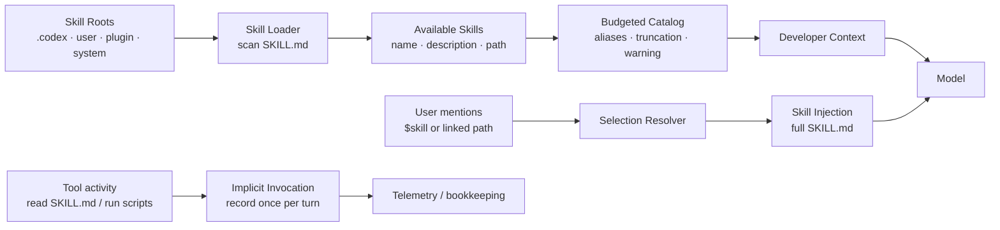

# s12: Skills — 先发现，再按需展开



上一章把上下文拆成 typed fragments，解决了“哪些运行时信息应该以什么 role 进入模型”的问题。
第 12 章继续向前一步：如果一台 Coding Agent 同时安装了几十个 Skills，能不能把每个 `SKILL.md`
都塞进上下文？

答案通常是不能，也不应该。Skills 的核心不是“把更多提示词拼进去”，而是：

> 先给模型一个可选择的能力目录；只有当本 turn 确实需要某个 skill 时，再展开完整指令。

这就是 **progressive disclosure（渐进式展开）**。模型先看到轻量 catalog；选择后才读完整
`SKILL.md`、相关脚本、模板或引用文件。

## 本章要解决的问题

如果把所有 Skills 全量注入，会出现几个工程问题：

- token 成本不可控，安装的插件越多，普通任务越慢。
- 无关指令彼此干扰，模型可能把“写论文 skill”的规则带进“修 CI skill”。
- 无法解释某个 skill 为什么被使用，因为 discovery、selection、injection 混在一起。
- 插件、远程环境、orchestrator resource 不一定是本地路径，不能假装所有 skill 都能直接 `cat`。
- 后续隐式行为，例如模型运行了 skill 自带脚本，也需要被记录，但不等于再次注入正文。

本章教学实现把 Skills 拆成四个阶段：

```text
discover → render catalog → resolve mention → inject selected skill
```

并额外演示：

```text
tool activity → implicit invocation record
```

## 心智模型：目录不是正文

把 Skills 想成一个图书馆会更稳：

```text
Available Skills catalog = 书目卡片
SkillInstructions       = 被借出的整本书
scripts/assets/templates = 书里的附录工具
implicit invocation     = 系统发现你真的用了这本书
```

目录卡片应该短：

```text
- lint-fix: Fix lint failures with the local formatter. (file: r0/lint-fix/SKILL.md)
- review: Review code for regressions and missing tests. (file: r1/review/SKILL.md)
```

完整 skill 则是另一个 user fragment：

```text
<skill>
<name>lint-fix</name>
<path>/repo/.codex/skills/lint-fix/SKILL.md</path>
---
name: lint-fix
description: ...
---

# Lint Fix
...
</skill>
```

这两个片段的 role 和生命周期不同：catalog 是 developer context，告诉模型“本会话有哪些能力”；
完整 skill 是 turn input，告诉模型“本 turn 已选中这个能力，请按它执行”。

## 最小教学实现

本章继承 s11 的上下文组装、配置、审批、沙箱和事件流，然后新增 Skills 层。

### SkillMetadata 与 SkillRoot

教学版用 `SkillRoot` 表示一个扫描入口：

```python
@dataclass(frozen=True)
class SkillRoot:
    path: Path
    scope: SkillScope
```

`SkillMetadata` 只保留本章需要的核心字段：

```python
@dataclass(frozen=True)
class SkillMetadata:
    name: str
    description: str
    path_to_skills_md: Path
    scope: SkillScope
    root: Path
    policy: SkillPolicy
```

真实 Codex 的 metadata 更丰富，还包含 `short_description`、interface、dependencies、plugin id、
product restrictions 等。本章只拿最关键的一条 policy：

```python
allow_implicit_invocation: bool
```

### SkillLoader：扫描 SKILL.md

`SkillLoader` 从 root 下递归查找 `SKILL.md`，读取 frontmatter：

```yaml
---
name: lint-fix
description: Fix lint failures with the local formatter and tests.
---
```

如果旁边有 `agents/openai.yaml`，教学版只解析：

```yaml
policy:
  allow_implicit_invocation: false
```

加载结果不是 prompt，而是结构化结果：

```python
SkillLoadOutcome(
    skills=(...),
    roots=(...),
    errors=(...),
    disabled_paths=frozenset(),
)
```

这一步的重点是：**发现不等于注入**。loader 只把可能可用的 skills 变成 metadata。

### SkillCatalogRenderer：预算化目录

目录渲染器把 `SkillMetadata` 压成模型可见的轻量列表：

```python
available = SkillCatalogRenderer(metadata_budget_chars=360).render(outcome)
```

输出会包含 root alias：

```text
- `r0` = `/repo/.codex/skills`
- lint-fix: Fix lint failures. (file: r0/lint-fix/SKILL.md)
```

如果描述太长，教学版先缩短 description；如果最小行仍然超预算，才省略部分 skills。

这对应真实 Codex 的设计取舍：Skills catalog 需要足够完整，让模型能发现能力；但它不能吞掉过多
上下文窗口。

### AvailableSkillsFragment：developer context

目录以 developer role 注入：

```python
AvailableSkillsFragment(available).render()
```

边界是：

```text
<skills_instructions>
...
</skills_instructions>
```

因此 s11 的上下文识别机制可以继续工作：它知道这是运行时上下文，不是普通用户消息。

### SkillMentionResolver：选择时避免乱猜

显式选择有两种教学输入：

```text
use $lint-fix
use [$lint-fix](/repo/.codex/skills/lint-fix/SKILL.md)
```

解析规则故意保守：

- `$PATH`、`$HOME` 等常见环境变量不当成 skill。
- 如果有多个同名 skill，纯 `$name` 不会选中任何一个。
- 带路径的链接优先，因为路径可以消除歧义。
- 如果结构化选择或链接路径指向缺失/禁用 skill，不会退回纯文本猜测。

这比“看到 `$demo` 就随便拿第一个 demo skill”安全得多。

### SkillInjector：选中后才读取完整正文

真正注入发生在 resolver 选中 skill 之后：

```python
selected = SkillMentionResolver().resolve("$lint-fix", outcome)
fragments = SkillInjector().build_injections(selected)
```

`SkillInjector` 读取完整 `SKILL.md`，生成 user role 的 `<skill>` fragment：

```text
<skill>
<name>lint-fix</name>
<path>...</path>
完整 SKILL.md 内容
</skill>
```

这就是 progressive disclosure 的关键：目录常驻，正文按需。

### ImplicitSkillInvocationDetector：记录真实使用

模型可能不是通过 `$skill` 触发，而是在读取 skill 或运行 skill 脚本之后被认为“正在使用它”。教学版检测两种行为：

```python
cat /repo/.codex/skills/lint-fix/SKILL.md
python3 /repo/.codex/skills/lint-fix/scripts/fix.py
```

如果 policy 允许，检测器返回：

```python
ImplicitSkillInvocation(skill=..., reason="ran script under skill scripts/")
```

`SkillInvocationTracker` 在同一 turn 内去重，避免重复记录。

注意：隐式调用记录不是再次注入完整正文。它更像 telemetry/bookkeeping：运行时注意到 agent 已经在用某个 skill。

## 工作原理

本章 demo 的流程是：

1. 创建 repo skill root：`.codex/skills`。
2. 创建 user skill root：`user-skills`。
3. 写入三个 skills：`lint-fix`、`deep-docs`、`review`。
4. `SkillLoader` 扫描 `SKILL.md` 并读取 policy。
5. `SkillCatalogRenderer` 生成 `<skills_instructions>` developer fragment。
6. `SkillMentionResolver` 从 `$lint-fix` 选中一个 skill。
7. `SkillInjector` 注入完整 `lint-fix/SKILL.md`。
8. `ImplicitSkillInvocationDetector` 识别运行 `scripts/fix.py`。
9. s11 的 `ContextHistory` 把 skills catalog 放进初始上下文。
10. 后续工具、审批、沙箱和事件流继续按前面章节工作。

运行：

```bash
python3.11 s12_skills_progressive_loading/code.py
```

你会看到类似输出：

```text
available skills catalog:
- `r0` = `/tmp/.../.codex/skills`
- `r1` = `/tmp/.../user-skills`
- deep-docs: ...
- lint-fix: ...
- review: ...
explicit skill injections:
- lint-fix: 178 chars
implicit skill invocation: lint-fix (ran script under skill scripts/)
initial context messages:
- developer: 5 sections
- user: 2 sections
```

`developer: 5 sections` 比上一章多出来的部分，就是 available skills catalog。

## 相对上一章的变化

s11 的核心是：

```text
runtime state → typed context fragments → initial context / diff
```

s12 在这个模型上新增：

```text
skill metadata → available skills fragment
selected skill → skill instructions fragment
tool activity → implicit invocation record
```

也就是说，Skills 不是替代 AGENTS.md，而是另一类上下文贡献者：

- `AGENTS.md`：项目范围的持续规则。
- `AvailableSkillsFragment`：本 session 可用能力目录。
- `SkillInstructionsFragment`：本 turn 选中的完整 skill 指令。
- `ImplicitSkillInvocation`：工具行为产生的使用记录。

## 与真实 Codex 的对应关系

本章源码笔记见 [SOURCE_NOTES.md](/Users/air/Documents/codex开源仓库学习/s12_skills_progressive_loading/SOURCE_NOTES.md)。

真实 Codex 中，Skills 相关机制主要分布在：

- `codex-rs/core-skills/src/model.rs`
- `codex-rs/core-skills/src/loader.rs`
- `codex-rs/core-skills/src/render.rs`
- `codex-rs/core-skills/src/injection.rs`
- `codex-rs/core-skills/src/invocation_utils.rs`
- `codex-rs/core-skills/src/skill_instructions.rs`
- `codex-rs/core/src/context/available_skills_instructions.rs`
- `codex-rs/core/src/skills.rs`
- `codex-rs/ext/skills/src/tools/list.rs`
- `codex-rs/ext/skills/src/tools/read.rs`

对应关系如下：

| 教学实现 | 真实 Codex 对应 | 说明 |
| --- | --- | --- |
| `SkillRoot` / `SkillLoader` | `loader.rs` | 扫描 root，查找 `SKILL.md`，解析 frontmatter 与 metadata |
| `SkillLoadOutcome` | `model.rs` | 保存 skills、errors、disabled paths、root/path 映射 |
| `SkillCatalogRenderer` | `render.rs` | 预算化渲染 available skills catalog |
| `AvailableSkillsFragment` | `available_skills_instructions.rs` | developer role，`<skills_instructions>` markers |
| `SkillMentionResolver` | `injection.rs` | 处理 `$skill`、链接路径、结构化选择和歧义 |
| `SkillInjector` | `injection.rs` + `skill_instructions.rs` | 选中后读取完整 `SKILL.md`，生成 `<skill>` user fragment |
| `ImplicitSkillInvocationDetector` | `invocation_utils.rs` + `core/src/skills.rs` | 识别读取 skill 或运行 skill script，并记录隐式调用 |

几个真实事实尤其重要：

- 真实 `AvailableSkillsInstructions` 是 developer role，不是普通 user message。
- 真实 `SkillInstructions` 是 user role 的 `<skill>` fragment，并包含完整 skill 内容。
- 真实目录渲染会用 8000 字符默认预算，或 context window 的 2% token 预算。
- 真实使用说明要求主 agent 在决定使用 skill 后完整读取 `SKILL.md`，不能只读一点就行动。
- 真实 Codex 还支持 orchestrator/executor/resource 型 skills；这类 skill 可能需要通过 `skills.list`
  和 `skills.read` 读取，不能当成本地路径。

## 教学简化与生产边界

本章主动省略了：

- 完整 YAML 解析，只保留简单 frontmatter。
- interface、dependencies、product restriction、plugin namespace、icon/default prompt 等字段。
- executor/orchestrator authority 和 opaque resource。
- OpenTelemetry、analytics 事件和真实 turn store。
- 真实 alias 选择算法，只演示 root alias 的心智模型。
- 完整 shell 解析，只演示常见脚本运行和 `SKILL.md` 读取。

这些省略不影响本章核心：**Skills 的工程价值来自分阶段加载，而不是一次性提示词膨胀。**

## 可运行实验

运行本章测试：

```bash
python3.11 -m unittest discover -s s12_skills_progressive_loading -p 'test_*.py' -v
```

本章新增的测试覆盖：

- skill root 扫描与 policy 解析。
- available skills 目录 alias 与预算截断。
- 超预算时省略 entries。
- `<skills_instructions>` developer context 识别。
- `$skill`、链接路径、结构化选择与歧义处理。
- 完整 `SKILL.md` 按需注入。
- 常见环境变量和 connector name 冲突跳过。
- 隐式脚本调用与 `SKILL.md` 读取检测。
- policy 禁止隐式调用。
- 同一 turn 内隐式调用去重。
- `ContextAssembler` 将 Skills catalog 接入初始上下文。

运行 demo：

```bash
python3.11 s12_skills_progressive_loading/code.py
```

结构检查：

```bash
python3.11 scripts/check_course.py
```

## 小结与下一章

这一章把 Skills 从“提示词文件”升级成了一个工程机制：

```text
目录发现 → 预算化暴露 → 明确选择 → 完整注入 → 使用记录
```

这套模式会在后面章节继续出现：Subagent、MCP、Plugin、App Server 都需要类似的“先暴露边界，再按需交互”的设计。

下一章进入 `s13_context_compaction_memory`：当会话越来越长，历史、上下文、Skills 和工具结果都塞进来之后，Agent 怎样压缩上下文、保留记忆，并在恢复时不丢掉关键状态？
