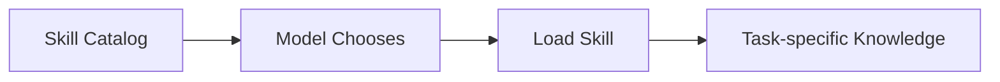

# s12: Skills — 先发现，再按需展开

```mermaid
flowchart LR
    S["Skill Catalog"] --> M["Model Chooses"]
    M --> L["Load Skill"]
    L --> K["Task-specific Knowledge"]
```

> 状态：待编写。目标是实现渐进式知识加载，避免一次注入全部内容。

