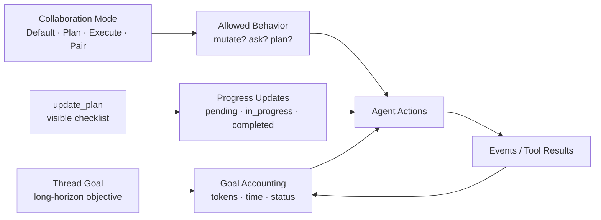

# s13: Plans, Modes & Goals — 把意图变成运行契约



第 10 到 12 章讲的是“模型看到什么”：`AGENTS.md`、context fragments、Skills catalog 与按需注入。
第 13 章切到另一个维度：**运行时如何把用户意图变成可执行、可约束、可持续追踪的契约**。

这里有三个容易混在一起的词：

- **Goal**：长期目标，跨 turn 持续存在。
- **Collaboration Mode**：协作模式，约束本 turn 怎么和用户合作。
- **Plan**：当前任务清单，用来展示进度，不等于目标，也不等于模式。

如果把它们混成一个“计划状态”，Agent 很快就会行为失真：在 Plan mode 里偷偷改文件；把一次临时 TODO
误当成长目标；或者因为有一个 checklist 就声称目标完成。真实 Codex 把它们拆得很细，本章用 Python
重建这层边界。

## 本章要解决的问题

成熟 Coding Agent 不只要知道“下一步做什么”，还要回答：

- 用户给的是一次普通任务，还是一个需要跨 turn 追踪的长期目标？
- 当前 turn 是默认执行、只规划、独立执行，还是结对编程？
- 计划清单是给用户看的进度，还是最终交付物？
- 目标什么时候算完成？什么时候只能说 blocked？
- Plan mode 产生的 plan item，和普通 `update_plan` checklist 有什么区别？
- token budget 用完时，Agent 还能不能继续开新工作？

本章把这几个问题拆成三个状态机：

```text
CollaborationMode  →  本 turn 允许怎样协作
PlanState          →  当前可见 checklist
GoalManager        →  持久目标与预算 accounting
```

## 心智模型：三个不同的“意图容器”

### Goal：用户真正要完成的终点

Goal 是跨 turn 的目标，例如：

```text
完成第 13 章，包括源码研究、正文、代码、测试、验证、commit 和 push。
```

它不是“下一步”，也不是“本轮回答”。它会有状态：

```text
active → complete
active → blocked
active → budget_limited
active ↔ paused
```

Goal 还可以有预算，例如 token budget。预算不是完成标准；预算只是运行时约束。

### Collaboration Mode：本 turn 的合作规则

Collaboration Mode 是 developer context，例如：

```text
<collaboration_mode>
# Plan Mode
只做非变更探索，输出 decision-complete plan，不执行实现。
</collaboration_mode>
```

它约束 agent 的行为方式：

- Default：合理假设并执行普通请求。
- Plan：只规划，不做 repo-tracked mutation。
- Execute：明确任务下独立执行到底，并报告进度。
- Pair Programming：和用户一起做，更多解释与对齐。

模式不是用户说一句“计划一下”就自动改变；真实 Codex 的模板也强调，active mode 由 developer
instructions 改变。

### Plan：当前可见 checklist

`update_plan` 是进度工具。它维护一个短清单：

```text
- [completed] 阅读源码
- [in_progress] 写教学实现
- [pending] 跑验证
```

它的用途是让用户知道当前多步任务在哪里。它不是 Goal，也不能证明 Goal 完成。

更有意思的是：真实 Codex 在 Plan mode 中会拒绝 `update_plan`。因为 Plan mode 的“最终计划”应通过
`<proposed_plan>...</proposed_plan>` 输出，而 `update_plan` 只是普通模式下的 TODO/checklist 工具。

## 最小教学实现

本章继续继承 s12 的运行时，然后新增三层对象。

### PlanState：可见进度清单

教学版的计划项：

```python
class PlanStatus(str, Enum):
    PENDING = "pending"
    IN_PROGRESS = "in_progress"
    COMPLETED = "completed"

@dataclass(frozen=True)
class PlanItem:
    step: str
    status: PlanStatus
```

`PlanUpdate` 会检查一个关键约束：

```python
@dataclass(frozen=True)
class PlanUpdate:
    plan: tuple[PlanItem, ...]
    explanation: str | None = None

    def __post_init__(self) -> None:
        in_progress = [item for item in self.plan if item.status is PlanStatus.IN_PROGRESS]
        if len(in_progress) > 1:
            raise ValueError("at most one plan item can be in_progress")
```

这对应真实 `update_plan` 工具说明：最多一个 `in_progress`。

`PlanState.update()` 还会检查当前协作模式：

```python
if not mode.allows_update_plan():
    raise ToolError("update_plan ... is not allowed in Plan mode")
```

### CollaborationMode：行为契约

教学版定义四种模式：

```python
class CollaborationModeKind(str, Enum):
    DEFAULT = "default"
    PLAN = "plan"
    EXECUTE = "execute"
    PAIR_PROGRAMMING = "pair_programming"
```

它们最重要的不是名字，而是约束：

```python
def can_mutate(self) -> bool:
    return self.kind is not CollaborationModeKind.PLAN

def allows_update_plan(self) -> bool:
    return self.kind is not CollaborationModeKind.PLAN
```

这故意把 Plan mode 设计成“非变更规划”。如果用户真的要执行，运行时应该切回 Default 或 Execute，而不是
在 Plan mode 中偷偷做实现。

### ProposedPlan：Plan mode 的最终计划

Plan mode 中，最终计划通过标签块表达：

```text
<proposed_plan>
# Final plan
- first
- second
</proposed_plan>
```

教学版实现一个简单解析器：

```python
ProposedPlan.from_message(message)
```

如果没有这个 block，就不产生 plan item。这个点来自 app-server 测试：Plan mode 不是天然生成 plan
item，必须有 `<proposed_plan>`。

### GoalManager：长期目标与预算

Goal 数据结构：

```python
@dataclass
class ThreadGoal:
    objective: str
    status: GoalStatus = GoalStatus.ACTIVE
    token_budget: int | None = None
    tokens_used: int = 0
    time_used_seconds: int = 0
```

`GoalManager.create_goal()` 的约束：

- objective 不能为空。
- token budget 如果给出，必须是正数。
- 已有未完成 goal 时不能创建新 goal。
- 只有旧 goal 完成后，才能替换成新 goal。

`GoalManager.update_goal()` 的约束：

- agent 只能标记 `complete` 或 `blocked`。
- `paused`、`active`、`budget_limited`、`usage_limited` 不由 agent 通过 `update_goal` 直接设置。

这正是本章最重要的边界：Goal 是用户/系统控制的长期契约，agent 只能在证据足够时声明完成，或在严格条件下声明 blocked。

### Goal accounting：只给执行性 turn 计费

教学版用一个整数 `total_tokens` 模拟 token usage：

```python
manager.start_turn("turn-1", CollaborationMode.default(), token_usage_at_start=100)
manager.create_goal("finish chapter")
manager.record_token_usage("turn-1", 135)
manager.tool_finished("turn-1", "call-shell")
```

如果 goal 是在 turn 中途创建的，baseline 会重置到创建时刻，避免把创建 goal 之前的 token 算进去。

Plan mode 不计入 goal token：

```python
manager.start_turn("turn-plan", CollaborationMode.plan(), token_usage_at_start=10)
manager.record_token_usage("turn-plan", 80)
manager.finish_turn("turn-plan")
# tokens_used 仍为 0
```

这个行为来自真实 `GoalAccountingState`：Plan mode turn 的 `account_tokens` 是 false。

## 工作原理

运行 demo：

```bash
python3.11 s13_plans_modes_and_goals/code.py
```

你会看到第 13 章新增的输出：

```text
plan update: Plan updated
plan mode update_plan rejection: update_plan is a TODO/checklist tool and is not allowed in Plan mode
proposed plan item: # Final plan
goal created: finish the chapter remaining 40
goal tokens after tool: 25
goal tokens after plan mode: 25
goal completion report: True
```

这些输出分别说明：

- Default mode 下可以用 `update_plan` 更新 checklist。
- Plan mode 下 `update_plan` 被拒绝。
- `<proposed_plan>` block 会被识别为 plan item。
- Goal 创建后有 remaining budget。
- tool finish 会把执行性 token delta 计入 goal。
- Plan mode turn 不推进 goal token usage。
- 完成带预算 goal 时，工具结果应提醒最终回复报告用量。

后面 demo 继续运行 s12 继承来的 AGENTS.md、context fragments、Skills、hooks、approval 和 sandbox 流程。

## 相对上一章的变化

s12 解决的是：

```text
哪些知识可以按需进入上下文？
```

s13 解决的是：

```text
进入上下文后，Agent 应该按什么运行契约行动？
```

新增边界如下：

| 概念 | 生命周期 | 谁控制 | 作用 |
| --- | --- | --- | --- |
| Collaboration Mode | 当前 turn / developer context | developer/system | 限制协作方式和是否可 mutation |
| PlanState | 当前任务进度 | agent 通过工具更新 | 给用户展示多步进度 |
| Thread Goal | 跨 turn 持久状态 | 用户/系统创建，agent 只能完成/阻塞 | 追踪长期目标和预算 |

这也解释了为什么“计划”和“目标”不能合并：计划可以频繁变，目标不能随手缩小；计划完成也不等于目标完成。

## 与真实 Codex 的对应关系

本章源码笔记见 [SOURCE_NOTES.md](/Users/air/Documents/codex开源仓库学习/s13_plans_modes_and_goals/SOURCE_NOTES.md)。

关键对应：

| 教学实现 | 真实 Codex 对应 | 说明 |
| --- | --- | --- |
| `PlanItem` / `PlanUpdate` | `protocol/src/plan_tool.rs` | `step` + `status`，status 为 pending/in_progress/completed |
| `PlanState.update()` | `core/src/tools/handlers/plan.rs` | 成功输出 `Plan updated`，Plan mode 下拒绝 |
| `ProposedPlan` | `app-server/tests/suite/v2/plan_item.rs` | `<proposed_plan>` 生成 `ThreadItem::Plan` 和 `item/plan/delta` |
| `CollaborationMode` | `collaboration-mode-templates/` | Default、Plan、Execute、Pair Programming 模板 |
| `CollaborationModeFragment` | `context/collaboration_mode_instructions.rs` | developer role，`<collaboration_mode>` markers |
| `GoalManager.create_goal()` | `ext/goal/src/spec.rs` + `tool.rs` | 明确请求才创建；未完成 goal 存在时失败 |
| `GoalManager.update_goal()` | `ext/goal/src/tool.rs` | agent 只可标记 complete 或 blocked |
| `GoalStatus` | `state/src/model/thread_goal.rs` | active、paused、blocked、usage_limited、budget_limited、complete |
| `Goal accounting` | `ext/goal/src/accounting.rs` | turn baseline、Plan mode 不计 token、tool finish accounting |
| `continuation_prompt()` | `prompts/templates/goals/*.md` | objective 作为用户数据处理，不是高优先级指令 |

几个源码事实值得特别记住：

- `update_plan` 是 checklist 工具，不是 Plan mode。
- Plan mode 是 collaboration mode，会禁止实现性 mutation，并要求最终计划使用 `<proposed_plan>`。
- Goal 工具在 ephemeral thread 和 review subagent 中不可见。
- Goal objective 会被当作用户提供的数据，真实 prompt 会显式提醒不要当作更高优先级指令。
- `blocked` 不是“有点难”的状态；真实工具说明要求同一阻塞条件连续出现至少三次 goal turn。

## 教学简化与生产边界

本章主动省略了：

- 完整 tool registry 暴露和 JSON schema，只保留计划更新行为。
- app-server 的完整 `ThreadItem::Plan`、`item/plan/delta` 和 streaming parser。
- collaboration mode preset 的 model、reasoning effort 和客户端列表接口。
- SQLite 持久化、rollout reconciliation、thread preview 和 resume snapshot。
- 真实 token usage 的 input/cache/output/reasoning 细分。
- wall-clock accounting、并发 tool finish semaphore、analytics、metrics 和 lifecycle extension。
- TUI 的 `/goal` 命令、draft、paste placeholder 和目标编辑菜单。

教学版保留的是心智模型：**Goal、Mode、Plan 是三种不同状态，必须由不同规则约束。**

## 可运行实验

运行本章测试：

```bash
python3.11 -m unittest discover -s s13_plans_modes_and_goals -p 'test_*.py' -v
```

本章新增测试覆盖：

- `update_plan` 只能有一个 `in_progress`。
- Plan mode 下拒绝 `update_plan`。
- 四种 collaboration mode 的执行权限差异。
- `<proposed_plan>` block 解析。
- goal objective 与 token budget 校验。
- 未完成 goal 存在时拒绝创建新 goal，complete 后允许替换。
- agent 只能把 goal 标记为 complete 或 blocked。
- goal 创建后重置 token baseline。
- Plan mode turn 不计 goal token。
- token budget 用尽后转为 budget_limited。
- complete goal 返回最终用量报告提示。
- external set 可暂停、恢复和编辑 goal。
- goal prompt 会 escape objective。

运行 demo：

```bash
python3.11 s13_plans_modes_and_goals/code.py
```

结构检查：

```bash
python3.11 scripts/check_course.py
```

## 小结与下一章

本章把“用户想要什么”和“Agent 正在做什么”拆成三层：

```text
Goal  = 长期终点
Mode  = 本 turn 协作规则
Plan  = 当前进度清单
```

这层拆分会直接影响下一章：`s14_threads_turns_and_state`。我们已经有了上下文、Skills、模式、计划和目标；下一章要把它们放回 Thread、Turn 和 runtime state 中，说明一次会话到底如何保存、切换、恢复这些状态。
