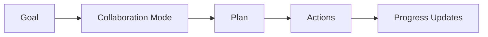

# s13: Plans, Modes & Goals — 把意图变成运行契约

```mermaid
flowchart LR
    G["Goal"] --> M["Collaboration Mode"]
    M --> P["Plan"]
    P --> A["Actions"]
    A --> U["Progress Updates"]
```

> 状态：待编写。目标是区分目标、计划、协作模式和进度状态。

