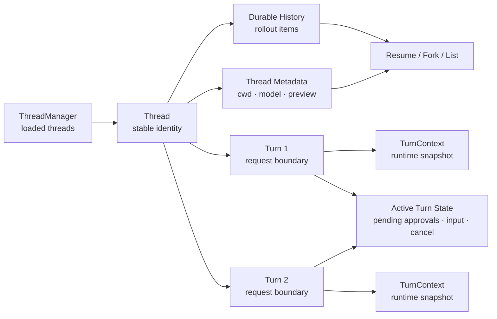

# s14: Threads, Turns & State — 不要把所有状态塞进 messages



前面 13 章已经把一个 Coding Agent 拆成了 event stream、tool registry、shell/file tools、approval、
sandbox、config、hooks、`AGENTS.md`、context fragments、Skills、plan/mode/goal。现在会出现一个很自然的诱惑：

> 既然模型最终看到的是 messages，那把所有状态都塞回 messages 里不就行了吗？

第 14 章的答案是：不行。Messages 是模型上下文的一部分，但不是运行时数据库。成熟 agent 需要同时回答三类问题：

- 这个长期会话是谁？能不能列出来、恢复、归档或 fork？
- 当前这次用户请求的边界在哪里？它完成、失败还是被中断？
- 正在运行的 turn 有哪些临时等待项？比如 pending approval、pending input、cancellation token。

这三类问题分别对应 **Thread**、**Turn** 和 **Runtime State**。

## 本章要解决的问题

如果只有一串 messages，下面这些行为都会变得脆弱：

- 用户开了两个项目窗口，怎样区分两个长期 thread？
- 一次 turn 中途被中断，后续 resume 应该从哪里开始？
- 一个 approval prompt 正在等待用户确认，它应该写进历史吗？
- context diff 的 baseline 该保存在 messages 中，还是作为运行时引用状态？
- fork thread 时，是复制全部历史，还是从某个用户消息边界截断？
- thread list 页面展示 preview、cwd、model、archive 状态时，是否需要重新扫描所有消息？

真实 Codex 的公开源码把这些问题拆开处理：`ThreadId`、`CodexThread`、`ThreadManager`、`SessionState`、`TurnState`、
`TurnContextItem`、`ThreadStore` 和 state runtime 各自承担不同边界。本章用一个小型 Python 教学版重建这个分层。

## 心智模型：三个状态容器

### Thread：稳定身份和可恢复历史

Thread 是长期容器。它至少需要：

- 稳定的 `thread_id`
- 可列出的 metadata，例如 cwd、model、preview、archive 状态
- 可重放的 durable history
- fork/parent 关系
- 当前是否 loaded

它不是“一次模型请求”，也不是“最后一条用户消息”。

### Turn：一次用户请求的执行边界

Turn 是一次请求或任务的边界。它至少需要：

- `turn_id`
- user input
- 本 turn 的 context snapshot
- status：`in_progress`、`completed`、`interrupted`、`failed`
- 本 turn 产生的 items 和 final response

Turn 的存在让客户端可以说：“第 3 轮失败了，但 thread 还在。”

### Runtime State：只在 active turn 中有意义

Runtime state 是活的、临时的、不可直接当成历史事实的东西：

- pending approval
- pending user input
- cancellation requested
- tool call counter
- active task handle
- turn-scoped permissions

这些状态完成或中断后应该清理。把它们永久塞进 messages，恢复时反而会把“已经过期的等待”误当成仍需处理的事实。

## 最小教学实现

第 14 章继续继承 `s13_plans_modes_and_goals/code.py`，新增以下对象：

```text
ThreadId
InMemoryThreadStore
ThreadMetadata
TurnRecord
TurnRuntimeState
ManagedThread
ThreadManager
```

### ThreadId

真实 Codex 的 `ThreadId` 是 UUIDv7 包装类型。教学版使用 Python 3.11 标准库中的 UUIDv4：

```python
@dataclass(frozen=True)
class ThreadId:
    value: str

    @classmethod
    def new(cls) -> ThreadId:
        return cls(str(uuid.uuid4()))

    @classmethod
    def parse(cls, value: str) -> ThreadId:
        uuid.UUID(value)
        return cls(value)
```

这里的重点不是 UUID 版本，而是 contract：thread id 是 opaque、stable、serializable 的 handle。

### ThreadStore

教学版的 `InMemoryThreadStore` 保存两类数据：

```python
self._metadata: dict[ThreadId, ThreadMetadata]
self._turns: dict[ThreadId, list[TurnRecord]]
```

它支持：

- `create_thread`
- `append_turn`
- `replace_turn`
- `read_thread`
- `list_threads`
- `archive_thread`

这对应真实 `ThreadStore` 的 storage-neutral 边界。真实实现还支持 resume、append rollout items、flush、shutdown、
list turns、list items、search、delete、unarchive 等，本章只保留必要骨架。

### TurnRecord

教学版 turn record：

```python
@dataclass
class TurnRecord:
    thread_id: ThreadId
    turn_id: str
    user_text: str
    context: TurnContextSnapshot
    status: StoredTurnStatus = StoredTurnStatus.IN_PROGRESS
    items: tuple[TurnItem, ...] = ()
    final_response: str | None = None
    error: str | None = None
    abort_reason: str | None = None
```

注意它不只是 `messages.append(user_text)`。它明确记录 status、context snapshot 和结果。

### TurnRuntimeState

教学版 active turn state：

```python
@dataclass
class TurnRuntimeState:
    turn_id: str
    pending_input: list[str] = field(default_factory=list)
    pending_approvals: dict[str, ApprovalRequest] = field(default_factory=dict)
    cancellation_requested: bool = False
    tool_calls: int = 0
```

`abort_turn()` 会清理这些 waiters：

```python
if self.runtime_state is not None:
    self.runtime_state.clear_waiters()
self.runtime_state = None
```

这就是本章的核心边界：pending approval 是活状态，不是永久历史。

## 工作原理

`ManagedThread.start_turn()` 做五件事：

1. 如果已有 active turn，抛出 `ThreadBusy`。
2. 分配新的 `turn_id`。
3. 通过 `ContextHistory.record_context_for_turn()` 记录 initial context 或 diff。
4. 创建 `TurnContextSnapshot` 和 `TurnRecord`。
5. 写入 store，并创建 `TurnRuntimeState`。

简化后的流程：

```python
turn_id = self.ids.new("turn")
context_updates = self.context_history.record_context_for_turn(snapshot)
self.context_history.append_user_turn(user_text)
self.goal_manager.start_turn(turn_id, mode, token_usage_at_start=...)
record = TurnRecord(..., status=IN_PROGRESS)
self.runtime_state = TurnRuntimeState(turn_id)
self.store.append_turn(record)
```

`ManagedThread.run_turn()` 再把底层 s13 的 turn loop 包起来：

```python
record = self.start_turn(...)
result = self._loop.run_turn(user_text, turn_id=record.turn_id)
if result.final_response:
    self.complete_turn(record.turn_id, result)
else:
    self.abort_turn(record.turn_id, reason="interrupted")
```

这里有一个重要设计：底层 `Thread.run_turn()` 仍负责 model/tool/event loop；`ManagedThread` 负责 thread/turn/state 边界。
这让第 14 章不是重写 agent loop，而是在已有 loop 外面加成熟运行时的壳。

## 相对上一章的变化

第 13 章新增的是 intent contract：

- `GoalManager`
- `CollaborationMode`
- `PlanState`

第 14 章新增的是 lifetime contract：

- `ThreadManager` 管 live thread registry
- `InMemoryThreadStore` 管 durable metadata 与 turn records
- `ManagedThread` 管一个 thread 内的 active turn
- `TurnRuntimeState` 管只在当前 turn 有意义的等待项

前一章回答“agent 应该怎么合作”，本章回答“这次合作属于哪个 thread、哪个 turn、哪些状态能恢复”。

## 与真实 Codex 的对应关系

本章的 `SOURCE_NOTES.md` 记录了实际阅读的源码。主要对应关系如下。

### ThreadId / SessionId

真实源码：

- `codex-rs/protocol/src/thread_id.rs`
- `codex-rs/protocol/src/session_id.rs`

真实 `ThreadId::new()` 使用 UUIDv7。`SessionId` 与 `ThreadId` 之间有双向 `From` 实现，用来兼容 session/thread 边界。

教学版保留 opaque id contract，但不复刻 UUIDv7。

### CodexThread / ThreadManager

真实源码：

- `codex-rs/core/src/codex_thread.rs`
- `codex-rs/core/src/thread_manager.rs`
- `codex-rs/core/src/thread_manager_tests.rs`

真实 `CodexThread` 是 thread 消息流 conduit。`ThreadManager` 维护 loaded threads，并负责 start、resume、fork、lookup、
metadata update 和 shutdown。测试还确认 internal threads 会从普通 lookup/list 中隐藏，但 shutdown 仍能覆盖。

教学版的 `ThreadManager` 只实现 create/get/list/fork/archive。

### SessionState / TurnState

真实源码：

- `codex-rs/core/src/state/session.rs`
- `codex-rs/core/src/state/turn.rs`

真实 `SessionState` 保存 session-scoped history、reference context item、rate limits、previous turn settings、auto-compaction、
connector selections、permission grants 等。真实 `TurnState` 保存 pending approvals、pending request permissions、pending user
input、elicitations、dynamic tools、pending input queue、mailbox delivery phase、tool call count 和 token baseline。

教学版把 session-scoped 部分收敛为 `ContextHistory`，把 turn-scoped 部分收敛为 `TurnRuntimeState`。

### TurnContextItem / RolloutItem

真实源码：

- `codex-rs/core/src/session/turn_context.rs`
- `codex-rs/core/src/session/mod.rs`
- `codex-rs/protocol/src/protocol.rs`

真实 `TurnContext::to_turn_context_item()` 会把 cwd、workspace roots、date/timezone、approval/sandbox/permission、network、model、
collaboration mode、multi-agent version、realtime、effort 等写入 `TurnContextItem`。

真实 `Session::record_context_updates_and_set_reference_context_item()` 会在每个真实用户 turn 持久化一个
`RolloutItem::TurnContext`，即使没有新的 model-visible context diff，也会推进 baseline。

教学版用 `TurnContextSnapshot.context_update_count` 展示这个机制：第一次 turn 有 initial context，后续相同 snapshot 为 0，
snapshot 变化时产生 diff。

### ThreadStore / State Runtime

真实源码：

- `codex-rs/thread-store/src/store.rs`
- `codex-rs/thread-store/src/types.rs`
- `codex-rs/state/src/model/thread_metadata.rs`
- `codex-rs/state/src/runtime/threads.rs`

真实 `ThreadStore` 是 storage-neutral persistence boundary，支持 create/resume/append/read/list/search/archive/delete 等。
真实 `StoredThread` 和 state runtime metadata 包含 preview、cwd、model、reasoning effort、sandbox/approval、token usage、
git info、archive 和 parent/fork 关系等。

教学版只保存最小 metadata：cwd、model、permission/approval、preview、fork/parent、archive 和 turn count。

## 教学简化与生产边界

本章主动省略了很多生产机制：

- 没有本地 JSONL rollout，也没有 SQLite projection。
- 没有 app-server pagination、search、list items 或 list turns API。
- 没有真实 async task handle、cancellation token、oneshot waiter。
- 没有 mailbox delivery phase 的完整调度。
- 没有 resume/fork 的 rollout reconstruction 和 interrupted marker。
- 没有多环境 `TurnEnvironmentSelection`。
- 没有 extension lifecycle、MCP runtime、telemetry、state DB spawn edge。

这些省略不是不重要，而是它们属于后续章节。第 14 章只建立一条主线：

```text
Thread 是长期身份。
Turn 是一次请求边界。
Runtime State 是 active turn 的临时等待区。
```

## 可运行实验

运行单章 demo：

```bash
/Users/air/.local/bin/python3.11 s14_threads_turns_and_state/code.py "Update greeting through a managed thread"
```

你会看到类似输出：

```text
thread id: eca54f65-ae60-4b09-8bb3-8460f7722d37
stored turn: turn_1 completed
turn context updates: 2
assistant: Action was not executed. Error: sandbox profile 'read-only' denied write access ...
```

这说明：

- demo 通过 `ThreadManager` 创建 thread。
- turn id 由管理层提前分配，并与事件流对齐。
- store 中有 `completed` turn record。
- context snapshot 被记录到 turn record。
- sandbox denial 仍然属于工具执行结果，不会改变 thread id。

运行测试：

```bash
/Users/air/.local/bin/python3.11 -m unittest discover -s s14_threads_turns_and_state -p 'test_*.py'
```

重点测试包括：

- `ThreadId` 可序列化/解析。
- thread metadata 独立于 messages 持久化。
- active turn 存在时拒绝第二个 turn。
- complete turn 会清理 runtime state，并保留 durable turn record。
- abort turn 会清理 pending waiters。
- context baseline 是 thread-scoped；同一 snapshot 第二次不再注入完整 context。
- changed runtime context 会产生新的 turn diff。
- turn context 会捕获 turn start 时的 plan/goal 快照。
- fork 会生成新 thread id，并记录 `forked_from_id`。
- archive 会从 loaded threads 中移除，但 archived store read 仍可显式读取。

## 小结与下一章

第 14 章把 agent runtime 从“一串 messages”提升到三层状态：

```text
Thread metadata/history  →  可以列出、恢复、归档、fork
Turn record              →  可以解释一次请求的状态和结果
Active runtime state     →  可以等待、取消、清理，但不伪装成历史事实
```

下一章可以在这个基础上继续讲恢复、rollout reconstruction、context compaction 或 fork 的更细边界：一旦有了 Thread/Turn/State，
“从哪里恢复”和“恢复什么”才有清晰答案。
