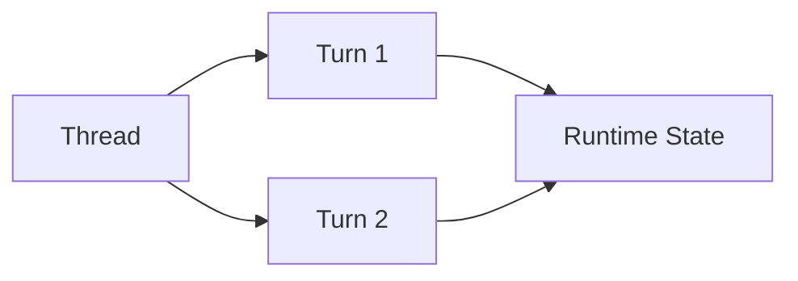

# s14: Threads, Turns & State — 不要把所有状态塞进 messages

```mermaid
flowchart LR
    T["Thread"] --> U1["Turn 1"]
    T --> U2["Turn 2"]
    U1 --> S["Runtime State"]
    U2 --> S
```

> 状态：待编写。目标是建立 Thread、Turn 与运行时状态机。

