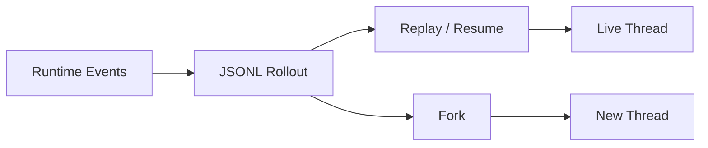

# s15: Rollouts — 让线程可恢复、可分叉

```mermaid
flowchart LR
    E["Runtime Events"] --> J["JSONL Rollout"]
    J --> R["Replay / Resume"]
    J --> F["Fork"]
    R --> T["Live Thread"]
    F --> T2["New Thread"]
```

> 状态：待编写。目标是用追加式记录恢复与分叉线程。

