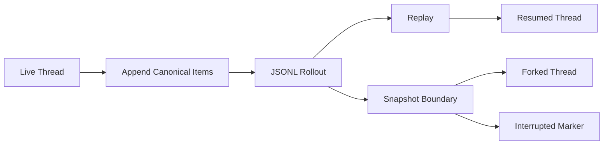

# s15: Rollouts — 让线程可恢复、可分叉



> 本章一句话：Thread 要长期工作，不能只存在内存对象里；它需要一条可追加、可重放、可截断的 rollout 日志。

## 本章目标

- 把上一章的内存 Thread/Turn 状态扩展成 JSONL rollout。
- 用 replay 恢复 thread identity、turn records 和模型可见历史。
- 用 fork snapshot 解释“复制整段历史”和“按 turn 边界截断”的区别。
- 演示 mid-turn fork 为什么需要显式 interrupted marker。

## 问题

s14 已经把 `Thread`、`Turn`、active runtime state 和 persistent store 分开了，但它仍然有一个根本限制：一旦进程退出，活线程里的 `_loop.history`、context baseline 和 turn 记录就只剩内存影子。

仅保存最终 metadata 也不够。一个 Coding Agent 要恢复工作，至少要知道：

- 用户说过什么，模型回过什么，工具调用和工具结果是什么。
- 哪些 turn 已完成，哪些 turn 是中断或失败。
- fork 时应该从哪个历史边界开始，而不是随便复制最后几行文本。
- 如果源线程停在 mid-turn，新的线程如何知道这不是一个自然完成的上下文。

所以本章引入 **rollout**：一条 append-only 的结构化历史日志。

## 心智模型

可以把 rollout 想成 thread 的“可重放航迹”，但它不是屏幕事件录制。

成熟 Agent 通常会同时有两类流：

- **UI/Event stream**：面向客户端，包含 delta、开始、结束、审批提示、hook 状态等高频事件。
- **Rollout history**：面向恢复和审计，只保留足以重建历史的 canonical item。

两者的目标不同。UI 需要实时、细粒度；rollout 需要稳定、可重放、可截断。

本章的教学实现保留这个分层：

- `InMemoryThreadStore` 仍然提供快速读写的 metadata 和 turn records。
- `JsonlRollout` 负责把 canonical facts 追加到 JSONL。
- `resume_thread_from_rollout()` 从 JSONL replay 出同一个 thread。
- `fork_thread_from_rollout()` 从 JSONL 生成一个新 thread，并记录 `forked_from_id`。

## 最小实现

运行示例：

```bash
/Users/air/.local/bin/python3.11 s15_rollouts_resume_and_fork/code.py "Update greeting through rollout"
```

核心新增类型在 [code.py](/Users/air/Documents/codex开源仓库学习/s15_rollouts_resume_and_fork/code.py) 中：

- `JsonlRollout`：写入和读取 JSONL rollout。
- `RolloutReplay`：replay 后得到的 metadata、turns、history。
- `ForkSnapshot`：选择 full 或 interrupted fork。
- `TruncateBeforeNthUserMessage`：按第 n 个用户 turn 边界之前截断。
- `ThreadManager.resume_thread_from_rollout()`：从 rollout path 恢复同一个 thread。
- `ThreadManager.fork_thread_from_rollout()`：从 rollout path 创建新 thread。

教学 JSONL 每行是一个小对象：

```json
{"timestamp":"...","kind":"turn_started","payload":{"turn_id":"turn_1","user_text":"..."}}
```

这不是 Codex 的真实格式，只是保留“按 kind 追加 canonical facts”的机制。

## 工作原理

一次新 thread 创建时，store 会写入 `session_meta`：

```text
session_meta(thread_id, cwd, model, permission profile, forked_from_id...)
```

一次 turn 开始时，store 追加：

```text
turn_started(turn_id, user_text, context snapshot)
```

一次 turn 完成时，store 再追加：

```text
item_completed(user message)
item_completed(agent message / function call / function output...)
turn_completed(turn_id, final_response)
```

如果 turn 被中断或失败，则追加：

```text
turn_aborted(turn_id, reason)
turn_failed(turn_id, error)
```

恢复时，`JsonlRollout.replay()` 从头扫描 JSONL：

1. 第一个 `session_meta` 决定 thread id 和 metadata。
2. `turn_started` 建立 active turn record。
3. `item_completed` 进入模型历史，并挂到 active turn。
4. `turn_completed`、`turn_aborted`、`turn_failed` 关闭 active turn。
5. replay 结果交给 `ThreadManager`，重新构造 `ManagedThread`。

fork 时，教学版先读取源 rollout，再选择快照边界：

- `ForkSnapshot.FULL`：复制源 rollout 的全部 canonical history。
- `TruncateBeforeNthUserMessage(n)`：切到第 n 个用户 turn 之前。
- `ForkSnapshot.INTERRUPTED`：如果源 rollout 停在 mid-turn，追加 interrupted marker 和 aborted turn。

fork 出来的 thread 有新 `thread_id`，并把源 thread 写入 `forked_from_id`。

## 相对上一章的变化

新增：

- JSONL rollout 文件。
- rollout replay。
- resume by rollout path。
- fork by rollout path。
- turn 边界截断和 interrupted fork marker。

保留：

- s14 的 Thread/Turn/State 分层。
- active runtime state 不持久化等待中的审批输入对象。
- context、plan、goal、安全运行时和工具路由仍按前章方式工作。

刻意不做：

- 不把所有 streaming delta 写入 rollout。
- 不把 rollout 当数据库索引用。
- 不实现压缩、搜索、归档和 SQLite metadata reconciliation。

## 与真实 Codex 的对应关系

本节依据同目录 [SOURCE_NOTES.md](/Users/air/Documents/codex开源仓库学习/s15_rollouts_resume_and_fork/SOURCE_NOTES.md)。

真实 Codex 中，rollout 相关能力主要分布在：

- `codex-rs/rollout/src/recorder.rs`
- `codex-rs/rollout/src/policy.rs`
- `codex-rs/thread-store/src/local/live_writer.rs`
- `codex-rs/thread-store/README.md`
- `codex-rs/core/src/thread_manager.rs`
- `codex-rs/core/src/thread_rollout_truncation.rs`
- `codex-rs/core/src/session/rollout_reconstruction.rs`

对应关系：

- 教学 `JsonlRollout` 对应真实 `RolloutRecorder` 的核心心智模型：把 canonical session items 写成 JSONL。
- 教学 `InMemoryThreadStore(...rollout_dir...)` 对应 local thread store 使用 `codex-rollout` 保存历史这一边界。
- 教学 `resume_thread_from_rollout()` 对应真实 `ThreadManager::resume_thread_from_rollout()` 先从 rollout path 读取历史，再启动线程。
- 教学 `fork_thread_from_rollout()` 对应真实 `ThreadManager::fork_thread()` 读取 rollout path、构造 fork history、再以新 thread id 启动。
- 教学 `TruncateBeforeNthUserMessage` 对应真实 `ForkSnapshot::TruncateBeforeNthUserMessage` 的边界语义。
- 教学 `ForkSnapshot.INTERRUPTED` 对应真实 `ForkSnapshot::Interrupted` 对 mid-turn 快照追加 interrupt boundary 的语义。

重要区别：真实 Codex 的 `RolloutRecorder` 是异步 writer，有 deferred materialization、flush/persist/shutdown 屏障、失败重试、压缩、metadata 提取和 SQLite state DB 协作。教学版只实现同步 JSONL。

## 教学简化与生产边界

教学版省略了许多生产细节：

- 没有后台 writer 和 I/O 重试。
- 没有 rollout 压缩与归档目录。
- 没有 SQLite metadata index。
- 没有 latest thread 搜索和 cwd/source/provider 过滤。
- 没有真实 Codex 的完整 `RolloutItem`、`ResponseItem`、`EventMsg` 类型。
- 没有 compaction replacement history。
- 没有 multi-agent inter-agent trigger turn 边界。
- 没有区分不同 multi-agent 版本下 interrupted marker 的实际内容。

所以本章不要理解为“Python 复刻 Codex rollout”。它只是把真实 Codex 中最重要的设计取舍变成可运行的教学模型：可追加、可重放、按 turn 边界 fork。

## 试一试

运行 demo：

```bash
/Users/air/.local/bin/python3.11 s15_rollouts_resume_and_fork/code.py "Update greeting through rollout"
```

观察输出中的：

- `rollout path`
- `replayed turns`
- `resumed thread id`
- `forked thread id`

运行测试：

```bash
/Users/air/.local/bin/python3.11 -m unittest discover -s s15_rollouts_resume_and_fork -p 'test_*.py' -v
```

重点看 `RolloutResumeForkTests`：

- `test_rollout_jsonl_records_completed_turn_facts`
- `test_resume_from_rollout_restores_thread_identity_and_history`
- `test_fork_from_rollout_can_truncate_before_user_boundary`
- `test_interrupted_fork_marks_mid_turn_snapshot_as_aborted`

## 小结

s15 把 thread 从“内存里的长期对象”推进到“可以从日志重建的长期对象”。这一步很关键：没有 rollout，就没有可靠 resume；没有边界化 snapshot，就没有可解释 fork。

下一章会继续处理长期会话的另一个问题：历史会越来越长。我们将引入 compaction 和 token budget，讨论如何在不破坏事件关系的前提下压缩上下文。
