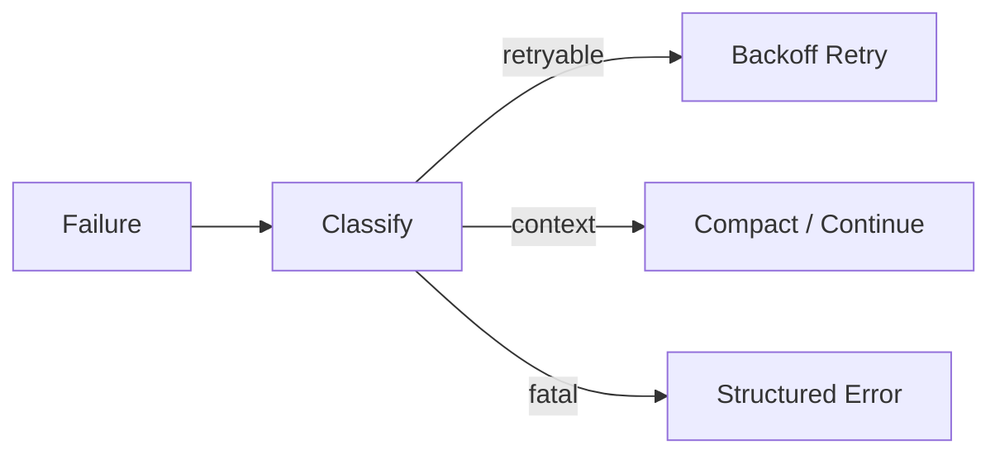

# s18: Error Recovery — 失败也是运行时事件

```mermaid
flowchart LR
    F["Failure"] --> C["Classify"]
    C -->|retryable| R["Backoff Retry"]
    C -->|context| K["Compact / Continue"]
    C -->|fatal| E["Structured Error"]
```

> 状态：待编写。目标是为模型、网络、上下文和工具错误设计不同恢复路径。

