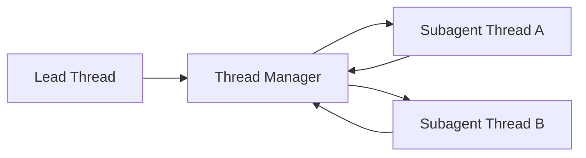

# s19: Subagents & Thread Manager — 子 Agent 是受管理的线程

```mermaid
flowchart LR
    L["Lead Thread"] --> M["Thread Manager"]
    M --> A["Subagent Thread A"]
    M --> B["Subagent Thread B"]
    A --> M
    B --> M
```

> 状态：待编写。目标是用线程管理器处理子 Agent 生命周期和结果回传。

