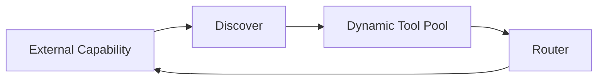

# s21: MCP, Plugins & Connectors — 动态扩展能力

```mermaid
flowchart LR
    E["External Capability"] --> D["Discover"]
    D --> T["Dynamic Tool Pool"]
    T --> R["Router"]
    R --> E
```

> 状态：待编写。目标是理解 MCP、插件和连接器进入统一工具系统的路径。

