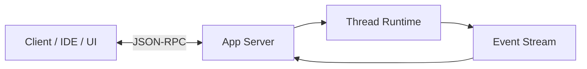

# s22: App Server Protocol — 把 Agent 变成可集成服务

```mermaid
flowchart LR
    C["Client / IDE / UI"] <-->|JSON-RPC| S["App Server"]
    S --> T["Thread Runtime"]
    T --> E["Event Stream"]
    E --> S
```

> 状态：待编写。目标是实现简化 App Server，并视教学价值加入 Java 客户端。

