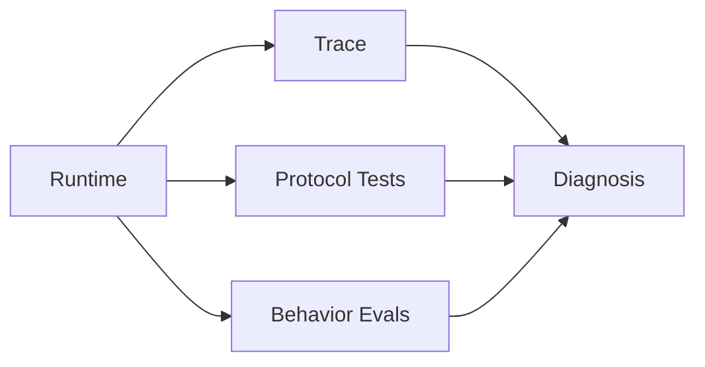

# s23: Observability, Testing & Evals — 解释 Agent 为什么这样行动

```mermaid
flowchart LR
    R["Runtime"] --> T["Trace"]
    R --> P["Protocol Tests"]
    R --> E["Behavior Evals"]
    T --> D["Diagnosis"]
    P --> D
    E --> D
```

> 状态：待编写。目标是建立轨迹、协议测试、集成测试和行为评估。

