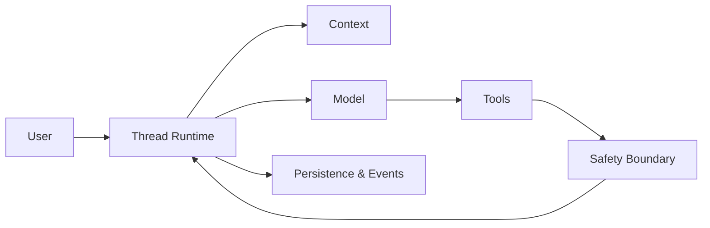

# s24: Comprehensive Agent — 多种机制，一个运行时

```mermaid
flowchart LR
    U["User"] --> T["Thread Runtime"]
    T --> C["Context"]
    T --> M["Model"]
    M --> O["Tools"]
    O --> S["Safety Boundary"]
    S --> T
    T --> P["Persistence & Events"]
```

> 状态：待编写。目标是把前 23 章组合成一个完整、可运行、仍然可理解的教学 Agent。

