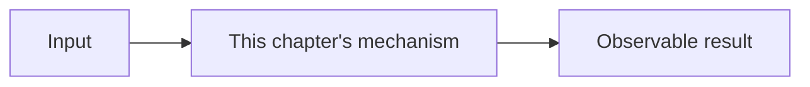

# sXX: Chapter Title

> 本章一句话：说明新增机制解决的核心问题。

## 本章目标

- 目标一
- 目标二

## 问题

描述上一章的实现遇到了什么真实限制。

## 心智模型

用目标读者能理解的方式解释机制，不从 Rust 类型定义开始。

## 最小实现

说明代码结构和运行方式。

## 工作原理

逐步解释数据如何流动，以及机制挂在运行时的哪个位置。

## 相对上一章的变化

列出新增、保留和刻意删除的部分。

## 与真实 Codex 的对应关系

列出公开源码路径，并解释概念映射。不要声称教学实现等同于生产实现。

## 教学简化与生产边界

明确本章省略的安全、并发、性能、兼容或平台细节。

## 试一试

给出可运行命令和观察点。

## 小结

总结本章机制，并自然引向下一章。

